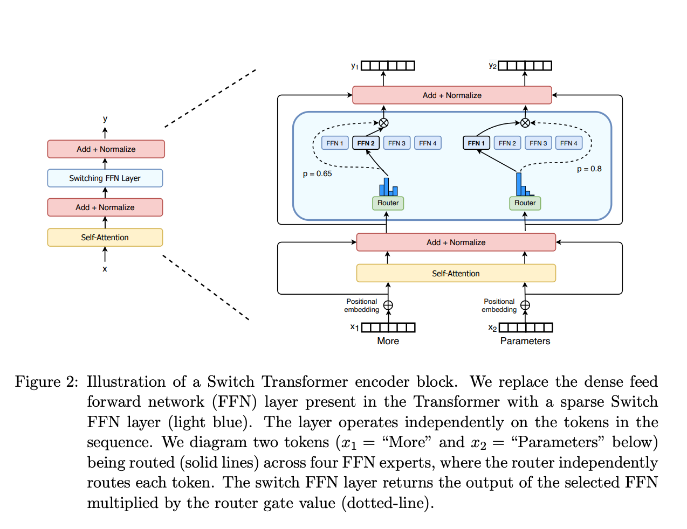

# MoE 混合专家模型：从原理到面试全攻略

**MoE（Mixture of Experts）是当前大模型最核心的架构创新之一，它通过"只激活部分参数"的稀疏计算策略，让模型拥有万亿级参数却只需消耗十亿级的算力。** DeepSeek-V3（671B 总参数，仅激活 37B）训练成本仅为同性能 Dense 模型的十分之一，正是 MoE 的威力所在。从 2024 年起，Mixtral、DeepSeek、Qwen3 等主流开源大模型全面拥抱 MoE 架构，使其成为算法岗面试的高频考点。本文用通俗类比讲清 MoE 原理，并收录来自牛客网、知乎、CSDN 等平台的 **30+ 道真实面试题**，覆盖从基础概念到前沿进展的完整知识体系。

> https://huggingface.co/blog/moe

---

## 一个医院的故事：MoE 到底是什么

想象你走进一家大型综合医院。如果只有一个"全科医生"接诊所有病人，他既看感冒又做手术，效率极低——这就是 **Dense 模型**（密集模型）的困境：每个输入都要经过全部参数计算。

MoE 的做法是：医院里配备 **8 位专科医生**（心脏科、骨科、神经科……），加一个 **分诊台护士**。病人来了，护士快速判断病情，把你分给最合适的 **2 位医生** 联合会诊。其他 6 位医生完全不参与——这就是 MoE 的核心思想：**条件计算（Conditional Computation）**。

用技术语言说：MoE 把 Transformer 中的 **FFN 层（前馈神经网络）** 替换为多个并行的"专家 FFN" + 一个"门控网络/路由器"。每个 token 只激活 Top-K 个专家处理，其余专家完全跳过计算。这实现了 **参数量与计算量的解耦**——模型可以拥有海量参数（存储大量知识），但推理时只消耗少量算力。

### MoE 的两大核心零件

**专家网络（Experts）** 就是医院里的专科医生。技术上，每个专家就是一个标准的 FFN/MLP 层，结构与普通 Transformer 里的 FFN 完全相同，只是现在有多个并行存在。Mixtral 8x7B 每层有 **8 个专家**，DeepSeek-V3 更是达到 **256 个路由专家 + 1 个共享专家**。值得注意的是，专家的"专业方向"并非人为指定，而是在训练中 **自发形成**——有的专家逐渐擅长处理句法结构，有的擅长数字推理，这种分化完全由梯度更新驱动。

**门控网络/路由器（Gating Network / Router）** 就是分诊台护士。它是一个轻量的线性变换层，公式为 $G(x) = \text{Softmax}(x \cdot W_g)$，接收 token 的隐藏状态，输出对每个专家的"亲和度分数"，决定这个 token 该去找哪些专家。路由器与整个模型 **端到端联合训练**，是 MoE 的"大脑"。

---

## Token 的旅程：从输入到输出的完整路由流程

一个 token 在 MoE 层中经历以下步骤：

1. **Attention 阶段不变**：token 先通过自注意力层（所有 token 共享），获得上下文信息
2. **路由器打分**：token 的隐藏状态进入路由器，路由器计算它与每个专家的亲和度分数
3. **Top-K 选择**：只保留得分最高的 K 个专家（通常 K=1 或 K=2），其余设为 $-\infty$
4. **Softmax 归一化**：对选中专家的分数做 Softmax，得到权重
5. **专家并行计算**：被选中的 K 个专家各自独立处理该 token
6. **加权聚合**：各专家输出按权重加权求和，得到最终结果
7. **残差连接**：输出传入下一层

数学表达非常简洁：**$y = \sum_{i=1}^{K} G(x)_i \cdot E_i(x)$**，其中大多数 $G(x)_i = 0$（未被选中的专家）。

### 稀疏 vs 密集：为什么"少即是多"

**密集 MoE** 激活所有专家，计算量巨大，已基本被淘汰。**稀疏 MoE** 只激活 Top-K 个专家，是现代大模型的标准做法。常见的 K 值选择：**Top-1**（Switch Transformer，最极致的稀疏）、**Top-2**（Mixtral，目前最常见）、**Top-8**（DeepSeek-V3，从 256 个专家中选 8 个）。

K 越小计算越省，但信息损失越大。实践中通过增加专家总数来弥补——当专家足够多时，即使 Top-1 也能表现优异。

---

## 负载均衡：MoE 最头疼的"热门专家"问题

MoE 面临一个棘手挑战：如果不加干预，路由器会 **"偏心"少数专家**。某几个专家被频繁选中 → 获得更多训练 → 变得更强 → 被更多选中，形成正反馈循环，最终导致 **路由崩塌（Routing Collapse）**——大部分专家沦为"死权重"。这就像医院里所有病人都挤去找同一个名医，其他医生闲着。

业界发展出多种解决方案，从早期到最新逐步演进：

- **辅助损失（Auxiliary Loss）**：在训练损失中加一项惩罚不均衡分配的额外 loss，公式为 $L_{aux} = \alpha \cdot \sum(f_i \cdot P_i)$，其中 $f_i$ 是各专家实际接收的 token 比例，$P_i$ 是平均路由概率。这是最经典的方案，但 **会与主训练目标冲突**，损害模型质量
- **专家容量限制（Expert Capacity）**：为每个专家设定 token 处理上限，超出的 token 通过残差连接跳过，避免某个专家过载
- **带噪声的门控（Noisy Top-K Gating）**：在路由分数中注入高斯噪声，增加随机性，帮助冷门专家获得训练机会
- **Router Z-Loss**：ST-MoE 提出，惩罚路由器输出的过大 logit 值，显著提升训练稳定性
- **DeepSeek-V3 的无辅助损失方案**：这是目前最先进的方案——为每个专家维护一个动态偏置 $b_i$，若某专家负载不足就微增偏置、过载则微减。**偏置仅用于 Top-K 筛选，不参与权重计算**，从而完全避免了辅助损失对主目标的干扰

---

## 三大里程碑模型：从理论到实战

### Switch Transformer 开创了"一个就够"的极简路由

Google 在 2021 年发布的 Switch Transformer 是 MoE 在大模型时代的奠基之作。其核心贡献是 **大胆地将 Top-K 简化为 Top-1**——每个 token 只路由到 1 个专家。这个违反直觉的设计却带来了三重好处：路由计算减半、每个专家的 batch size 翻倍、通信开销降低。Switch-C 模型达到 **1.6 万亿参数（2048 个专家）**，比 T5-XXL 预训练速度快 **4 倍**，比 T5-Base 快 **7 倍**。

### Mixtral 8x7B 证明了"开源 MoE 能打败 GPT-3.5"

Mistral AI 于 2023 年底发布 Mixtral 8x7B，采用 **8 个专家 + Top-2 路由**。一个常见面试陷阱：它的总参数量是 **46.7B 而非 56B（8×7）**，因为自注意力层、Embedding 层等参数是所有专家共享的，只有 FFN 层被复制为 8 份。每个 token 仅激活 **12.9B 参数**，推理速度接近 13B Dense 模型，但性能 **匹配甚至超越 Llama 2 70B**（后者参数量是其 5 倍），在数学和代码任务上大幅领先。

### DeepSeek-MoE 系列推动了三项关键创新

DeepSeek 的 MoE 演进路线（V1→V2→V3）代表了该领域最前沿的技术突破：

**细粒度专家分割**：将传统的大专家拆分为更多更小的专家。传统 Top-2 from 16 只有 $C(16,2)=120$ 种组合，而 DeepSeek 的 Top-8 from 64 有约 **44 亿种组合**，灵活性提升 3690 万倍。**共享专家隔离**：指定 1-2 个专家为"共享专家"，无论路由决策如何都参与每个 token 的计算，负责通用知识（如基础语法），让路由专家可以更专注于专业化知识。**Sigmoid 替代 Softmax 门控**：当专家数从 160 增加到 256 时，Softmax 的归一化约束导致数值区分度下降（所有值加和为 1，维度越高每个值越小），而 Sigmoid 对每个专家独立输出 [0,1] 分数，区分度不受专家数量影响。

DeepSeek-V3 最终实现 **671B 总参数、37B 激活参数**，训练仅用 280 万 H800 GPU 小时，成本约为 Llama 3.1 405B 的十分之一。

---

## MoE 的优势与代价：一张清晰的账单

**核心优势**在于效率。相同算力下训练更大模型、收敛更快（Switch Transformer 快 4-7 倍）；推理时 FLOPs 远低于同参数 Dense 模型（Mixtral 47B 参数只用 13B 的算力）；可通过增加专家数灵活扩展容量而不成比例增加计算成本。

**主要代价**集中在工程复杂度。**内存占用大**——所有专家必须加载到显存中，Mixtral 8x7B 需要约 90GB VRAM（半精度），尽管推理只用到 13B 参数的计算。**训练不稳定**——路由的离散选择导致梯度优化困难，需要 Z-loss、精度控制等额外技巧。**通信开销高**——分布式场景中 All-to-All 通信成本显著。**微调易过拟合**——稀疏激活在小数据集上泛化能力较弱。此外还有一个常被忽视的点：**MoE 在小 batch size 推理时表现不佳**，因为每个专家只处理极少 token，算术强度极低，受限于内存带宽；高并发大 batch 场景才能充分发挥优势。

---

## MoE的训练和推理

###  MoE 的训练过程

训练 MoE 模型比训练普通的稠密（Dense）模型要复杂得多，主要面临“负载不均衡”和“通信瓶颈”的问题。

1. **前向传播与稀疏路由**：
   - 输入的一个 Batch 的 Tokens 经过 Attention 层后，到达 MoE 层。
   - Router 计算每个 Token 对所有专家的偏好分数，并选出得分最高的 K 个专家（例如 Top-2）。
   - **Token 分发（Dispatch）**：Token 被发送到被选中的专家那里。
   - 专家进行计算后，将结果按照 Router 给出的权重进行加权求和（Combine），传递给下一层。
2. **负载均衡（Load Balancing）与辅助损失函数（Auxiliary Loss）**：
   - **问题**：神经网络有“马太效应”。如果某个专家在早期偶然表现得好，Router 就会倾向于把所有 Token 都发给它，导致这个专家“撑死”（计算过载），而其他专家“饿死”（得不到训练），这被称为**表示崩溃（Representation Collapse）**。
   - **解决方案**：在模型原本的交叉熵损失函数之外，加入一个**负载均衡损失（Load Balancing Loss）**。这个损失函数会惩罚 Router，强制它尽可能均匀地将 Token 分配给所有的专家。
3. **专家容量限制（Expert Capacity）与 Token 丢弃（Token Dropping）**：
   - 为了硬件计算效率，通常要求每个专家处理的 Token 数量是固定的（即容量上限）。
   - 容量公式通常为：$Capacity = \frac{Total\_Tokens\_in\_Batch}{Number\_of\_Experts} \times Capacity\_Factor$。
   - 如果分配给某个专家的 Token 数量超过了它的容量，多出来的 Token 就会被**丢弃（Dropped）**，或者通过残差连接直接跳过该 MoE 层，不参与这层的专家计算。
4. **并行策略（并行训练）**：
   - MoE 极大地增加了参数量，单张 GPU 无法装下所有专家。因此训练时通常采用 **专家并行（Expert Parallelism）**：将不同的专家放置在不同的 GPU 上。Router 在 GPU 之间进行 All-to-All 通信，把 Token 路由到目标 GPU 上的专家。

------

### MoE 的推理过程 (Inference)

推理过程在逻辑上与训练的前向传播相似，但侧重点和面临的挑战不同。

1. **路由计算**：
   - 输入的 Token 经过自注意力机制后，输入到 Router。
   - Router 计算出 Top-K 的专家索引及其对应的权重。
2. **稀疏激活与计算**：
   - **这是 MoE 推理速度快的核心原因**：系统**只**激活并计算那 K 个被选中的专家，完全跳过未被选中的专家。
   - 例如，一个有 8 个专家的模型（如 8x7B），如果 $K=2$，那么每个 Token 实际参与计算的参数量只有总参数量的约 1/4（加上公共层的参数，实际占比更小），因此推理计算量（FLOPs）接近于一个更小的模型（如 14B 左右的模型）。
3. **结果聚合**：
   - 将激活的 K 个专家的输出按权重相乘并相加，得到最终的 FFN 输出。
4. **推理面临的挑战（显存占用大）**：
   - 虽然计算量变小了，推理速度变快了，但**内存墙（Memory Wall）依然存在**。
   - 为了能让 Router 随时调用任何一个专家，**模型的所有专家参数必须全部加载到显存（VRAM）中**。因此，一个 8x7B 的 MoE 模型，其显存占用依然接近一个 40B-50B 级别的稠密模型。

---

## 面试题库：30+ 道真题按难度分级

以下面试题收集自牛客网（滴滴、腾讯混元、蚂蚁集团面经）、知乎（AI 算法面试心得总结专栏等）、CSDN（AI 面试秘籍专栏等），覆盖五个层次。

### 🟢 Level 1：基础概念（适合所有候选人）

**Q1：什么是 MoE？它的核心设计思想是什么？**
*来源：牛客网 · 滴滴大模型面经*

答案要点：MoE 由多个专家网络 + 一个门控网络组成。核心思想是条件计算——不同输入只激活不同的专家子集，实现参数量与计算量的解耦。在 Transformer 中，MoE 替换的是 FFN 层。

**Q2：MoE 中的"专家"具体指什么？它是不是某个领域的专家？**
*来源：知乎 · MoE 面经总结 / 博客园*

答案要点：专家通常就是一个标准 FFN/MLP 层。它并非"心理学专家"或"物理专家"这种领域划分，而是在训练中自发学习到不同的 token 模式（如句法结构、标点符号等）。每个专家是嵌入在模型中的子模块，不是独立的完整模型。

**Q3：什么是 Top-K 门控？常见的 K 值有哪些？**
*来源：知乎 · AI 算法面试心得总结*

答案要点：对输入做线性变换后保留得分最高的 K 个专家，其余设为 $-\infty$，经 Softmax 后变为 0，实现稀疏性。Top-1（Switch Transformer）、Top-2（Mixtral）、Top-8（DeepSeek-V3）是三种典型配置。

**Q4：MoE 的主要优势有哪些？**
*来源：知乎 · MoE 面经总结*

答案要点：（1）相同算力下预训练更快、模型更大；（2）推理速度快，只激活部分参数；（3）可扩展性强；（4）动态路由灵活适配不同输入。研究显示 MoE + 指令调优仅用 1/3 算力可提升性能约 45%。

**Q5：有哪些代表性的 MoE 模型？**
*来源：知乎 · MoE 面经总结*

答案要点：Switch Transformer（Google，Top-1，1.6T 参数）、GShard（Google，Top-2）、Mixtral 8x7B（Mistral AI，8 专家选 2）、DeepSeek-V2/V3（细粒度专家 + 共享专家）、DBRX（Databricks）、Qwen3-235B（阿里，128 专家选 8）。GPT-4 据传也使用 MoE 架构。

### 🟡 Level 2：技术细节（算法岗必考）

**Q6：为什么门控网络要引入噪声（Noisy Gating）？**
*来源：知乎 · AI 算法面试心得总结*

答案要点：防止路由崩塌。不加噪声时，路由器会收敛到只激活少数"热门"专家，形成正反馈循环。噪声在训练早期引入随机性，帮助各专家获得均衡的训练机会，公式为 $H(x)_i = (x \cdot W_g)_i + \text{StandardNormal()} \cdot \text{Softplus}(x \cdot W_{noise})$。

**Q7：如何解决 MoE 中的专家负载不均衡问题？**
*来源：牛客网 · 滴滴面经 / 知乎 / 博客园*

答案要点：（1）Noisy Top-K Gating 加入随机噪声；（2）辅助损失函数 $L_{aux} = \alpha \cdot \sum(f_i \cdot P_i)$ 惩罚不均衡；（3）专家容量因子上限，超出 token 被丢弃或跳过；（4）Expert Choice 路由——让专家选 token 而非 token 选专家；（5）DeepSeek-V3 的无辅助损失方案，使用动态偏置替代辅助 loss。

**Q8：专家数量对模型表现有什么影响？**
*来源：知乎 · MoE 面经总结*

答案要点：增加专家数量可以提高样本效率和训练速度，但收益随数量增加递减，尤其超过 256-512 后。更多专家意味着更大显存需求。Switch Transformer 证明即使小模型中 2、4、8 个专家也有效。DeepSeek 用 256 个细粒度小专家 + Top-8 在灵活性和效率间取得了良好平衡。

**Q9：DeepSeek-V3 为什么把门控函数从 Softmax 换成 Sigmoid？**
*来源：知乎 · DeepSeek 技术解读*

答案要点：V3 将路由专家数从 160 增到 256。Softmax 要求所有维度加和为 1，维度越高每个值越小，导致 Top-K 选择时数值区分度下降，路由决策不稳定。Sigmoid 对每个专家独立计算 [0,1] 分数，不受专家总数影响，值域更宽、区分度更高。

**Q10：如何评估 MoE 模型的稀疏性效率？**
*来源：牛客网 · 滴滴面经*

答案要点：常用指标包括激活参数比（激活参数/总参数）、专家利用率（token 分配均匀度）、FLOPs 效率（相同计算量下的性能对比）、路由崩溃率（专家被选中次数的方差）。

**Q11：MoE 中专家的"自发专化"现象是怎么形成的？**
*来源：知乎 · DeepSeek-V3 架构详解*

答案要点：专家方向并非人为预设，而是训练中通过梯度更新自发形成。初期门控参数随机，各专家接收数据均匀；随训练进行，局部梯度差异使某些专家逐渐专注特定输入类型。ST-MoE 论文观察到编码器中专家按 token 类型（标点、专有名词等）进行浅层专业化，但在多语言模型中专家并非按语言分工。

### 🔴 Level 3：对比分析（展示深度理解）

**Q12：MoE 和 Dense 模型有什么本质区别？各有什么优劣？**
*来源：牛客网 · 腾讯混元面经 / 蚂蚁面经 / 知乎*

答案要点：Dense 模型每个 token 激活全部参数，参数量=计算量严格绑定；MoE 通过稀疏路由解耦二者。训练方面，MoE 在相同算力下更快收敛；推理方面，MoE 需高显存但高吞吐量（Mixtral 47B 参数只需 13B 的 FLOPs），Dense 需低显存但低吞吐量；微调方面，MoE 更易过拟合。具体对比：Mixtral 8x7B（47B 参数）性能超越 Llama 2 70B，但推理算力仅需 1/5。

**Q13：MoE 为什么放在 FFN 层而不是 Attention 层？**
*来源：知乎 / CSDN*

答案要点：（1）FFN 层执行"通道变换"（channel-mixing），本质上是"稀疏键值记忆"——任一时刻只有少数神经元起主导作用，与 MoE 的稀疏激活天然匹配；（2）FFN 层占 Transformer 参数量的绝大部分（如 PaLM-540B 中 FFN 占 90% 参数），替换为 MoE 节约效果最大；（3）Attention 层负责序列内 token 间的全局交互，不适合稀疏化。

**Q14：MoE 的主要挑战有哪些？**
*来源：知乎 · MoE 面经总结 / CSDN*

答案要点：（1）训练不稳定——路由离散性导致梯度问题；（2）微调阶段泛化不足、易过拟合；（3）高内存消耗——所有专家需加载到显存；（4）负载不均衡——路由崩塌风险；（5）分布式通信开销——All-to-All 通信随专家数增长；（6）小 batch 推理性能差——算术强度低，受内存带宽限制。

**Q15：为什么 MoE 在小 Batch Size 推理时表现不佳，高并发时才有优势？**
*来源：CSDN*

答案要点：小 Batch 时计算是 Memory Bound，MoE 总参数量大，每个专家只处理极少 token，算术强度极低（权重大量加载但计算极少）。大 Batch 时，分配到同一专家的 token 被批量打包为矩阵乘法，权重只需载入一次处理多个 token，算术强度显著提高，从 Memory Bound 转向 Compute Bound，MoE 优势得以发挥。

### ⚫ Level 4：工程实现（高级岗位 / 系统方向）

**Q16：在分布式训练中，MoE 如何实现专家参数的高效更新？**
*来源：牛客网 · 滴滴面经*

答案要点：采用专家并行（Expert Parallelism），将不同专家分配到不同设备。DeepSeek-V2 引入设备受限路由——限制每个 token 最多路由到 M 个设备（实验证明 M≥3 效果等同全局 Top-K），控制通信成本。V3 实现了几乎完全的计算-通信重叠。

**Q17：什么是 Expert Parallelism？如何与 TP/DP 组合？**
*来源：CSDN / 博客园*

答案要点：EP 将不同专家静态分配到不同 GPU，通过 All-to-All 通信路由 token 到正确专家。EP 比 TP 轻量（不需切分矩阵乘法）。常见组合：EP+DP（同一套专家分布在节点内，数据并行复制多套）；EP+DP+TP（单个专家过大时再做张量切分）。DeepSeek 推理中 Decode 阶段用 EP128+TP1，Prefill 阶段用 EP32+TP1。

**Q18：MoE 推理中的 All-to-All 通信如何优化？**
*来源：CSDN*

答案要点：MoE 前向/反向各需两次 All-to-All（dispatch + combine），共四次。优化方案：（1）分层 All-to-All——利用节点内 NVLink 高带宽 vs 节点间低带宽分层处理；（2）计算-通信重叠——用流水线掩盖等待时间；（3）DeepEP 库——DeepSeek 专用 EP 通信库，节点内 153-158 GB/s NVLink，跨节点 43-47 GB/s RDMA；（4）设备受限路由——减少通信扇出。

**Q19：MoE 训练中 TP 和 EP 怎么选型？**
*来源：CSDN · AI 面试秘籍*

答案要点：专家少、参数大时用 TP（切分单个专家的矩阵乘法）；专家多时用 EP（每个 GPU 放不同专家）。EP 的通信模式是 All-to-All（路由 hidden states），比 TP 的 AllReduce 更轻量。实际中常用 EP+DP+TP 三维组合。路由计算本身增加约 30% 计算开销，需要 profiling 验证瓶颈。

**Q20：MoE 模型的微调策略有哪些？**
*来源：知乎 / CSDN*

答案要点：两种主要策略——（1）冻结非专家层，只训练专家层（利用专家特化能力）；（2）冻结 MoE 层，训练其他层（避免路由分布变化导致不稳定）。研究表明第二种方案效果几乎与全参数更新一样好，因为 MoE 层在每 token 只看 2 个专家的情况下信息更新有限。MoE 微调需要更高的 dropout 率（稀疏层用更高比例）来对抗过拟合。

**Q21：什么是 EPLB？DeepSeek 如何解决推理阶段负载不均？**
*来源：CSDN*

答案要点：EPLB（Expert Parallel Load Balancing）是 DeepSeek 开发的推理负载均衡器。核心策略是"冗余专家复制"——复制高负载专家到多个 GPU，用 replicate_experts（最小化最大负载）、balanced_packing（均衡打包）、rebalance_experts_hierarchical（分层均衡）三个关键函数实现。DeepSeek-R1 采用 32 个专家副本的静态+局部冗余复制策略。

### 🟣 Level 5：前沿进展（加分项）

**Q22：DeepSeek MoE 从 V1 到 V3 的演进路线和主要创新？**
*来源：知乎 · DeepSeek 技术解读 / 阿里云开发者社区*

答案要点：**V1** 引入细粒度专家分割 + 共享专家隔离两大核心创新，提出专家级和设备级负载均衡 loss。**V2** 优化通信——引入设备受限路由（每 token 最多路由到 M 个设备，M≥3 等效全局 Top-K），160 个路由专家 + 2 个共享专家，Top-6 路由。**V3** 实现无辅助损失负载均衡（动态偏置替代辅助 loss）、Sigmoid 替代 Softmax、256 个路由专家 + 1 个共享专家 + Top-8，前 3 层保留 Dense FFN，训练中不丢弃任何 token。

**Q23：为什么 DeepSeek-V3 的前几层保留 Dense FFN 而不用 MoE？**
*来源：CSDN / 博客园*

答案要点：前几层关注低级且通用的特征（如基础 token 表示），不需要复杂的专家分工。第一层的负载均衡收敛非常慢，MoE 在初始层难以稳定工作。DeepSeek-V3 前 3 层用 Dense MLP，后续全部 MoE。类似地，GShard 也是间隔一层才替换为 MoE。

**Q24：MoE 在 RL 阶段有什么特殊挑战？什么是 Routing Replay？**
*来源：LangCopilot 技术博客*

答案要点：MoE 放大了 RL 中 train-inference 不匹配和 policy lag 问题——路由分数的微小变化就可能切换完全不同的专家。失败模式包括专家坍塌和均衡压力过强损害任务质量。Routing Replay 是关键的稳定化工具：通过重放路由决策减少 policy lag 和 train-inference gap。核心认知：Dense 模型优化改变的是"相同参数的响应"，MoE 优化还额外改变了"哪些参数被选中"。

**Q25：DeepSeek-V3 的无辅助损失负载均衡具体怎么实现？**
*来源：知乎 · DeepSeek 技术解读*

答案要点：为每个专家维护动态偏置 $b_i$。Top-K 选择时用 $s_{i,t} + b_i$ 排序（$b_i$ 仅参与筛选，不参与后续权重计算）。每个训练步后动态调整：专家过载则减小 $b_i$，负载不足则增加 $b_i$。这完全避免了辅助损失对主训练目标的干扰，实验效果优于传统辅助损失方案。

**Q26：MoE 模型有哪些分类？**
*来源：知乎 · 混合专家模型原理与挑战*

答案要点：（1）硬混合 MoE——每个输入只分配给唯一专家；（2）软混合 MoE——多专家按概率加权输出；（3）稀疏 MoE——当前主流，门控输出稀疏权重仅激活部分专家；（4）自适应 MoE——动态调整激活专家数量；（5）层次化 MoE——多层嵌套的专家结构。

**Q27：Mixtral 8x7B 的总参数量为什么是 46.7B 而不是 56B（8×7B）？**
*来源：知乎 / CSDN 多篇技术文章*

答案要点：因为只有 FFN 层被复制为 8 个专家，而自注意力层、Embedding 层、LayerNorm 等参数是所有专家 **共享的**。实际总参数 = 共享参数 + 8 × 专家 FFN 参数 ≈ 46.7B。这是面试中常见的"陷阱题"，考察候选人是否真正理解 MoE 架构。

---

## 结论：备战 MoE 面试的核心认知框架

理解 MoE 的关键不在于记忆公式，而在于建立三层认知。**第一层是"为什么"**：Dense 模型参数量与计算量线性绑定，MoE 通过稀疏激活打破这一约束，让模型"知道很多但每次只想一点"。**第二层是"怎么做"**：路由器打分 → Top-K 选择 → 专家并行计算 → 加权聚合，辅以负载均衡机制防止路由崩塌。**第三层是"代价是什么"**：内存占用大（所有专家需加载）、训练不稳定、通信开销高、小 batch 推理差——这些代价催生了从辅助损失到 DeepSeek 无损均衡的一系列工程创新。

面试时特别值得关注 DeepSeek-V3 的三项创新（无辅助损失均衡、Sigmoid 门控、细粒度+共享专家），它们代表了 MoE 架构的最新演进方向，也是 2025-2026 年面试中的高频新题。