# Transformer

## Architecture

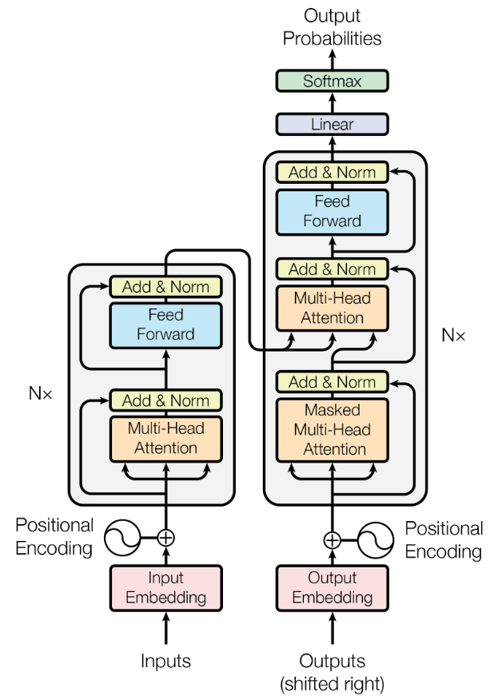

## Parameters

|   key   | value |
| :-----: | :---: |
|    N    |   6   |
| D_model |  512  |
|         |       |

## Attention

### Scaled Dot Attention

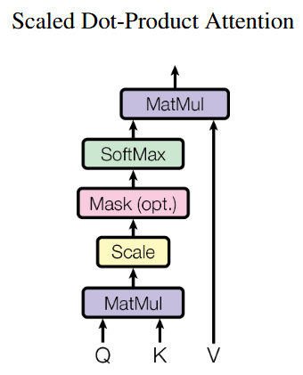

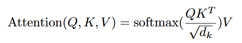

#### Why divide?

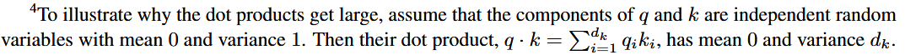

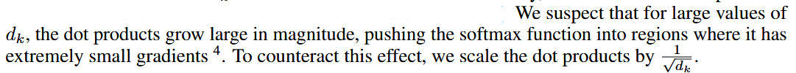

### Multi-Head Attention

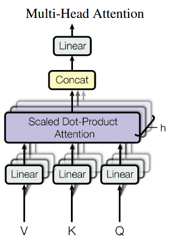

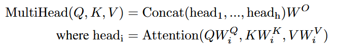

#### Computational cost

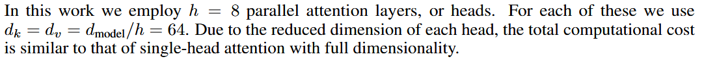

##### WHY similar computational cost

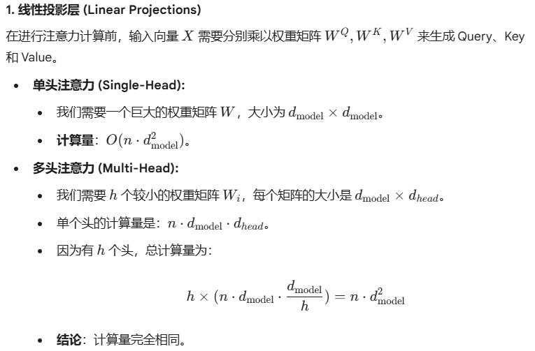

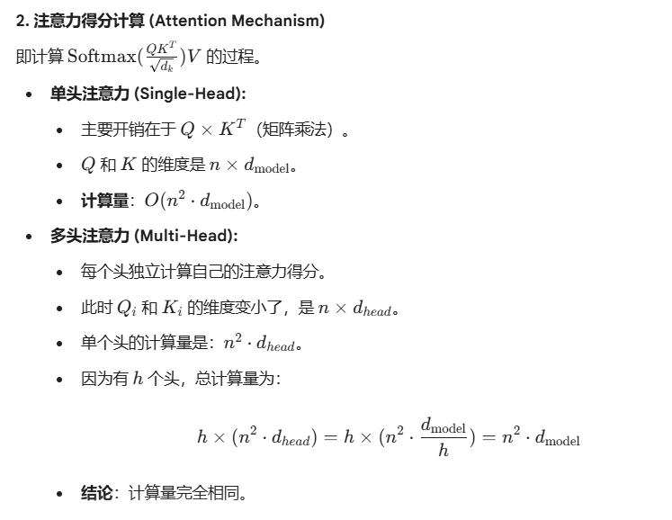

#### Why Multi-head

Multi-head attention allows the model to jointly attend to information from different representation subspaces at different positions. With a single attention head, averaging inhibits this.

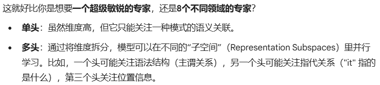

## Layer Comparison

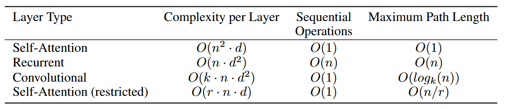

## Positional Encoding

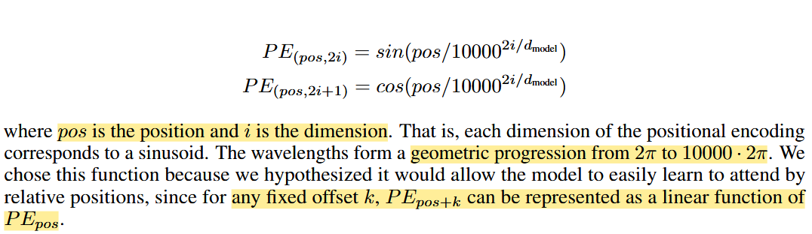

在 Transformer 的位置编码中，使用几何级数是为了让位置编码的波长（Wavelengths） 随着维度的增加而以一个固定的倍数（公比）增长，从而确保不同维度能够覆盖不同的尺度：这种设计保证了模型的 $d_{\text{model}}$​ 个维度能够**系统地、均匀地**捕捉从精细的近距离位置信息到宏观的远距离位置信息。

## Training

### Teacher Forcing

核心操作：Shifted Right (右移)

假设我们要把英文 `"I love AI"` 翻译成中文 `"我 爱 人工智能"`。

- **目标序列 (Target):** `[我, 爱, 人工智能, <EOS>]`
- **Decoder 输入 (Shifted Right):** `[<SOS>, 我, 爱, 人工智能]`

我们将目标序列整体向右移动一位，并在开头加上起始符 `<SOS>`。这样，模型在每一个位置的任务就是预测“下一个词”：

- 输入 `<SOS>` $\rightarrow$ 预测 `我`
- 输入 `我` $\rightarrow$ 预测 `爱`
- ...以此类推。

### Learning Rate Warm-up

通常，我们训练模型时学习率是不断**下降**的（为了在后期更精细地收敛）。但 Warmup 反其道而行之，在起步阶段让学习率“由低到高”。

一个典型的 Transformer 学习率曲线包含两个阶段：

1. **Warmup Phase（预热期）：** 学习率从 $0$（或一个极小值）线性增加到预设的最大学习率 $\eta_{max}$。
2. **Decay Phase（衰减期）：** 达到 $\eta_{max}$ 后，学习率按照余弦退火（Cosine Decay）或反平方根（Inverse Square Root）等方式逐渐减小。

**数学表达（线性预热）：**

假设预热步数为 $T_{warmup}$，当前步数为 $t$，预设学习率为 $\eta_{max}$，则当前学习率 $\eta_t$ 为：

$$\eta_t = \eta_{max} \cdot \frac{t}{T_{warmup}}, \quad t \le T_{warmup}$$​

#### 为什么要使用 Warmup？

- 初始阶段的梯度波动

在 Transformer 训练初期，输出是完全随机的。预测结果与真实结果差异巨大，导致计算出的梯度 $g$ 数值极大（例如 $10^5$）。$\Delta W = - \eta \cdot g$。如果学习率 $\eta$ 是较大的 $0.001$，那么权重一次性改变 $100$。对于通常在 $[-0.1, 0.1]$​ 之间的初始化权重来说，这种改变是毁灭性的，它彻底摧毁了模型原本的初始化结构。

- Adam 优化器的参数估计

Adam 会计算梯度的**二阶矩（方差）** $v_t$。简单来说，它会记录梯度的波动情况。如果某个参数波动小，它就让学习率大一点；波动大，就小一点。

在训练的前 10 个 Step，预报员只看了 10 秒钟的天气。如果这 10 秒恰好没刮风，Adam 就会错误地认为：“这里永远风平浪静！” 于是它会把学习率放大成百上千倍（因为 $\frac{1}{\sqrt{v_t} + \epsilon}$​​ 变得极大）。

- LayerNorm 与残差结构

$Output = x + \text{Sublayer}(x)$。 这意味着输入信息 $x$ 可以不加修改地流向深层。在初始阶段，`Sublayer` 计算出的东西全是“噪音”。如果学习率很高，`Sublayer` 产生的噪音会被放大。

1. 在一个 **Post-LN** 结构（原始 Transformer）中，LayerNorm 放在残差相加之后：$LayerNorm(x + Sublayer(x))$。
2. 由于初始梯度很大，LayerNorm 的归一化参数 $\gamma$ 和 $\beta$​ 会被瞬间推向极端。
3. 在深度超过 12 层的 Transformer 中，如果不使用 Warmup，深层的梯度会逐层累积，导致底层（靠近输入的那几层）的权重更新量比深层大得多，这种**“梯度不均衡”**会导致模型在训练开始的几秒钟内就彻底丧失提取基础特征的能力。

## 相关问题

### Transformer中的低秩问题

Transformer中的低秩问题是什么意思？ - Cv大法代码酱的回答 - 知乎 https://www.zhihu.com/question/3114865731/answer/1981635048504590660

### Transformer中的mask

**Padding Mask**（处理不定长输入）和 **Sequence Mask**（在 Decoder 中防止泄露未来信息）

mask的维度：batch-head-query-key

#### encoder-src_mask

屏蔽源序列中的 **填充 (Padding)** token

形状：$(B, 1, 1, L_{src})$

#### decoder-trg_mask

处理 **填充** 和 **前瞻 (Look-Ahead)** 两种限制

形状：填充掩码 (`trg_pad_mask`) 形状：$(B, 1, L_{trg}, 1)$

前瞻掩码 (`trg_sub_mask`) 形状：$(L_{trg}, L_{trg})$

最终组合 (`trg_pad_mask & trg_sub_mask`) 形状：$(B, 1, L_{trg}, L_{trg})$