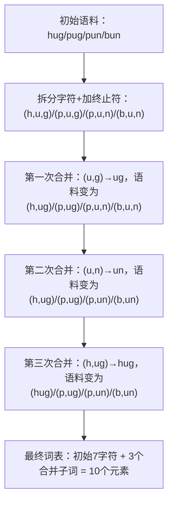

# BPE

## what is BPE

BPE（Byte Pair Encoding，字节对编码）是一种从数据压缩算法演变而来的子词分词技术，核心是通过迭代合并语料中最频繁的相邻字节/字符对来构建子词词汇表，在NLP中用于平衡词汇表大小与未登录词（OOV）处理，是大模型分词的主流方案之一。

---

### 核心背景与定位
1.  起源与适配：1994年由Philip Gage提出用于数据压缩；2015年Sennrich等人将其改造为NLP子词分词算法，解决词级分词的OOV与词表膨胀问题。
2.  核心目标：在固定词表大小下，用最少的token覆盖文本，同时保留语义单元；兼顾高频词完整性与低频词的子词拆分能力。
3.  典型应用：GPT系列、RoBERTa等主流模型的tokenizer均基于BPE（常以字节为基础单元，避免Unicode字符OOV）。

---

### 算法流程（训练+推理）
#### 训练阶段（构建词表）
1.  初始化：将语料中所有单词拆分为字符序列，每个单词末尾加终止符（如`</w>`）；词表初始为所有唯一字符。
2.  统计频率：计算所有相邻字符对的出现频次。
3.  迭代合并：每次合并频次最高的字符对，生成新子词并加入词表；同时更新语料中对应序列。
4.  停止条件：达到预设词表大小（如32k、50k）或无新高频对可合并。

**示例**（语料：hug(10), pug(5), pun(12), bun(4), hugs(5)）
| 步骤 | 高频对 | 合并后子词 | 词表更新 | 语料更新 |
| :--- | :--- | :--- | :--- | :--- |
| 1 | ("u","g") | "ug" | 添加"ug" | hug→h ug, pug→p ug, hugs→h ug s |
| 2 | ("u","n") | "un" | 添加"un" | pun→p un, bun→b un |
| 3 | ("h","ug") | "hug" | 添加"hug" | h ug→hug, h ug s→hug s |

#### 推理阶段（分词）
1.  最长匹配：对输入文本按词表中最长可能子词进行拆分，优先匹配长单元。
2.  退化机制：未匹配部分逐步拆分为更小单元，最终退化为单个字符/字节，彻底避免OOV。
3.  示例："lowering" → "low" + "er" + "ing"；若"ing"不在词表则拆为"i"+"n"+"g"。

---

### 关键特性与优缺点
| 维度 | 优势 | 局限 |
| :--- | :--- | :--- |
| 词汇表 | 可控大小，平衡OOV与内存开销 | 需预训练，词表大小影响分词粒度 |
| 未知词 | 可拆分为已知子词，无OOV | 极端罕见词拆分过细，可能损失语义 |
| 多语言 | 适配字节级后支持任意Unicode文本 | 对形态丰富语言的拆分策略需调优 |
| 效率 | 训练与推理速度快，可并行 | 贪心合并可能导致局部最优，非全局最优 |

---

### 与其他分词方案对比
| 方案 | 核心差异 | 适用场景 |
| :--- | :--- | :--- |
| BPE | 贪心合并高频对，子词粒度灵活 | 大模型预训练、机器翻译 |
| WordPiece | 基于概率增益合并，偏向通用子词 | BERT等双向模型 |
| Unigram LM | 从全量候选中筛选最优子词集，全局最优 | 对分词质量要求高的任务 |

---

### 实践要点
1.  字节级BPE：以字节（256种）为初始单元，覆盖所有Unicode字符，避免OOV；GPT系列采用此方案。
2.  词表大小：小词表（如16k）节省内存但token数多；大词表（如100k）token数少但训练成本高。
3.  终止符作用：区分词尾与词中相同子词（如"low"在"lower"中与独立词"low"）。

## bpe_ranks

`bpe_ranks`是BPE训练阶段的核心产物，它本质上是一个**记录“字符/子词对”合并优先级的字典**（key是合并对，value是合并顺序/优先级）。

### 一、`bpe_ranks`的核心生成逻辑
`bpe_ranks`的生成对应BPE的**训练阶段**（和你之前看的推理阶段是互补的），核心是**迭代统计+合并高频对**，并把每次合并的“字符对”按**合并顺序**记录下来（合并越早，优先级越高，对应的value值越小）。

#### 核心步骤（训练阶段）
1. **语料初始化**：
   - 把语料中所有单词拆分为单个字符，末尾加`</w>`；
   - 统计每个单词的出现频率（比如`hug:10, pug:5`）。
2. **迭代合并高频对**：
   - 每次遍历所有单词，统计所有相邻字符对的出现频次；
   - 找到频次最高的字符对，将其作为新的子词加入词表；
   - 把语料中所有该字符对替换为新子词；
   - 记录这个合并对（作为`bpe_ranks`的key），并赋予一个“优先级值”（比如第1次合并的对值为1，第2次为2，以此类推）。
3. **停止条件**：达到预设的词表大小（比如32000），或没有可合并的高频对。

最终，`bpe_ranks`就存储了“所有合并过的字符对”和它们的“合并顺序”——**数值越小，代表合并越早、优先级越高**（推理阶段会优先合并这些对）。

### 二、完整代码实现（生成`bpe_ranks`）
下面是可直接运行的代码，包含“语料预处理→迭代合并→生成bpe_ranks”的全流程，我会标注关键步骤：

```python
from collections import defaultdict

def get_vocab(corpus):
    """
    初始化语料：拆分字符+加终止符+统计词频
    参数：corpus - 原始语料（列表，每个元素是单词）
    返回：vocab - 字典{单词(字符元组): 出现频率}
    """
    vocab = defaultdict(int)
    for word in corpus:
        # 拆分为字符 + 末尾加</w>
        tokenized_word = tuple(word) + ('</w>',)
        vocab[tokenized_word] += 1
    return vocab

def get_pairs(vocab):
    """
    统计语料中所有相邻字符对的出现频次
    参数：vocab - 初始化后的词频字典
    返回：pairs - 字典{(字符1, 字符2): 总频次}
    """
    pairs = defaultdict(int)
    for word, freq in vocab.items():
        symbols = word
        for i in range(len(symbols) - 1):
            pair = (symbols[i], symbols[i+1])
            pairs[pair] += freq
    return pairs

def merge_vocab(pair, v_in):
    """
    把语料中所有指定的字符对合并为新子词
    参数：
        pair - 要合并的字符对（如('u','g</w>')）
        v_in - 当前的词频字典
    返回：v_out - 合并后的新词频字典
    """
    v_out = {}
    bigram = ''.join(pair)  # 合并后的新子词（如'u'+'g</w>'='ug</w>'）
    for word, freq in v_in.items():
        new_word = []
        i = 0
        while i < len(word):
            # 找到当前位置的字符，检查是否匹配要合并的对
            if i < len(word) - 1 and word[i] == pair[0] and word[i+1] == pair[1]:
                new_word.append(bigram)
                i += 2  # 跳过已合并的第二个字符
            else:
                new_word.append(word[i])
                i += 1
        new_word = tuple(new_word)
        v_out[new_word] = freq
    return v_out

def train_bpe(corpus, vocab_size):
    """
    训练BPE，生成bpe_ranks
    参数：
        corpus - 原始语料（列表）
        vocab_size - 目标词表大小（需大于初始字符数）
    返回：
        bpe_ranks - 字典{(合并对): 优先级值}
        vocab - 最终的词频字典
    """
    # 步骤1：初始化语料和词表
    vocab = get_vocab(corpus)
    # 初始词表是所有唯一字符（比如h/u/g/</w>等）
    initial_vocab = set()
    for word in vocab.keys():
        initial_vocab.update(word)
    initial_vocab_size = len(initial_vocab)
    # 检查目标词表大小是否合理
    if vocab_size <= initial_vocab_size:
        raise ValueError(f"目标词表大小需大于初始字符数（{initial_vocab_size}）")
    
    # 步骤2：迭代合并，生成bpe_ranks
    bpe_ranks = {}
    # 合并次数 = 目标词表大小 - 初始字符数（每次合并新增1个子词）
    merge_steps = vocab_size - initial_vocab_size
    
    for i in range(merge_steps):
        # 2.1 统计当前所有相邻对的频次
        pairs = get_pairs(vocab)
        if not pairs:
            break  # 没有可合并的对，提前终止
        
        # 2.2 找到频次最高的对（核心：优先合并高频对）
        best_pair = max(pairs, key=pairs.get)
        
        # 2.3 记录这个合并对到bpe_ranks（i+1是优先级，越小优先级越高）
        bpe_ranks[best_pair] = i + 1
        
        # 2.4 合并语料中的该字符对，更新词频字典
        vocab = merge_vocab(best_pair, vocab)
    
    return bpe_ranks, vocab

# ------------------- 测试示例 -------------------
if __name__ == "__main__":
    # 原始语料（模拟小样本）
    corpus = ["hug", "hug", "pug", "pun", "pun", "bun"]
    # 训练BPE，目标词表大小=10（初始字符数：h/p/b/u/g/n/</w> → 7个，所以合并3次）
    bpe_ranks, final_vocab = train_bpe(corpus, vocab_size=10)
    
    print("生成的bpe_ranks（合并对: 优先级）：")
    for pair, rank in sorted(bpe_ranks.items(), key=lambda x: x[1]):
        print(f"{pair}: {rank}")
    
    print("\n最终的词频字典（合并后的单词: 频次）：")
    for word, freq in final_vocab.items():
        print(f"{word}: {freq}")
```

### 三、代码运行结果与解读
以示例中的语料`["hug", "hug", "pug", "pun", "pun", "bun"]`为例，运行后输出如下（核心结果）：
```
生成的bpe_ranks（合并对: 优先级）：
('u', 'g</w>'): 1  # 第1次合并（频次最高）
('u', 'n</w>'): 2  # 第2次合并
('h', 'ug</w>'): 3 # 第3次合并

最终的词频字典（合并后的单词: 频次）：
('hug</w>',): 2
('p', 'ug</w>'): 1
('p', 'un</w>'): 2
('b', 'un</w>'): 1
```

#### 关键解读：
1. **优先级逻辑**：`('u','g</w>')`的value是1（最先合并），因为它在语料中出现的频次最高（hug出现2次+ pug出现1次 → 共3次）；
2. **bpe_ranks的作用**：推理阶段（你之前问的`bpe`函数）会根据这个字典，优先选择value小的合并对进行合并；
3. **词表大小关联**：目标词表大小=10，初始字符数=7，所以合并3次 → `bpe_ranks`中有3个合并对。

## 示例

你希望我从头一步步构建一个完整的BPE词表，我会用一个极简但完整的示例，从**原始语料**开始，经过初始化、迭代合并、生成词表和`bpe_ranks`，最终得到可直接用于分词的BPE词表，让你清晰看到每一步的变化。

### 一、准备工作
#### 1. 定义基础参数
- **原始语料**：选择小样本语料（方便跟踪每一步）：`["hug", "hug", "pug", "pun", "pun", "bun"]`（对应频次：hug=2，pug=1，pun=2，bun=1）。
- **目标词表大小**：设为`10`（初始字符数为7，因此需要合并3次）。
- **终止符**：`</w>`（标记词尾）。

#### 2. 核心概念回顾
- 初始词表：所有唯一字符（包括`</w>`）。
- 每次合并：选频次最高的相邻字符对，生成新子词并加入词表。
- 最终词表：初始字符 + 所有合并生成的子词。

### 二、从头构建BPE词表（逐步骤）
#### 步骤1：语料初始化（拆分字符+加终止符+统计频次）
首先把每个单词拆分为单个字符，末尾加`</w>`，并统计每个拆分后序列的频次：

| 原始单词 | 拆分+加终止符 | 频次 |
|----------|---------------|------|
| hug      | (h, u, g</w>) | 2    |
| pug      | (p, u, g</w>) | 1    |
| pun      | (p, u, n</w>) | 2    |
| bun      | (b, u, n</w>) | 1    |

**初始词表**（所有唯一字符）：  
`{h, p, b, u, g</w>, n</w>, </w>}` → 共7个元素（注意：`</w>`是独立字符，`g</w>`/`n</w>`是“字符+终止符”的组合）。

#### 步骤2：第一次合并（找最高频字符对）
##### 2.1 统计所有相邻字符对的频次
遍历所有拆分后的序列，统计每对相邻字符的出现次数：

| 字符对       | 出现场景                | 总频次 |
|--------------|-------------------------|--------|
| (h, u)       | hug的h和u（2次）        | 2      |
| (u, g</w>)   | hug的u和g</w>（2次）+ pug的u和g</w>（1次） | 3      |
| (p, u)       | pug的p和u（1次）+ pun的p和u（2次） | 3      |
| (u, n</w>)   | pun的u和n</w>（2次）+ bun的u和n</w>（1次） | 3      |
| (b, u)       | bun的b和u（1次）        | 1      |

⚠️ 注意：这里`(u, g</w>)`、`(p, u)`、`(u, n</w>)`频次均为3（并列最高），我们任选其一（比如选`(u, g</w>)`，实际实现中会按字符序/固定规则选）。

##### 2.2 合并`(u, g</w>)`，生成新子词`ug</w>`
将所有序列中的`(u, g</w>)`替换为`ug</w>`，更新后的语料频次：

| 合并后序列     | 频次 |
|----------------|------|
| (h, ug</w>)    | 2    |
| (p, ug</w>)    | 1    |
| (p, u, n</w>)  | 2    |
| (b, u, n</w>)  | 1    |

##### 2.3 更新词表和`bpe_ranks`
- 新增子词：`ug</w>` → 词表变为8个元素。
- `bpe_ranks`记录：`(u, g</w>): 1`（1代表第一次合并，优先级最高）。

#### 步骤3：第二次合并（找新的最高频字符对）
##### 3.1 重新统计相邻字符对的频次
基于步骤2更新后的语料，统计字符对：

| 字符对       | 出现场景                | 总频次 |
|--------------|-------------------------|--------|
| (h, ug</w>)   | (h, ug</w>)（2次）      | 2      |
| (p, ug</w>)   | (p, ug</w>)（1次）      | 1      |
| (p, u)       | (p, u, n</w>)（2次）    | 2      |
| (u, n</w>)   | (p, u, n</w>)（2次）+ (b, u, n</w>)（1次） | 3      |
| (b, u)       | (b, u, n</w>)（1次）    | 1      |

最高频字符对：`(u, n</w>)`（频次3）。

##### 3.2 合并`(u, n</w>)`，生成新子词`un</w>`
替换所有`(u, n</w>)`为`un</w>`，更新后的语料频次：

| 合并后序列     | 频次 |
|----------------|------|
| (h, ug</w>)    | 2    |
| (p, ug</w>)    | 1    |
| (p, un</w>)    | 2    |
| (b, un</w>)    | 1    |

##### 3.3 更新词表和`bpe_ranks`
- 新增子词：`un</w>` → 词表变为9个元素。
- `bpe_ranks`记录：`(u, n</w>): 2`（2代表第二次合并，优先级次之）。

#### 步骤4：第三次合并（找新的最高频字符对）
##### 4.1 重新统计相邻字符对的频次
基于步骤3更新后的语料，统计字符对：

| 字符对       | 出现场景                | 总频次 |
|--------------|-------------------------|--------|
| (h, ug</w>)   | (h, ug</w>)（2次）      | 2      |
| (p, ug</w>)   | (p, ug</w>)（1次）      | 1      |
| (p, un</w>)   | (p, un</w>)（2次）      | 2      |
| (b, un</w>)   | (b, un</w>)（1次）      | 1      |

最高频字符对：`(h, ug</w>)`和`(p, un</w>)`（频次均为2），选`(h, ug</w>)`。

##### 4.2 合并`(h, ug</w>)`，生成新子词`hug</w>`
替换所有`(h, ug</w>)`为`hug</w>`，更新后的语料频次：

| 合并后序列     | 频次 |
|----------------|------|
| (hug</w>)      | 2    |
| (p, ug</w>)    | 1    |
| (p, un</w>)    | 2    |
| (b, un</w>)    | 1    |

##### 4.3 更新词表和`bpe_ranks`
- 新增子词：`hug</w>` → 词表变为10个元素（达到目标大小）。
- `bpe_ranks`记录：`(h, ug</w>): 3`（3代表第三次合并）。

### 三、最终成果
#### 1. 完整的BPE词表（共10个元素）
```
初始字符：h, p, b, u, g</w>, n</w>, </w>
合并生成的子词：ug</w>, un</w>, hug</w>
```
最终词表：`{h, p, b, u, g</w>, n</w>, </w>, ug</w>, un</w>, hug</w>}`。

#### 2. 最终的`bpe_ranks`（合并对→优先级）
```python
bpe_ranks = {
    (u, g</w>): 1,   # 第一次合并，优先级最高
    (u, n</w>): 2,   # 第二次合并
    (h, ug</w>): 3   # 第三次合并
}
```

#### 3. 验证分词效果（用这个词表分词）
- 输入`hug` → 优先合并`(u, g</w>)`→`(h, ug</w>)`→再合并为`hug</w>` → 最终分词结果：`hug</w>`。
- 输入`pug` → 合并`(u, g</w>)`→`(p, ug</w>)`（无更高优先级合并对） → 最终分词结果：`p ug</w>`。
- 输入`bun` → 合并`(u, n</w>)`→`(b, un</w>)` → 最终分词结果：`b un</w>`。

### 四、可视化合并流程


### 总结
从头构建BPE词表的核心关键点：
1. **初始化**：将单词拆分为最小单元（字符/字节）+ 加终止符，统计频次；
2. **迭代合并**：每次选频次最高的相邻对合并，生成新子词并加入词表；
3. **终止条件**：达到预设词表大小，停止合并并整理`bpe_ranks`（记录合并优先级）。

这个过程的本质是“数据驱动的贪心合并”——语料中越常见的字符组合，越早被合并为子词，最终词表既包含基础字符，也包含高频子词，兼顾了OOV处理和分词效率。