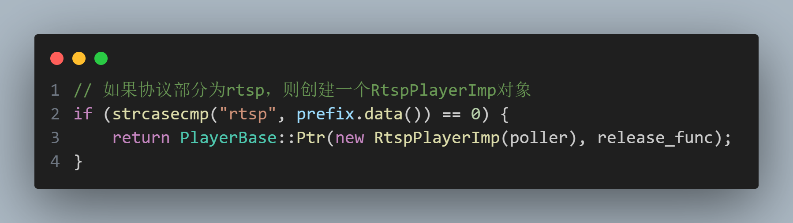
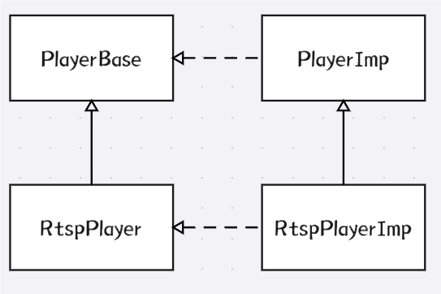

## createPlayer

```C 
static std::shared_ptr<PlayerBase> 
    createPlayer(const toolkit::EventPoller::Ptr &poller, const std::string &strUrl)
```



这边是智能指针的复制构造初始化，同时指定了智能指针的删除器为`release_func`。

构造出一个指向`RtspPlayerImp`的`PlayerBase`的`shared_ptr`

同时，传入`poller`参数，初始化`RtspPlayerImp`类

## PlayerImp

```C++
template<typename Parent, typename Delegate>
class PlayerImp : public Parent {
    public:
    using Ptr = std::shared_ptr<PlayerImp>;

    template<typename ...ArgsType>
    PlayerImp(ArgsType &&...args) : Parent(std::forward<ArgsType>(args)...) {}

    void play(const std::string &url) override {
        return _delegate ? _delegate->play(url) : Parent::play(url);
    }
    ......
    protected:
    ......
    std::shared_ptr<Delegate> _delegate;
};
```

`Delegate`一般是`PlayerBase`，`Parent`一般是具体的`Player`类

对于类中的函数，有`_delegate`的情况下，优先使用`_delegate`的，其次再使用`Parent`的


## 类图——工厂模式



ZLMediaKit中各个Player与PlayerBase之间的设计采用了工厂模式
