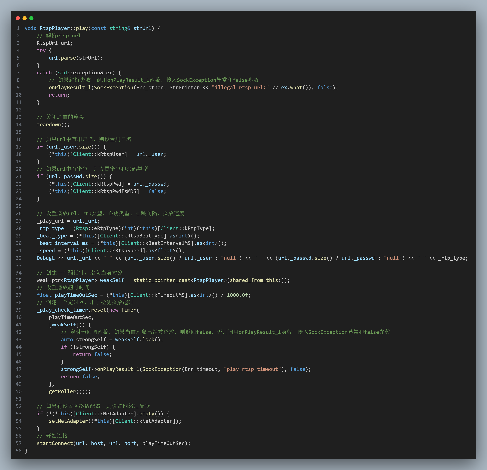
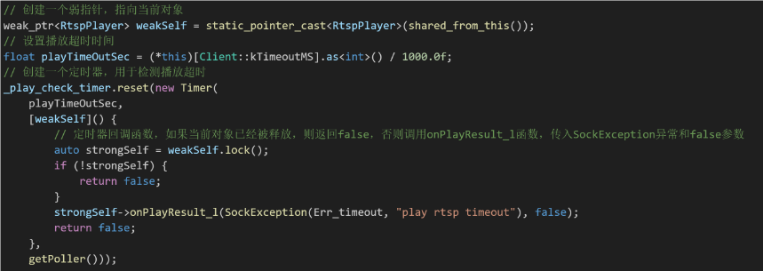
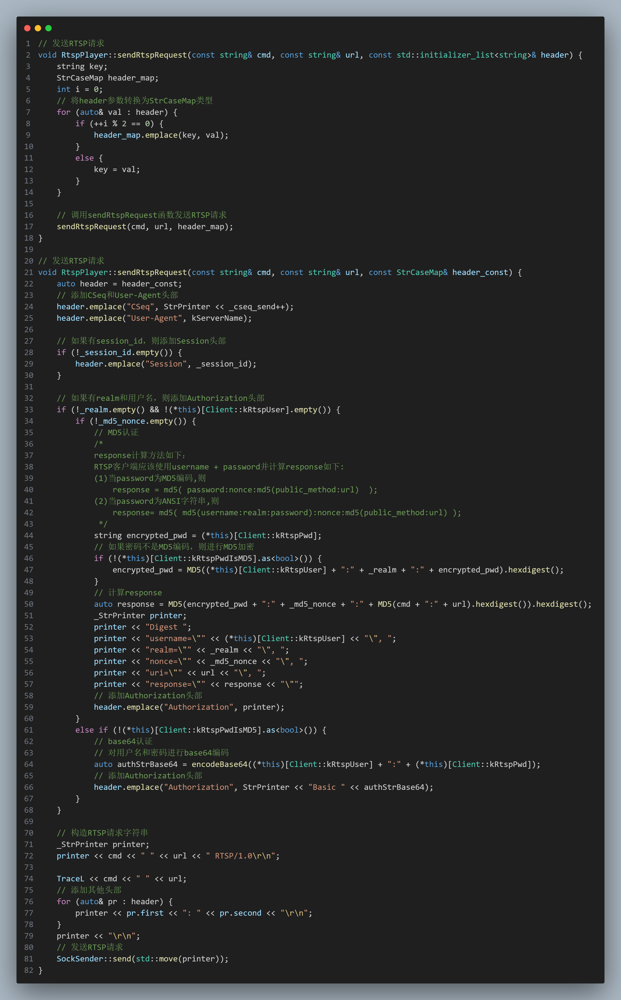
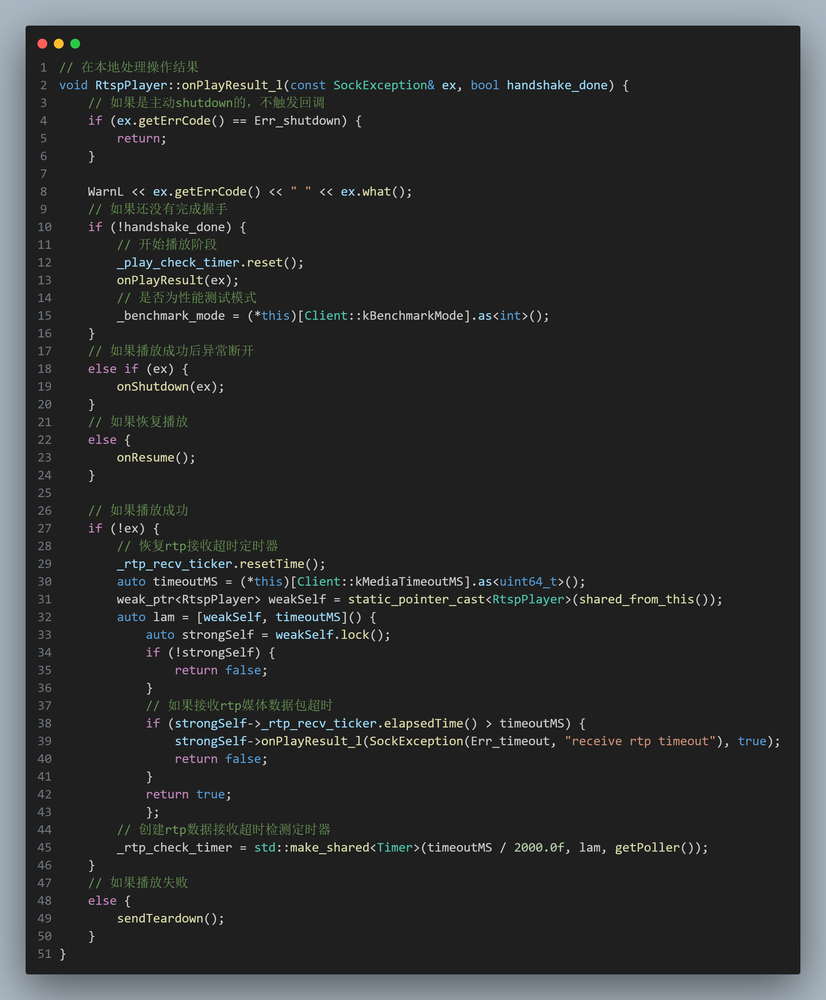

## 处理逻辑

**主动**

`sendOptions`等函数

**被动**

通过设置`_on_response`为`handleResOptions`等函数，在`onWholeRtspPacket`中调用`_on_response`实现。

## 建立连接

**使用指向自己的弱指针**

防止在别处要释放这个对象本身的时候，不能正常地释放

> 弱指针+回调函数

## 发送RTSP请求

## 本地处理操作结果

