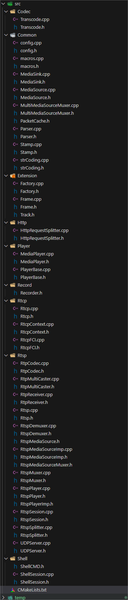

## 背景

尝试ZLMediaKit中实现Player的相关内容导出为.so共享库后发现，库文件的大小一度达到了100MB左右，在嵌入式环境下，这么大的库文件肯定是不能用的，所以着手优化库的体积。

## 尝试解决

### 1. 优化包含接口

该步骤主要裁剪ZLMediaKit中冗余的接口块，如Pusher等暂时不需要的功能。

裁剪之后体积变化

可以看到，优化后库的体积减小了约10%

### 2. 裁剪依赖库冗余模块

运行strip命令之后，可以看到库文件仍然还有MB

此时查看所依赖的静态库文件，其中体积较大的库有

- release/linux/Debug/libzlmediakit.a —— 217.18MB
- release/linux/Debug/libzltoolkit.a —— 31.12MB
- release/linux/Debug/libsrt.a —— 15.40MB
- release/linux/Debug/libext-codec.a —— 37.84MB

#### 1- libsrt.a

没用到SRT功能，整个不要了

#### 2- libext-codec.a

只留下AAC和H264/H265的Codec

#### 3- libzltoolkit.a

这个工具类暂时不动，里面的内容基本上都有用到，还比较基础

#### 4- libzlmediakit.a

**裁剪后**

具体内容见

https://github.com/Tsubaki-01/ZLMediaKit/tree/clean

#### 裁剪后libmk_api.so体积

### 3. strip命令裁剪符号及调试信息

从上一部分可以看到，裁剪掉ZLMediaKit中冗余的模块功能，对库文件的体积问题有所改善，但体积仍有32MB左右。

在网上查阅资料得知，有一个编译命令：`strip`，可以裁剪动态库的符号及调试信息

使用后库文件体积减小80%

