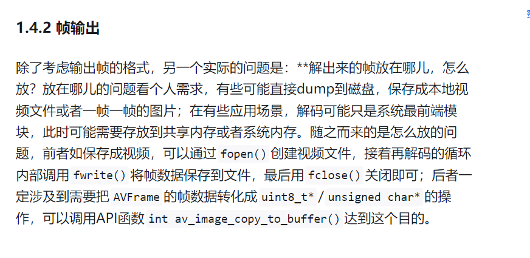
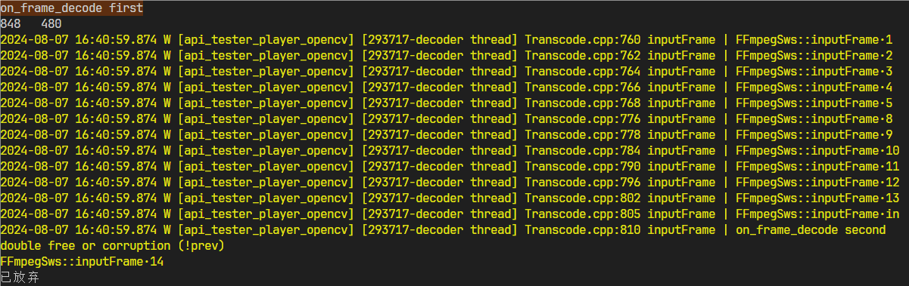
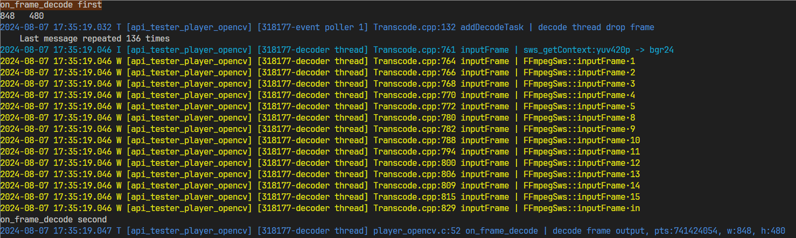
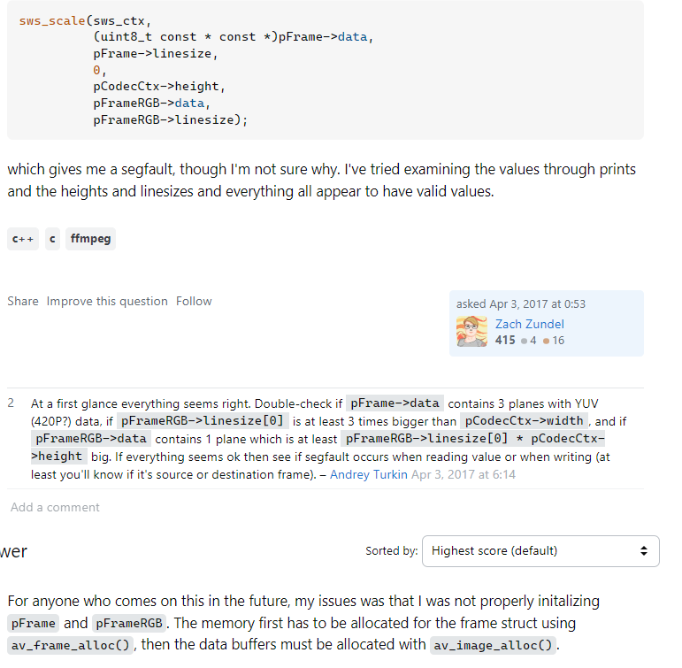
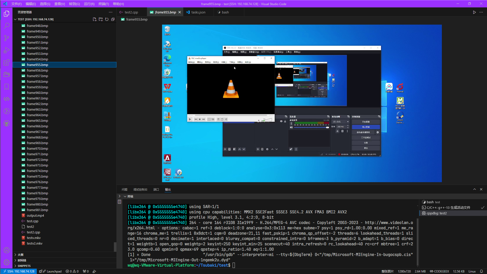
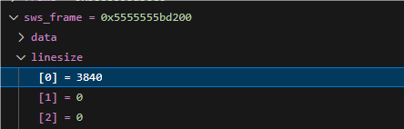

## 抓取视频流

`player_opencv.c`

文件


## FFmpeg

https://zhuanlan.zhihu.com/p/697547841



## 遇到的错误

### 1

`auto ret = avcodec_send_packet(_context.get(), pkt.get());`

会一直报错，unknown error 1313558101

找了一整天资料没有遇到这个问题的解决办法

大概知道是解码器的问题

最后     **尝试**

_context.get()，解码器默认是h264_qsv。

改成软件解码器就OK

### 2

段错误

```c
if (0 >= (ret = sws_scale(_ctx, frame->get()->data, frame->get()->linesize, 0, frame->get()->height, out->get()->data, out->get()->linesize))) {

        WarnL << "sws_scale failed:" << ffmpeg_err(ret);

        return nullptr;

      }
```



```c++
Thread 8 "decoder thread" received signal SIGSEGV, Segmentation fault.
[Switching to Thread 0x7fffe3e006c0 (LWP 304557)]
Download failed: 无效的参数.  Continuing without source file ./malloc/./malloc/malloc.c.
0x00007ffff68a9acf in unlink_chunk (p=p@entry=0x7fffc03e2670, av=0x7fffc0000030) at ./malloc/malloc.c:1610
warning: 1610   ./malloc/malloc.c: 没有那个文件或目录
(gdb) bt
#0  0x00007ffff68a9acf in unlink_chunk (p=p@entry=0x7fffc03e2670, av=0x7fffc0000030) at ./malloc/malloc.c:1610
#1  0x00007ffff68ac1c5 in _int_malloc (av=av@entry=0x7fffc0000030, bytes=bytes@entry=102368) at ./malloc/malloc.c:4381
#2  0x00007ffff68ad206 in _int_memalign
    (av=av@entry=0x7fffc0000030, alignment=alignment@entry=64, bytes=bytes@entry=102256) at ./malloc/malloc.c:5069
#3  0x00007ffff68ada22 in _mid_memalign (alignment=alignment@entry=64, bytes=bytes@entry=102256, address=<optimized out>)
    at ./malloc/malloc.c:3648
#4  0x00007ffff68af46c in __posix_memalign (size=102256, alignment=64, memptr=0x7fffe3df67b0) at ./malloc/malloc.c:5798
#5  __posix_memalign (memptr=memptr@entry=0x7fffe3df67b0, alignment=alignment@entry=64, size=102256)
    at ./malloc/malloc.c:5782
#6  0x00007ffff505fc15 in av_malloc (size=size@entry=102256) at src/libavutil/mem.c:105
#7  0x00007ffff502a4ca in av_buffer_alloc (size=size@entry=102256) at src/libavutil/buffer.c:82
#8  0x00007ffff502a552 in av_buffer_allocz (size=102256) at src/libavutil/buffer.c:95
#9  0x00007ffff502ae2e in pool_alloc_buffer (pool=0x7fffc000d680) at src/libavutil/buffer.c:363
#10 av_buffer_pool_get (pool=0x7fffc000d680) at src/libavutil/buffer.c:401
#11 0x00007ffff3dcb6c7 in alloc_picture (pic=0x7fffede32ed0, h=0x7fffedd87040) at src/libavcodec/h264_slice.c:248
#12 h264_frame_start (h=h@entry=0x7fffedd87040) at src/libavcodec/h264_slice.c:528
#13 0x00007ffff3dcee01 in h264_field_start
    (first_slice=<optimized out>, nal=0x7fffedd87040, sl=0x7fffd8008880, h=0x7fffc0001480)
    at src/libavcodec/h264_slice.c:1505
#14 ff_h264_queue_decode_slice (h=h@entry=0x7fffedd87040, nal=nal@entry=0x7fffc00012e0)
    at src/libavcodec/h264_slice.c:2132
--Type <RET> for more, q to quit, c to continue without paging--c
#15 0x00007ffff3dd41f7 in decode_nal_units (buf_size=386, buf=0x7fffc0005e70 "", h=0x7fffedd87040)
    at src/libavcodec/h264dec.c:651
#16 h264_decode_frame (avctx=<optimized out>, pict=0x7fffd8003f80, got_frame=0x7fffe3dff54c, avpkt=<optimized out>)
    at src/libavcodec/h264dec.c:1047
#17 0x00007ffff3ca8525 in decode_simple_internal
    (discarded_samples=0x7fffe3dff550, frame=<optimized out>, avctx=0x7fffd80084c0) at src/libavcodec/decode.c:430
#18 decode_simple_receive_frame (frame=0x7fffd8003f80, avctx=0x7fffd80084c0) at src/libavcodec/decode.c:609
#19 decode_receive_frame_internal (avctx=avctx@entry=0x7fffd80084c0, frame=0x7fffd8003f80) at src/libavcodec/decode.c:637
#20 0x00007ffff3ca8b24 in avcodec_send_packet (avctx=0x7fffd80084c0, avpkt=0x7fffc0001180) at src/libavcodec/decode.c:734
#21 0x00007ffff77fa870 in mediakit::FFmpegDecoder::decodeFrame
    (this=0x7fffd8004810, data=0x7fffd8027b30 "", size=386, dts=1723021519921, pts=1723021520046, live=false, key_frame=false) at /home/wq/Tsubaki/ZLMediaKit/src/Codec/Transcode.cpp:624
#22 0x00007ffff77fa325 in mediakit::FFmpegDecoder::inputFrame_l
    (this=0x7fffd8004810, frame=std::shared_ptr<mediakit::Frame> (use count 1, weak count 0) = {...}, live=false, enable_merge=true) at /home/wq/Tsubaki/ZLMediaKit/src/Codec/Transcode.cpp:551
#23 0x00007ffff77fa3bf in operator() (__closure=0x7fffd8006940) at /home/wq/Tsubaki/ZLMediaKit/src/Codec/Transcode.cpp:566
#24 0x00007ffff77fefe4 in std::__invoke_impl<void, mediakit::FFmpegDecoder::inputFrame(const mediakit::Frame::Ptr&, bool, bool, bool)::<lambda()>&>(std::__invoke_other, struct {...} &) (__f=...) at /usr/include/c++/13/bits/invoke.h:61
#25 0x00007ffff77fe522 in std::__invoke_r<void, mediakit::FFmpegDecoder::inputFrame(const mediakit::Frame::Ptr&, bool, bool, bool)::<lambda()>&>(struct {...} &) (__fn=...) at /usr/include/c++/13/bits/invoke.h:150
#26 0x00007ffff77fdcdf in std::_Function_handler<void(), mediakit::FFmpegDecoder::inputFrame(const mediakit::Frame::Ptr&, bool, bool, bool)::<lambda()> >::_M_invoke(const std::_Any_data &) (__functor=...)
    at /usr/include/c++/13/bits/std_function.h:290
#27 0x00007ffff76c8168 in std::function<void ()>::operator()() const (this=0x7fffe3dff8a0)
    at /usr/include/c++/13/bits/std_function.h:591
#28 0x00007ffff77f808b in mediakit::TaskManager::onThreadRun (this=0x7fffd8004810, name="decoder thread")
    at /home/wq/Tsubaki/ZLMediaKit/src/Codec/Transcode.cpp:207
#29 0x00007ffff77f7a74 in operator() (__closure=0x7fffd8003938) at /home/wq/Tsubaki/ZLMediaKit/src/Codec/Transcode.cpp:156
#30 0x00007ffff7801cb4 in std::__invoke_impl<void, mediakit::TaskManager::startThread(const std::string&)::<lambda()> >(std::__invoke_other, struct {...} &&) (__f=...) at /usr/include/c++/13/bits/invoke.h:61
#31 0x00007ffff7801c77 in std::__invoke<mediakit::TaskManager::startThread(const std::string&)::<lambda()> >(struct {...} &&) (__fn=...) at /usr/include/c++/13/bits/invoke.h:96
#32 0x00007ffff7801c24 in std::thread::_Invoker<std::tuple<mediakit::TaskManager::startThread(const std::string&)::<lambda()> > >::_M_invoke<0>(std::_Index_tuple<0>) (this=0x7fffd8003938) at /usr/include/c++/13/bits/std_thread.h:292
#33 0x00007ffff7801ba4 in std::thread::_Invoker<std::tuple<mediakit::TaskManager::startThread(const std::string&)::<lambda()> > >::operator()(void) (this=0x7fffd8003938) at /usr/include/c++/13/bits/std_thread.h:299
#34 0x00007ffff78019fc in std::thread::_State_impl<std::thread::_Invoker<std::tuple<mediakit::TaskManager::startThread(const std::string&)::<lambda()> > > >::_M_run(void) (this=0x7fffd8003930) at /usr/include/c++/13/bits/std_thread.h:244
#35 0x00007ffff36eabb4 in std::execute_native_thread_routine (__p=0x7fffd8003930)
    at ../../../../../src/libstdc++-v3/src/c++11/thread.cc:104
#36 0x00007ffff689ca94 in start_thread (arg=<optimized out>) at ./nptl/pthread_create.c:447
#37 0x00007ffff6929c3c in clone3 () at ../sysdeps/unix/sysv/linux/x86_64/clone3.S:78
```

```c++
Thread 8 "decoder thread" received signal SIGSEGV, Segmentation fault.
[Switching to Thread 0x7fffe3e006c0 (LWP 307400)]
Downloading source file /build/ffmpeg-O0xFfA/ffmpeg-6.1.1/libswscale/x86//src//libavutil/x86/x86inc.asm
0x00007ffff6b318f2 in ff_yuv_420_bgr24_ssse3.loop0 () at src//libavutil/x86/x86inc.asm:1264                                
warning: 1264   src//libavutil/x86/x86inc.asm: 没有那个文件或目录
(gdb) bt
#0  0x00007ffff6b318f2 in ff_yuv_420_bgr24_ssse3.loop0 () at src//libavutil/x86/x86inc.asm:1264
#1  0x00007ffff6b303b4 in yuv420_bgr24_ssse3
    (c=0x7fffc02a8e40, src=0x7fffe3dff220, srcStride=0x7fffe3dff200, srcSliceY=0, srcSliceH=480, dst=0x7fffe3dff240, dstStride=0x7fffe3dff210) at src/libswscale/x86/yuv2rgb_template.c:192
#2  0x00007ffff6af37c9 in scale_internal
    (c=<optimized out>, srcSlice=<optimized out>, srcStride=<optimized out>, srcSliceY=<optimized out>, srcSliceH=<optimized out>, dstSlice=<optimized out>, dstStride=<optimized out>, dstSliceY=<optimized out>, dstSliceH=<optimized out>)
    at src/libswscale/swscale.c:1041
#3  0x00007ffff6af5710 in sws_scale
    (c=<optimized out>, srcSlice=<optimized out>, srcStride=<optimized out>, srcSliceY=<optimized out>, srcSliceH=<optimized out>, dst=<optimized out>, dstStride=0x7fffc02b8240) at src/libswscale/swscale.c:1213
#4  0x00007ffff77fc9ee in mediakit::FFmpegSws::inputFrame
    (this=0x555555583d70, frame=std::shared_ptr<mediakit::FFmpegFrame> (use count 1, weak count 0) = {...}, ret=@0x7fffe3dff42c: -1, data=0x7fffeaad5010 "3*.3*.3*.3*.3*.3*.3*.3*.4+/4+/4+/4+/4+/4+/4+/4+/4+/4+/4+/4+/4+/4+/4+/4+/3*.3*.3*.3*.3*.3*.3*.3*.3*.3*.3*.3*.3*.3*.3*.3*.0*-0*-0*-0*-0*-0*-0*-0*-0*-0*-0*-0*-0*-0*-0*-0*-1+.1+.1+.1+.1+.1+.1+.1+.1*01*01*"...)
    at /home/wq/Tsubaki/ZLMediaKit/src/Codec/Transcode.cpp:806
#5  0x00007ffff77fba60 in mediakit::FFmpegSws::inputFrame
    (this=0x555555583d70, frame=std::shared_ptr<mediakit::FFmpegFrame> (use count 1, weak count 0) = {...}, data=0x7fffeaad5010 "3*.3*.3*.3*.3*.3*.3*.3*.4+/4+/4+/4+/4+/4+/4+/4+/4+/4+/4+/4+/4+/4+/4+/4+/3*.3*.3*.3*.3*.3*.3*.3*.3*.3*.3*.3*.3*.3*.3*.3*.0*-0*-0*-0*-0*-0*-0*-0*-0*-0*-0*-0*-0*-0*-0*-0*-1+.1+.1+.1+.1+.1+.1+.1+.1*01*01*"...)
    at /home/wq/Tsubaki/ZLMediaKit/src/Codec/Transcode.cpp:729
#6  0x00007ffff77595a1 in mk_swscale_input_frame
    (ctx=0x555555583d70, frame=0x7fffe3dff630, data=0x7fffeaad5010 "3*.3*.3*.3*.3*.3*.3*.3*.4+/4+/4+/4+/4+/4+/4+/4+/4+/4+/4+/4+/4+/4+/4+/4+/3*.3*.3*.3*.3*.3*.3*.3*.3*.3*.3*.3*.3*.3*.3*.3*.0*-0*-0*-0*-0*-0*-0*-0*-0*-0*-0*-0*-0*-0*-0*-0*-1+.1+.1+.1+.1+.1+.1+.1+.1*01*01*"...) at /home/wq/Tsubaki/ZLMediaKit/api/source/mk_transcode.cpp:131
#7  0x0000555555555593 in on_frame_decode (user_data=0x7fffffffdcc0, frame=0x7fffe3dff630)
```

```c++
(gdb) print frame->get()->linesize
$1 = {896, 448, 448, 0, 0, 0, 0, 0}
(gdb) print out->get()->linesize
$2 = {2560, 0, 0, 0, 0, 0, 0, 0}
```

```c++
#0  __pthread_kill_implementation (no_tid=0, signo=6, threadid=<optimized out>) at ./nptl/pthread_kill.c:44
#1  __pthread_kill_internal (signo=6, threadid=<optimized out>) at ./nptl/pthread_kill.c:78
#2  __GI___pthread_kill (threadid=<optimized out>, signo=signo@entry=6) at ./nptl/pthread_kill.c:89
#3  0x00007ffff684526e in __GI_raise (sig=sig@entry=6) at ../sysdeps/posix/raise.c:26
#4  0x00007ffff68288ff in __GI_abort () at ./stdlib/abort.c:79
#5  0x00007ffff68297b6 in __libc_message_impl (fmt=fmt@entry=0x7ffff69ce8d7 "%s\n") at ../sysdeps/posix/libc_fatal.c:132
#6  0x00007ffff68a8fe5 in malloc_printerr (str=str@entry=0x7ffff69d1ae0 "double free or corruption (!prev)")
    at ./malloc/malloc.c:5772
#7  0x00007ffff68ab11c in _int_free_merge_chunk (av=0x7fffc0000030, p=0x7fffc02bfb30, size=1221136)
    at ./malloc/malloc.c:4679
#8  0x00007ffff68ab42a in _int_free (av=0x7fffc0000030, p=<optimized out>, have_lock=<optimized out>)
    at ./malloc/malloc.c:4646
#9  0x00007ffff68add9e in __GI___libc_free (mem=0x7fffc02bfb40) at ./malloc/malloc.c:3398
#10 0x00005555555555b5 in on_frame_decode (user_data=0x7fffffffdcc0, frame=0x7fffe3dff630)
    at /home/wq/Tsubaki/ZLMediaKit/api/tests/player_opencv.c:45
#11 0x00007ffff7758c6f in operator()
    (__closure=0x7fffd0008280, pix_frame=std::shared_ptr<mediakit::FFmpegFrame> (use count 1, weak count 0) = {...})
--Type <RET> for more, q to quit, c to continue without paging--c
    at /home/wq/Tsubaki/ZLMediaKit/api/source/mk_transcode.cpp:67
#12 0x00007ffff7759f7b in std::__invoke_impl<void, mk_decoder_set_cb2(mk_decoder, on_mk_decode, void*, on_user_data_free)::<lambda(const mediakit::FFmpegFrame::Ptr&)>&, const std::shared_ptr<mediakit::FFmpegFrame>&>(std::__invoke_other, struct {...} &) (__f=...) at /usr/include/c++/13/bits/invoke.h:61
#13 0x00007ffff7759d3d in std::__invoke_r<void, mk_decoder_set_cb2(mk_decoder, on_mk_decode, void*, on_user_data_free)::<lambda(const mediakit::FFmpegFrame::Ptr&)>&, const std::shared_ptr<mediakit::FFmpegFrame>&>(struct {...} &) (__fn=...)
    at /usr/include/c++/13/bits/invoke.h:150
#14 0x00007ffff7759a23 in std::_Function_handler<void(const std::shared_ptr<mediakit::FFmpegFrame>&), mk_decoder_set_cb2(mk_decoder, on_mk_decode, void*, on_user_data_free)::<lambda(const mediakit::FFmpegFrame::Ptr&)> >::_M_invoke(const std::_Any_data &, const std::shared_ptr<mediakit::FFmpegFrame> &)
    (__functor=..., __args#0=std::shared_ptr<mediakit::FFmpegFrame> (use count 1, weak count 0) = {...})
    at /usr/include/c++/13/bits/std_function.h:290
#15 0x00007ffff7803151 in std::function<void (std::shared_ptr<mediakit::FFmpegFrame> const&)>::operator()(std::shared_ptr<mediakit::FFmpegFrame> const&) const
    (this=0x7fffd0009ec0, __args#0=std::shared_ptr<mediakit::FFmpegFrame> (use count 1, weak count 0) = {...})
    at /usr/include/c++/13/bits/std_function.h:591
#16 0x00007ffff77fb312 in mediakit::FFmpegDecoder::onDecode
    (this=0x7fffd0009db0, frame=std::shared_ptr<mediakit::FFmpegFrame> (use count 1, weak count 0) = {...})
    at /home/wq/Tsubaki/ZLMediaKit/src/Codec/Transcode.cpp:662
#17 0x00007ffff77fb124 in mediakit::FFmpegDecoder::decodeFrame
    (this=0x7fffd0009db0, data=0x7fffd0023450 "", size=1684, dts=1723022467555, pts=1723022467576, live=false, key_frame=false) at /home/wq/Tsubaki/ZLMediaKit/src/Codec/Transcode.cpp:651
#18 0x00007ffff77fa82f in mediakit::FFmpegDecoder::inputFrame_l
    (this=0x7fffd0009db0, frame=std::shared_ptr<mediakit::Frame> (use count 1, weak count 0) = {...}, live=false, enable_merge=true) at /home/wq/Tsubaki/ZLMediaKit/src/Codec/Transcode.cpp:551
```

有时候行，大部分时候不行

定位到是sws_scale错误





#### 解决问题

##### 单独程序调试

```c++
#include <iostream>
#include <memory>
#include <cstdio>
#include <cstdint>
#include <cstdlib>
extern "C" {
#include <libavcodec/avcodec.h>
#include <libavformat/avformat.h>
#include <libavutil/avutil.h>
#include <libavutil/pixfmt.h>
#include <libavutil/pixdesc.h>
#include <libswscale/swscale.h>
#include <libavformat/avio.h>
#include <libavutil/imgutils.h>
}
void save_frame_as_bmp(AVFrame* frame, int width, int height, int index) {
    FILE* file;
    char filename[32];
    int y;

    // 创建文件名
    snprintf(filename, sizeof(filename), "frame%d.bmp", index);

    // 打开文件
    file = fopen(filename, "wb");
    if (!file) {
        fprintf(stderr, "Could not open %s\n", filename);
        return;
    }

    // BMP 文件头
    uint8_t bmpfileheader[14] = {
        'B', 'M',           // Magic number for file
        0, 0, 0, 0,         // Size of the file (will set later)
        0, 0,               // Reserved
        0, 0,               // Reserved
        54, 0, 0, 0         // Start of pixel array (54 bytes)
    };

    // DIB 文件头（BITMAPINFOHEADER）
    uint8_t bmpinfoheader[40] = {
        40, 0, 0, 0,        // Header size
        0, 0, 0, 0,         // Image width (will set later)
        0, 0, 0, 0,         // Image height (will set later)
        1, 0,               // Number of color planes
        24, 0,              // Bits per pixel (24 for BGR)
        0, 0, 0, 0,         // Compression (no compression)
        0, 0, 0, 0,         // Image size (can be zero for no compression)
        19, 11, 0, 0,       // Horizontal resolution (pixels per meter)
        19, 11, 0, 0,       // Vertical resolution (pixels per meter)
        0, 0, 0, 0          // Number of colors in palette
    };

    int filesize = width * height * 3 + sizeof(bmpfileheader) + sizeof(bmpinfoheader);

    bmpfileheader[2] = filesize;
    bmpfileheader[3] = filesize >> 8;
    bmpfileheader[4] = filesize >> 16;
    bmpfileheader[5] = filesize >> 24;

    bmpinfoheader[4] = width;
    bmpinfoheader[5] = width >> 8;
    bmpinfoheader[6] = width >> 16;
    bmpinfoheader[7] = width >> 24;

    bmpinfoheader[8] = height;
    bmpinfoheader[9] = height >> 8;
    bmpinfoheader[10] = height >> 16;
    bmpinfoheader[11] = height >> 24;

    fwrite(bmpfileheader, 1, sizeof(bmpfileheader), file);
    fwrite(bmpinfoheader, 1, sizeof(bmpinfoheader), file);

    for (y = height - 1; y >= 0; y--) {
        fwrite(frame->data[0] + y * frame->linesize[0], 3, width, file);
    }

    fclose(file);
}
// 自定义删除器，用于释放 AVCodecContext
void av_codec_context_deleter(AVCodecContext* ctx) {
    if (ctx) {
        avcodec_free_context(&ctx);
    }
}

// 获取像素格式名称的示例函数
void print_pix_fmt_name(std::shared_ptr<AVCodecContext> context) {
    if (!context) {
        std::cerr << "AVCodecContext is null." << std::endl;
        return;
    }

    const char* pix_fmt_name = av_get_pix_fmt_name(context->pix_fmt);
    if (!pix_fmt_name) {
        std::cerr << "Unknown or uninitialized pixel format." << std::endl;
    }
    else {
        std::cout << "Pixel Format: " << pix_fmt_name << std::endl;
    }
}

// 初始化输出视频文件
int init_output_file(AVFormatContext** out_fmt_ctx, AVStream** out_stream, const char* filename, AVCodecContext* codec_ctx) {
    // 创建输出格式上下文
    avformat_alloc_output_context2(out_fmt_ctx, nullptr, nullptr, filename);
    if (!*out_fmt_ctx) {
        std::cerr << "Could not create output context." << std::endl;
        return -1;
    }

    // 查找编码器
    const AVCodec* out_codec = avcodec_find_encoder(AV_CODEC_ID_H264);
    if (!out_codec) {
        std::cerr << "Necessary encoder not found." << std::endl;
        return -1;
    }

    // 创建输出流
    *out_stream = avformat_new_stream(*out_fmt_ctx, out_codec);
    if (!*out_stream) {
        std::cerr << "Failed to allocate the output stream." << std::endl;
        return -1;
    }

    // 初始化编码器上下文
    AVCodecContext* out_codec_ctx = avcodec_alloc_context3(out_codec);
    if (!out_codec_ctx) {
        std::cerr << "Failed to allocate the encoder context." << std::endl;
        return -1;
    }

    // 设置编码器参数
    out_codec_ctx->height = codec_ctx->height;
    out_codec_ctx->width = codec_ctx->width;
    out_codec_ctx->sample_aspect_ratio = codec_ctx->sample_aspect_ratio;
    out_codec_ctx->pix_fmt = AV_PIX_FMT_YUV420P;  // 确保使用 YUV420P 格式
    out_codec_ctx->time_base = av_inv_q(codec_ctx->framerate);

    if ((*out_fmt_ctx)->oformat->flags & AVFMT_GLOBALHEADER)
        out_codec_ctx->flags |= AV_CODEC_FLAG_GLOBAL_HEADER;

    if (avcodec_open2(out_codec_ctx, out_codec, nullptr) < 0) {
        std::cerr << "Cannot open video encoder for output file." << std::endl;
        return -1;
    }

    // 复制编码器参数到输出流
    if (avcodec_parameters_from_context((*out_stream)->codecpar, out_codec_ctx) < 0) {
        std::cerr << "Failed to copy encoder parameters to output stream." << std::endl;
        return -1;
    }

    // 打开输出文件
    if (!((*out_fmt_ctx)->oformat->flags & AVFMT_NOFILE)) {
        if (avio_open(&(*out_fmt_ctx)->pb, filename, AVIO_FLAG_WRITE) < 0) {
            std::cerr << "Could not open output file." << std::endl;
            return -1;
        }
    }

    // 写文件头
    if (avformat_write_header(*out_fmt_ctx, nullptr) < 0) {
        std::cerr << "Error occurred when writing header to output file." << std::endl;
        return -1;
    }

    return 0;
}

// 解码并输出视频
int decode_and_output(AVFormatContext* fmt_ctx, AVCodecContext* codec_ctx, int video_stream_index, const char* output_filename) {
    AVPacket packet;
    AVFrame* frame = av_frame_alloc();

    // 确保 sws_frame 的像素格式为 YUV420P 
    AVFrame* sws_frame = av_frame_alloc();
    sws_frame->format = AV_PIX_FMT_BGR24;
    sws_frame->width = codec_ctx->width;
    sws_frame->height = codec_ctx->height;
    av_image_alloc(sws_frame->data, sws_frame->linesize, codec_ctx->width, codec_ctx->height, (AVPixelFormat)sws_frame->format, 32);


    int frame_number = 0;


    SwsContext* sws_ctx = sws_getContext(codec_ctx->width, codec_ctx->height,
        codec_ctx->pix_fmt,
        codec_ctx->width,
        codec_ctx->height,
        (AVPixelFormat)sws_frame->format,
        SWS_BICUBIC,
        nullptr,
        nullptr,
        nullptr);

    if (!sws_ctx || !frame || !sws_frame) {
        std::cerr << "Failed to allocate sws context or frames" << std::endl;
        return -1;
    }


    AVFormatContext* out_fmt_ctx = nullptr;
    AVStream* out_stream = nullptr;

    // 如果输入视频的帧率没有设置，则使用 av_guess_frame_rate 函数猜测帧率
    if (!codec_ctx->framerate.num || !codec_ctx->framerate.den) {
        codec_ctx->framerate = av_guess_frame_rate(fmt_ctx, fmt_ctx->streams[video_stream_index], nullptr);
    }

    // 初始化输出文件
    if (init_output_file(&out_fmt_ctx, &out_stream, output_filename, codec_ctx) < 0) {
        std::cerr << "Failed to initialize output file." << std::endl;
        return -1;
    }

    // 获取输出流的编解码参数
    AVCodecParameters* codecpar = out_stream->codecpar; // 你的 AVCodecParameters
    const AVCodec* out_codec = avcodec_find_decoder(codecpar->codec_id);
    AVCodecContext* out_codec_ctx = avcodec_alloc_context3(out_codec);

    // 读取输入文件中的数据包
    while (av_read_frame(fmt_ctx, &packet) >= 0) {
        // 如果数据包是视频流
        if (packet.stream_index == video_stream_index) {
            // 发送数据包进行解码
            if (avcodec_send_packet(codec_ctx, &packet) == 0) {
                // 接收解码后的帧
                while (avcodec_receive_frame(codec_ctx, frame) == 0) {
                    // 将解码后的帧进行格式转换
                    sws_scale(sws_ctx,
                        frame->data,
                        frame->linesize,
                        0,
                        codec_ctx->height,
                        sws_frame->data,
                        sws_frame->linesize);

                    // 设置转换后的帧的显示时间戳
                    sws_frame->pts = frame->pts;

                    {
                        save_frame_as_bmp(sws_frame, codec_ctx->width, codec_ctx->height, frame_number++);
                    }
                    // 发送转换后的帧进行编码
                    /* if (avcodec_send_frame(out_codec_ctx, sws_frame) == 0) {

                        // 接收编码后的数据包
                        while (avcodec_receive_packet(out_codec_ctx, &packet) == 0) {

                            // 设置数据包的流索引
                            packet.stream_index = out_stream->index;

                            // 写入数据包到输出文件
                            if (av_interleaved_write_frame(out_fmt_ctx, &packet) < 0) {

                                std::cerr << "Error while writing video frame" << std::endl;

                                return-1;

                            }

                            // 释放数据包
                            av_packet_unref(&packet);

                        }

                    } */

                }
            }
            else {
                std::cerr << "Error sending packet for decoding" << std::endl;
                return-1;

            }

        }

        // 释放数据包
        av_packet_unref(&packet);

    }

    // 写文件尾

    av_write_trailer(out_fmt_ctx);

    // 释放资源

    av_frame_free(&frame);

    av_frame_free(&sws_frame);

    sws_freeContext(sws_ctx);

    avio_closep(&out_fmt_ctx->pb);

    avformat_free_context(out_fmt_ctx);

    return 0;

}


int main() {


    // 打开输入文件

    AVFormatContext* fmt_ctx = nullptr;

    if (avformat_open_input(&fmt_ctx, "testv2.mkv", nullptr, nullptr) < 0) {

        std::cerr << "Could not open source file" << std::endl;

        return-1;

    }


    // 查找流信息

    if (avformat_find_stream_info(fmt_ctx, nullptr) < 0) {

        std::cerr << "Could not find stream information" << std::endl;

        return-1;

    }


    // 查找视频流索引

    int video_stream_index = -1;

    for (int i = 0;i < fmt_ctx->nb_streams;i++) {

        if (fmt_ctx->streams[i]->codecpar->codec_type == AVMEDIA_TYPE_VIDEO) {

            video_stream_index = i;

            break;

        }

    }


    if (video_stream_index == -1) {

        std::cerr << "Could not find video stream" << std::endl;

        return-1;

    }


    // 查找解码器

    const AVCodec* codec = avcodec_find_decoder(fmt_ctx->streams[video_stream_index]->codecpar->codec_id);

    if (!codec) {

        std::cerr << "Codec not found" << std::endl;

        return-1;

    }


    // 分配并初始化 AVCodecContext

    std::shared_ptr<AVCodecContext > codec_ctx(avcodec_alloc_context3(codec), av_codec_context_deleter);

    if (!codec_ctx) {

        std::cerr << "Could not allocate video codec context" << std::endl;

        return-1;

    }


    // 从 AVCodecParameters 初始化 AVCodecContext

    if (avcodec_parameters_to_context(codec_ctx.get(), fmt_ctx->streams[video_stream_index]->codecpar) < 0) {

        std::cerr << "Failed to copy codec parameters to decoder context" << std::endl;

        return-1;

    }


    // 打开解码器

    if (avcodec_open2(codec_ctx.get(), codec, nullptr) < 0) {

        std::cerr << "Could not open codec" << std::endl;

        return-1;

    }


    // 检查像素格式（初始化解码后）

    AVFrame* frame = av_frame_alloc();

    AVPacket packet;

    av_new_packet(&packet, 0);


    // 读取帧以初始化像素格式

    bool frame_decoded = false;

    while (av_read_frame(fmt_ctx, &packet) >= 0) {

        if (packet.stream_index == video_stream_index) {

            if (avcodec_send_packet(codec_ctx.get(), &packet) == 0) {

                if (avcodec_receive_frame(codec_ctx.get(), frame) == 0) {

                    frame_decoded = true;

                    break;

                }

            }

        }

        av_packet_unref(&packet);

    }


    av_packet_unref(&packet);

    av_frame_free(&frame);


    if (!frame_decoded) {

        std::cerr << "Failed to decode a frame,pixel format may not be initialized" << std::endl;

        return-1;

    }


    // 打印像素格式名称

    print_pix_fmt_name(codec_ctx);

    std::cout << codec_ctx.get()->codec->name << std::endl;

    // 解码并输出视频

    if (decode_and_output(fmt_ctx, codec_ctx.get(), video_stream_index, "output.mp4") < 0) {

        std::cerr << "Failed to decode and output video" << std::endl;

        return-1;

    }


    return 0;

}

```


输出bmp图片正常



sws_frame的linesize是视频宽度1280的三倍（符合官方说明）




#### 解决

是库里面给的示例程序里申请的char* 空间不够导致的，没有考虑到内存对齐

```c++
// 当视频帧解码完成时调用的回调函数
void API_CALL on_frame_decode(void* user_data, mk_frame_pix frame) {
    Context* ctx = (Context*)user_data;
    int w = mk_get_av_frame_width(mk_frame_pix_get_av_frame(frame));
    int h = mk_get_av_frame_height(mk_frame_pix_get_av_frame(frame));
    printf("on_frame_decode first\n%d   %d\n", w, h);

#if 1
    // 将解码后的帧转换为BRG24格式
    int align = 32; // 对齐值（32 字节）

    // 每个像素3字节，对于BRG24格式
    size_t pixel_size = 3;

    // 原始行大小（未对齐）
    size_t raw_linesize = w * pixel_size;

    // 对齐后的行大小
    size_t aligned_linesize = (raw_linesize + align - 1) & ~(align - 1);

    // 总内存大小
    size_t total_size = aligned_linesize * h;
    uint8_t* brg24 = malloc(total_size);

    mk_swscale_input_frame(ctx->swscale, frame, brg24);
```

