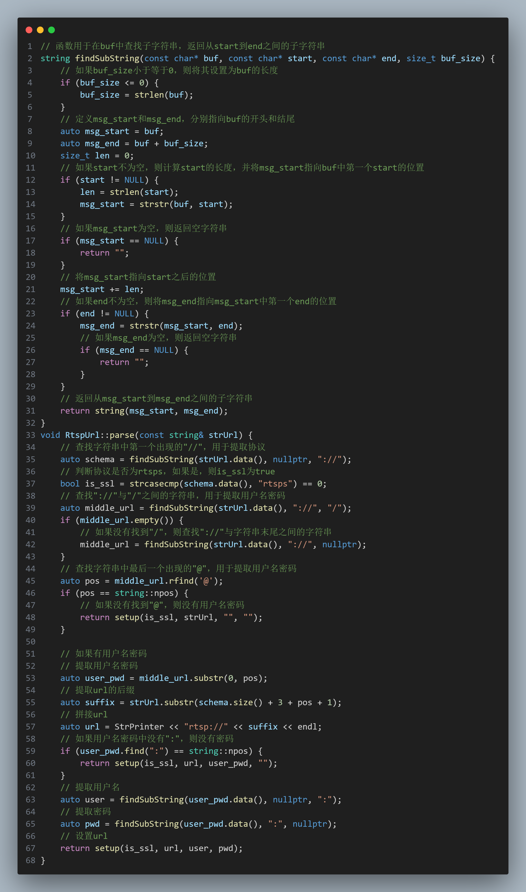
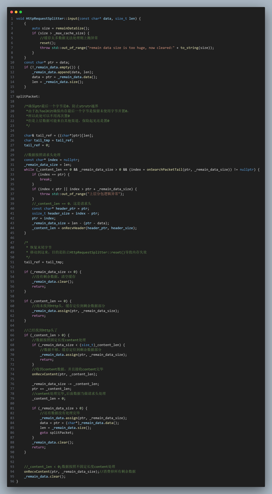
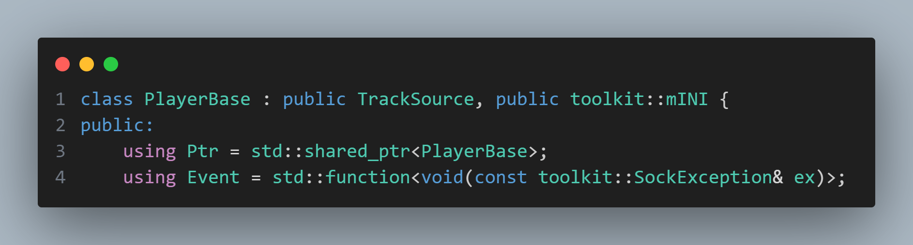
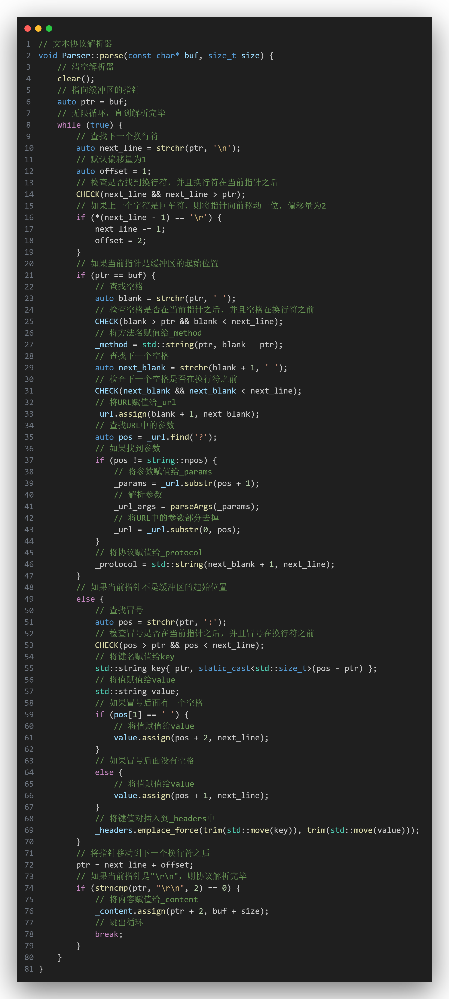
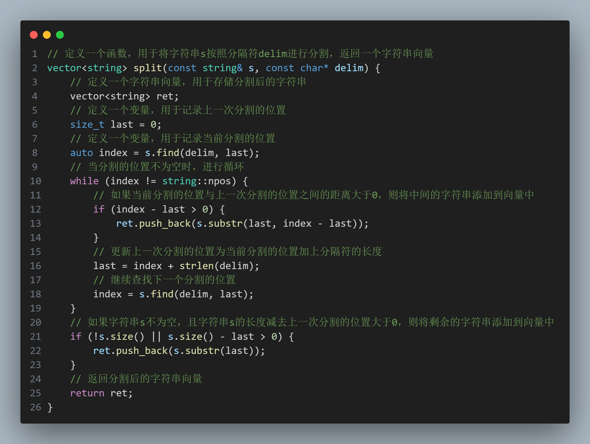
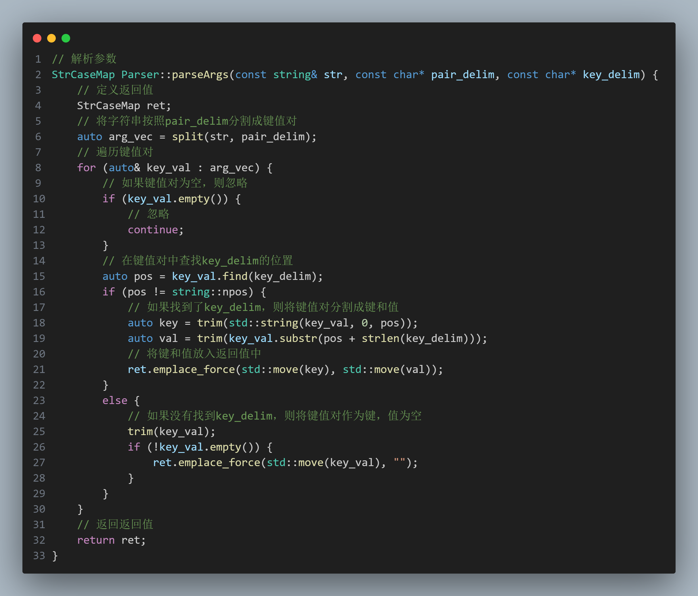
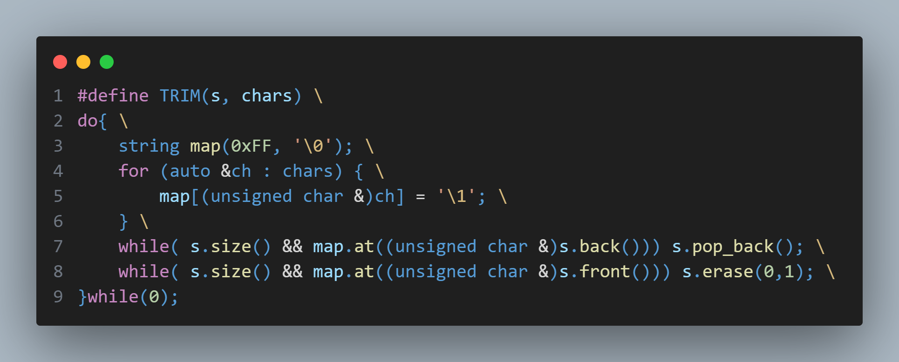
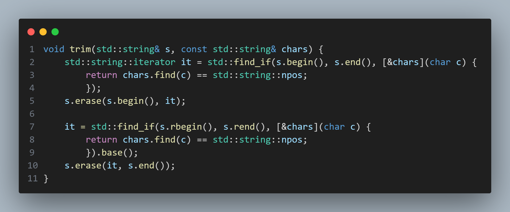

## 在区间内查找出现的第一个子字符串



## HTTP请求解析分割



## 类型智能指针别名



> 这个声明定义了一个类型别名 `Ptr`，它代表 `std::shared_ptr<PlayerBase>`。这意味着 `Ptr` 是一个指向 `PlayerBase` 对象的共享指针。
>
> 它们只是编译时的替换，类似于C中的宏替换。类型别名的定义在编译时被替换成实际的类型，之后编译器再处理这些实际的类型。因此，它们的作用范围（scope）仅限于定义它们的作用域。通常，类型别名会被定义在类内部或命名空间内部，使得它们在该作用域内有效。
>
> 在类的作用域内使用 `PlayerBase::Ptr` 来表示 `std::shared_ptr<PlayerBase>`
>
> 通过使用类型别名，可以使代码更简洁，特别是在处理复杂类型时。将类型别名放在类的内部，可以提高代码的可读性和可维护性，使其更符合面向对象编程的原则。

## 针对基本类型，无智能指针封装时的RAII


> 针对于基本类型，无智能指针封装时的RAII

## HTTP、RTSP等文本协议解析器



## SDP解析器

```C++
// 加载SDP字符串
void SdpParser::load(const string& sdp) {
    {
        // 清空_track_vec
        _track_vec.clear();
        // 创建一个新的SdpTrack对象
        SdpTrack::Ptr track = std::make_shared<SdpTrack>();
        // 设置_track_vec的第一个元素为TrackTitle类型
        track->_type = TrackTitle;
        _track_vec.emplace_back(track);

        // 将sdp字符串按行分割
        auto lines = split(sdp, "\n");
        // 遍历每一行
        for (auto& line : lines) {
            // 去除行首和行尾的空格
            trim(line);
            // 如果行长度小于2或者第二位不是'='，则跳过
            if (line.size() < 2 || line[1] != '=') {
                continue;
            }
            // 获取选项和选项值
            char opt = line[0];
            string opt_val = line.substr(2);
            // 根据选项类型进行不同的处理
            switch (opt) {
            case 't':
                // 设置_track_vec的第一个元素的_t属性
                track->_t = opt_val;
                break;
            case 'b':
                // 设置_track_vec的第一个元素的_b属性
                track->_b = opt_val;
                break;
            case 'm': {
                // 创建一个新的SdpTrack对象
                track = std::make_shared<SdpTrack>();
                int pt, port, port_count;
                char rtp[16] = { 0 }, type[16];
                // 解析选项值
                if (4 == sscanf(opt_val.data(), " %15[^ ] %d %15[^ ] %d", type, &port, rtp, &pt) ||
                    5 == sscanf(opt_val.data(), " %15[^ ] %d/%d %15[^ ] %d", type, &port, &port_count, rtp, &pt)) {
                    // 设置_track_vec的_pt属性
                    track->_pt = pt;
                    // 设置_track_vec的_samplerate属性
                    track->_samplerate = RtpPayload::getClockRate(pt);
                    // 设置_track_vec的_channel属性
                    track->_channel = RtpPayload::getAudioChannel(pt);
                    // 设置_track_vec的_type属性
                    track->_type = toTrackType(type);
                    // 设置_track_vec的_port属性
                    track->_port = port;
                    // 将新的SdpTrack对象添加到_track_vec中
                    _track_vec.emplace_back(track);
                }
                break;
            }
            case 'a': {
                // 解析选项值
                string attr = findSubString(opt_val.data(), nullptr, ":");
                if (attr.empty()) {
                    // 如果没有找到':'，则将选项值添加到_track_vec的第一个元素的_attr属性中
                    track->_attr.emplace(opt_val, "");
                }
                else {
                    // 如果找到了':'，则将选项值和':'后面的部分分别添加到_track_vec的第一个元素的_attr属性中
                    track->_attr.emplace(attr, findSubString(opt_val.data(), ":", nullptr));
                }
                break;
            }
            default: track->_other[opt] = opt_val; break;
            }
        }
    }

    // 遍历_track_vec中的每一个元素
    for (auto& track_ptr : _track_vec) {
        auto& track = *track_ptr;
        // 查找_attr属性中是否有"range"键
        auto it = track._attr.find("range");
        if (it != track._attr.end()) {
            // 解析"range"键的值
            char name[16] = { 0 }, start[16] = { 0 }, end[16] = { 0 };
            int ret = sscanf(it->second.data(), "%15[^=]=%15[^-]-%15s", name, start, end);
            if (3 == ret || 2 == ret) {
                // 如果"range"键的值中包含"now"，则将"now"替换为"0"
                if (strcmp(start, "now") == 0) {
                    strcpy(start, "0");
                }
                // 设置_track_vec的_start属性
                track._start = (float)atof(start);
                // 设置_track_vec的_end属性
                track._end = (float)atof(end);
                // 设置_track_vec的_duration属性
                track._duration = track._end - track._start;
            }
        }

        // 查找_attr属性中是否有"rtpmap"键
        for (it = track._attr.find("rtpmap"); it != track._attr.end() && it->first == "rtpmap";) {
            auto& rtpmap = it->second;
            int pt, samplerate, channel;
            char codec[16] = { 0 };

            // 解析"rtpmap"键的值
            sscanf(rtpmap.data(), "%d", &pt);
            // 如果"rtpmap"键的值中的pt不匹配_track_vec的_pt属性，则跳过
            if (track._pt != pt && track._pt != 0xff) {
                // pt不匹配
                it = track._attr.erase(it);
                continue;
            }
            // 如果"rtpmap"键的值中包含"/"，则解析出samplerate和channel
            if (4 == sscanf(rtpmap.data(), "%d %15[^/]/%d/%d", &pt, codec, &samplerate, &channel)) {
                // 设置_track_vec的_codec属性
                track._codec = codec;
                // 设置_track_vec的_samplerate属性
                track._samplerate = samplerate;
                // 设置_track_vec的_channel属性
                track._channel = channel;
            }
            else if (3 == sscanf(rtpmap.data(), "%d %15[^/]/%d", &pt, codec, &samplerate)) {
                // 设置_track_vec的_pt属性
                track._pt = pt;
                // 设置_track_vec的_codec属性
                track._codec = codec;
                // 设置_track_vec的_samplerate属性
                track._samplerate = samplerate;
            }
            // 继续查找下一个"rtpmap"键
            ++it;
        }

        // 查找_attr属性中是否有"fmtp"键
        for (it = track._attr.find("fmtp"); it != track._attr.end() && it->first == "fmtp";) {
            auto& fmtp = it->second;
            int pt;
            // 解析"fmtp"键的值
            sscanf(fmtp.data(), "%d", &pt);
            // 如果"fmtp"键的值中的pt不匹配_track_vec的_pt属性，则跳过
            if (track._pt != pt && track._pt != 0xff) {
                // pt不匹配
                it = track._attr.erase(it);
                continue;
            }
            // 设置_track_vec的_fmtp属性
            track._fmtp = findSubString(fmtp.data(), " ", nullptr);
            // 继续查找下一个"fmtp"键
            ++it;
        }

        // 查找_attr属性中是否有"control"键
        it = track._attr.find("control");
        if (it != track._attr.end()) {
            // 设置_track_vec的_control属性
            track._control = it->second;
        }

        // 如果_track_vec的_samplerate属性为空且_track_vec的_type属性为TrackVideo，则将_samplerate属性设置为90000
        if (!track._samplerate && track._type == TrackVideo) {
            // 未设置视频采样率时，赋值为90000
            track._samplerate = 90000;
        }
        else if (!track._samplerate && track._type == TrackAudio) {
            // some rtsp sdp no sample rate but has fmt config to parser get sample rate
            // 如果_track_vec的_samplerate属性为空且_track_vec的_type属性为TrackAudio，则通过Factory::getTrackBySdp函数获取采样率
            auto t = Factory::getTrackBySdp(track_ptr);
            if (t) {
                // 设置_track_vec的_samplerate属性
                track._samplerate = std::static_pointer_cast<AudioTrack>(t)->getAudioSampleRate();
            }
        }
    }
}
```

## 字符串按照分隔符分割



## 解析键值对参数



## 去除字符串 `s` 两端指定的字符 `chars`



> 1. **定义字符映射表**：首先，定义一个长度为 `0xFF`（即255）的字符数组 `map`，并初始化为全零。这个数组用于记录哪些字符需要被去除。
> 2. **填充映射表**：遍历 `chars` 字符串，将每个字符在 `map` 中对应的索引位置设置为 `'\1'`。这样，`map` 中被设置为 `'\1'` 的位置就表示需要被去除的字符。
> 3. **去除字符串末尾的字符**：使用 `while` 循环，检查字符串 `s` 的最后一个字符是否在 `map` 中被标记为需要去除。如果是，则使用 `s.pop_back()` 方法去除该字符，直到 `s` 的末尾字符不在 `map` 中被标记。
> 4. **去除字符串开头的字符**：使用 `while` 循环，检查字符串 `s` 的第一个字符是否在 `map` 中被标记为需要去除。如果是，则使用 `s.erase(0,1)` 方法去除该字符，直到 `s` 的第一个字符不在 `map` 中被标记。



> 1. **函数定义**：定义了一个名为 `trim` 的函数，它接受两个参数：一个是要修剪的字符串 `s`，另一个是包含需要去除字符的字符串 `chars`。
> 2. **去除字符串开头的字符**：使用 `std::find_if` 函数从字符串的开头开始查找第一个不在 `chars` 中的字符。找到后，使用 `s.erase` 方法去除从字符串开头到该字符之间的所有字符。
> 3. **去除字符串末尾的字符**：使用 `std::find_if` 函数从字符串的末尾开始查找第一个不在 `chars` 中的字符。找到后，使用 `s.erase` 方法去除从该字符到字符串末尾之间的所有字符。
> 4. **调用函数**：在 `main` 函数中，定义了一个字符串 `str`，并调用 `trim` 函数来去除字符串两端的空格、逗号和感叹号。
