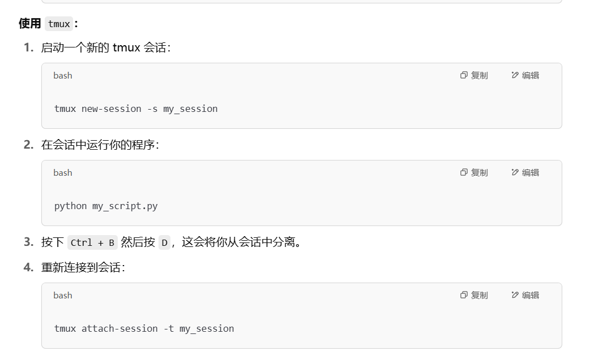

|   表达式    |   类型   |      示例       |
| :---------: | :------: | :-------------: |
|    `{}`     |  空字典  |    `d = {}`     |
|   `set()`   |  空集合  |   `s = set()`   |
| `{1, 2, 3}` | 非空集合 | `s = {1, 2, 3}` |

**python对对象的所有赋值都是引用赋值**，一定要时刻注意！！！

