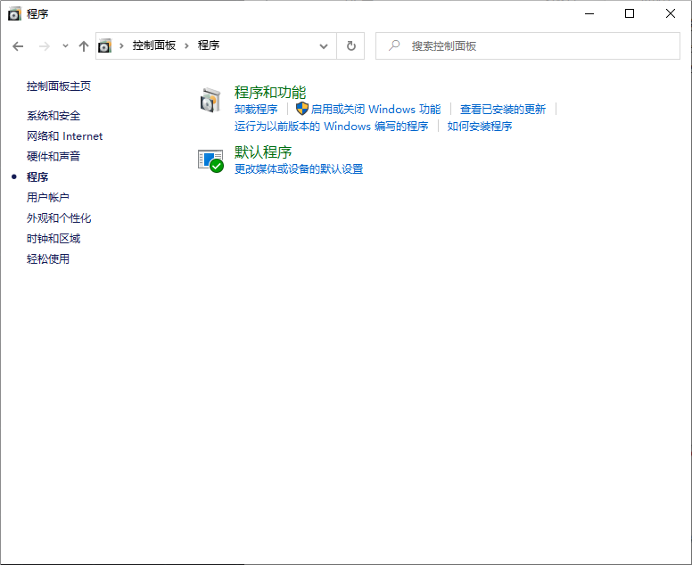
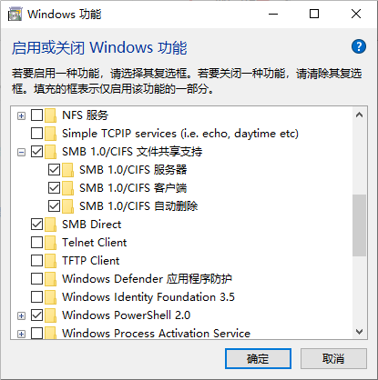
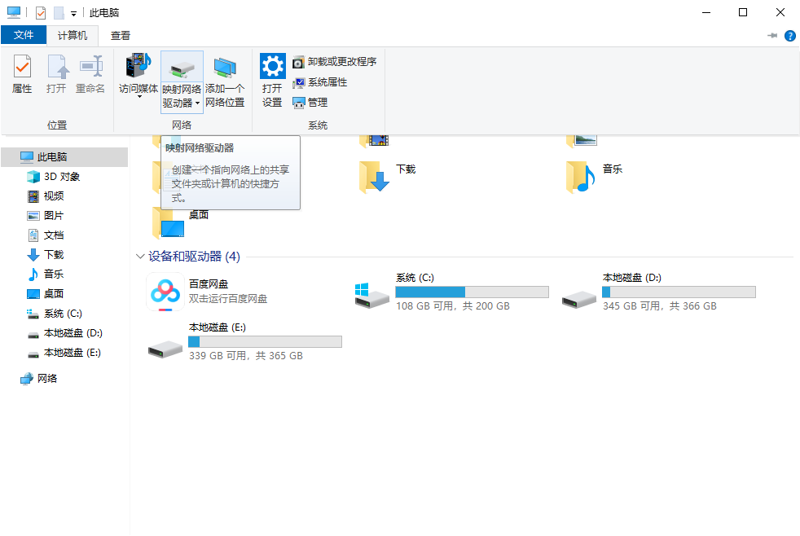
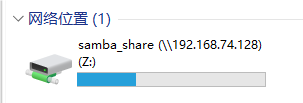

## 描述

- Samba文件服务器可以在网络上实现不同操作系统的文件共享。主要是**Windows与Linux**系统之间

- Samba是通过**Network (LAN)局域网**来实现的。

## 安装与设置

- 环境：Ubuntu 24.04

**安装**

```shell
sudo apt update                #这一步可以根据自己的情况省略
sudo apt install samba         #这一步是下载和安装
```

**检验安装是否成功**

```shell
whereis samba
```

```
samba: /usr/sbin/samba /usr/lib/x86_64-linux-gnu/samba /etc/samba /usr/libexec/samba /usr/share/samba /usr/share/man/man8/samba.8.gz /usr/share/man/man7/samba.7.gz
```

**新建文件夹作为我们的共享文件夹**

```shell
sudo mkdir /home/{your username}/{your path}
```

> Samba的配置文件位于 /etc/samba/smb.conf

**编辑conf文件**

```shell
sudo nano /home/etc/samba/smb.conf
```

**在底部添加以下内容（自选）**

```shell
[共享文件夹账户名]
comment = {your comment}         #设置共享文件夹的注释或描述。
browsable = yes                    #指定是否可以浏览该共享文件夹。
path = {your path}     #设置共享文件夹的完整路径
create mask = 0777                 #设置新创建的文件的权限掩码。
directory mask = 0777            #设置新创建的目录的权限掩码。
valid users = {your username}                #指定允许访问该共享文件夹的有效用户。
force user = {your username}                 #强制将所有的操作者视为指定的用户。
force group = {your username}              #强制将所有的操作者视为指定的组。
public = yes                            #指定该共享文件夹是否可以公开访问。 
available = yes                        #指定该共享文件夹是否可用。 
writable = yes                         #指定该共享文件夹是否可写入。
```

**重启samba 使其生效**

```shell
sudo service smbd restart
```

> 若重启失败，可能是配置文件设置错误，可以通过
>
> ```
> testparam
> ```
>
> 来检查Samba配置文件的语法

**更新防火墙规则以允许 Samba 流量**

```shell
sudo ufw allow samba
```

## 设置用户账户并共享文件

因为Samba不使用系统帐户密码，所以我们需要为用户帐户**设置一个Samba密码**

> 若用户不存在

> ```shell
> sudo adduser {your username}
> ```

```shell
sudo smbpasswd -a {your username}
```

> username与conf里配置的需要一致

**启用用户**

```shell
sudo smbpasswd -e wq
```

## 使用

**获取Linux ipv4地址**

```shell
ifconfig
```

**进入文件夹**

在Windows主机中win+r打开运行界面，输入

```shell
\\{your Linux ipv4}\samba_share
```

之后输入之前设置的用户名以及密码即可进入共享文件夹

**添加盘符**

首先打开Windows的功能





重启

点击




输入`\\{your Linux ipv4}\samba_share`



添加成功

## 附

Win11上按照以上流程配置会遇到错误

> > Windows 访问共享报错
>
> 你不能访问此共享文件夹，因为你组织的安全策略阻止未经身份验证的来宾访问。这些策略可帮助保护你的电脑免受网络上不安全设备或恶意设备的威胁。

**解决方法**：

win+r输入`gpedit.ms`打开组策略编辑器

计算机配置—>管理模块—>网络—>lanman工作站—>启用不安全的来宾登录
