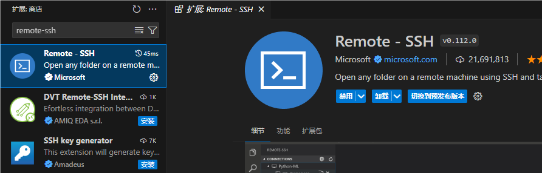
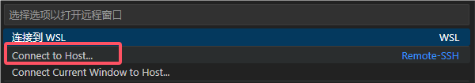
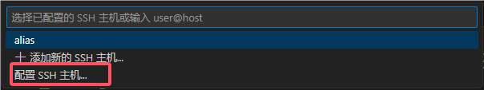
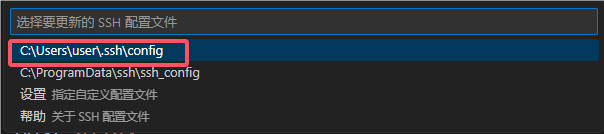
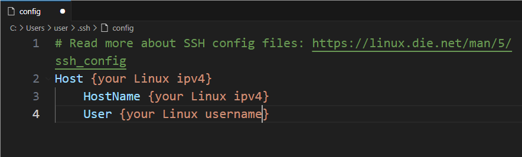
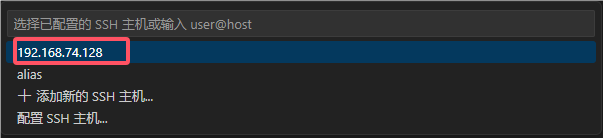
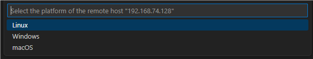
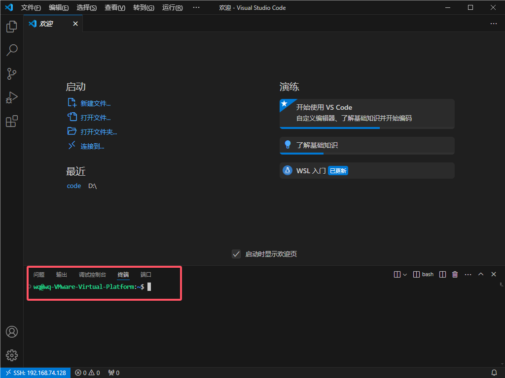
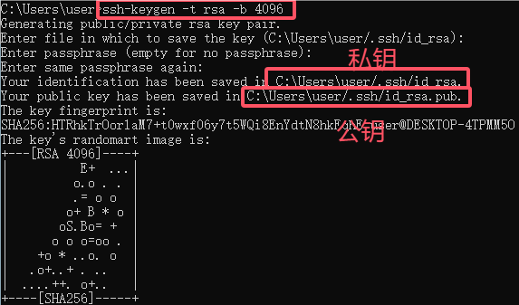
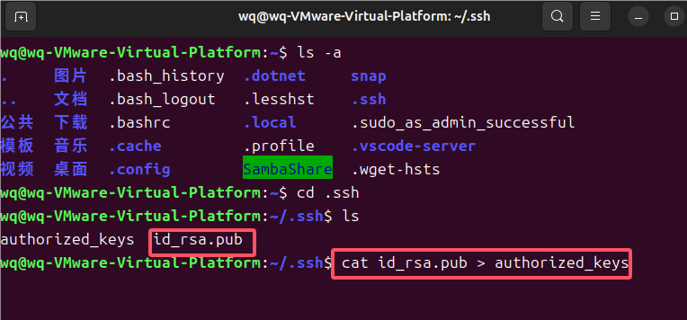

### vscode安装

具体参照网上教程

### 安装Remote-SSH拓展



### 连接














发现连不通，提示

> 过程试图写入的管道不存在。

原因是Ubuntu没有安装ssh服务

### Ubuntu安装SSH服务

**安装软件包**

```shell
sudo apt-get install openssh-server
```

**开启SSH服务**

```shell
sudo service ssh start
```

**查看SSH服务状态**

```shell
systemctl service ssh start
```

**关闭虚拟机防火墙**

```shell
systemctl stop firewalld.service
#关闭防火墙
systemctl disable firewalld.service 
#关闭防火墙开机启动
```

主机ping虚拟机能ping通即可

### 继续连接




出现终端的命令行即成功

### 秘钥连接

完成以上步骤之后，每次连接都需要输入对应用户的密码，接下来使用秘钥，不需要每次都输入密码

**生成秘钥**



接下来找到公钥文件`id_rsa.pub`

将其复制到Ubuntu对应用户的`.ssh`文件夹中，并将其添加到`authorized_keys`文件中



完成
