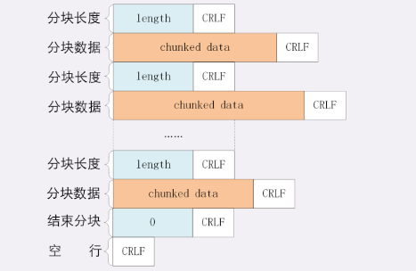
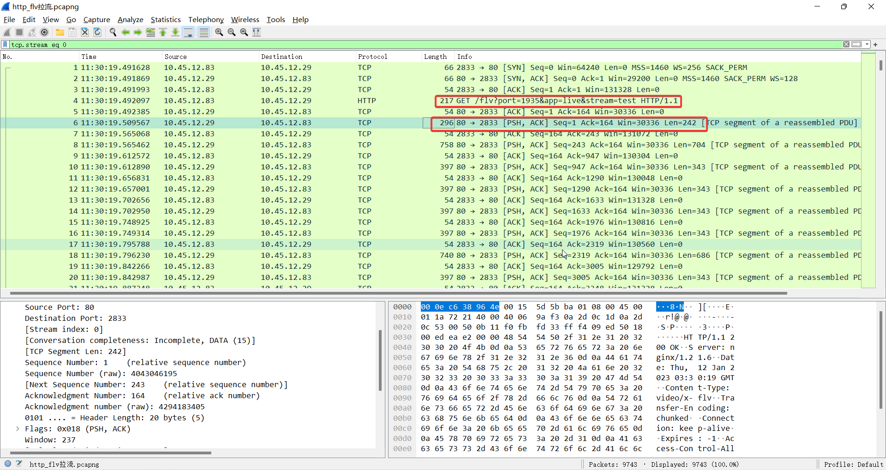
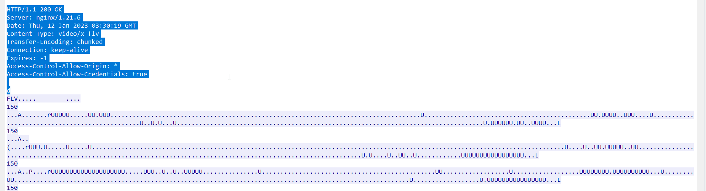
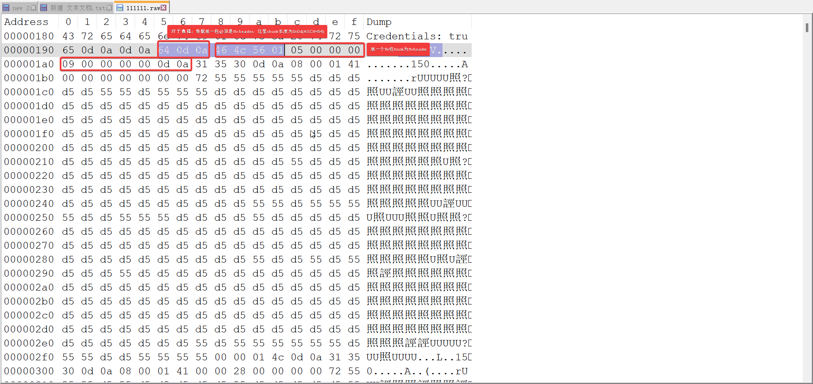

# FLV


## HTTP FLV 抓包分析

HTTP FLV利用了一个HTTP的协议约定，http 的content-length头字段如果不存在，则客户端就会一直接收数据，直到HTTP连接断开为止，HTTP FLV传输流程是视频客户端发送HTTP请求，不带content-length头字段，服务器响应HTTP，并一直发送FLV的数据；客户端接收响应并一直接收数据直到连接断开。HTTP FLV一般采用分块的传输方式，分块的格式如下：


- chunk分块包含长度头和数据体，长度头和数据体都以0x0d0a换行符为结尾标志
- 长度头的值是以16进制的ASCII值表示，以0x0d0a为结尾，比如31 35 30 0d 0a ascii为31、35、30的字符分别为’1’、‘5’、‘0’,因此表示数据体的长度为0x150，这里要注意是十六进制表示，其十进制为336（**大端**）
- 消息体紧跟在长度头后，以0x0d0a为结尾，这里注意长度头所表示的长度不包含0x0d0a
- 最后一个块用长度为0的块来表示，即为：30 0d 0a


样例数据包，是通过wireshark抓取的HTTP FLV拉流的数据包，数据包总览如下：


- 首先建立TCP连接
- 视频客户端发送HTTP Get请求，获取FLV数据，请求如下：

```http
GET /flv?port=1935&app=live&stream=test HTTP/1.1
Host: 10.45.12.29
Accept: */*
Accept-Language: zh_CN
User-Agent: VLC/3.0.18 LibVLC/3.0.18
Range: bytes=0-

```

资源标识flv，rtmp推送端口为1935，应用名为live标识直播，流标识为test，这里没有content-length，标识一直接收数据，Rang字段直播时从0开始，一直播放，如果时点播，可通过rang来制定字节偏移和长度，服务器收到rang后，需要校验rang的合法性

- 服务器端响应包含HTTP响应头和FLV的数据，音视频数据会携带在响应消息体里，这里无content-length，标识消息体不定长，客户端需要一直接收


这里要注意响应头字段中的`Transfer-Encoding:chunked` 标识分块传输

- 响应消息体为FLV数据，分块传输的方式，实例如下：
  

