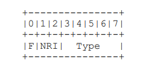
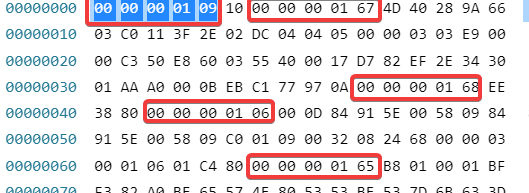
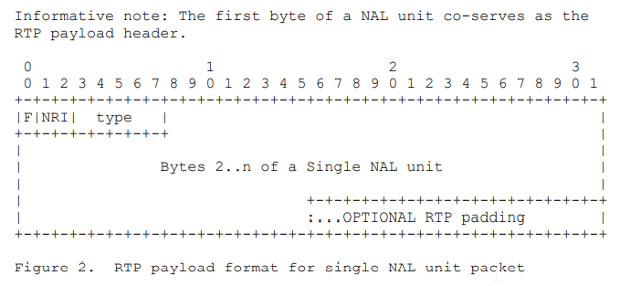
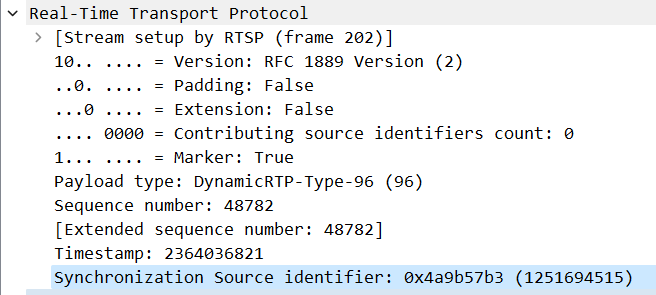
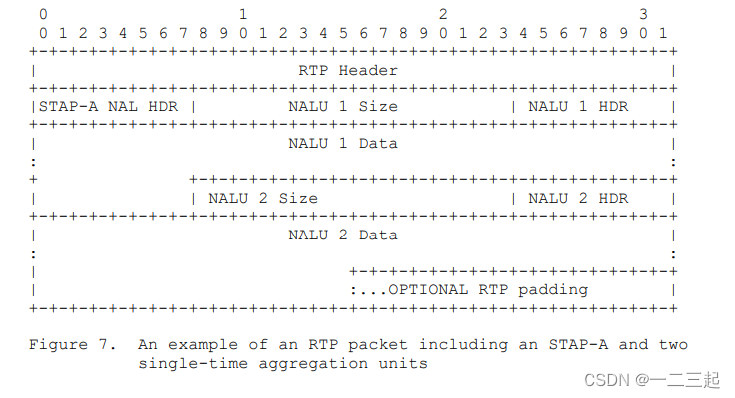
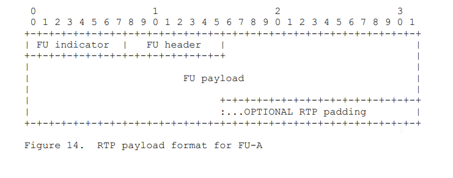
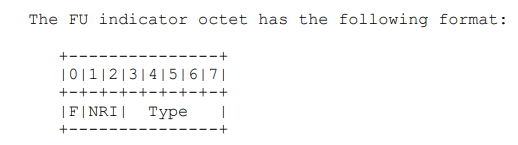
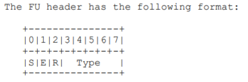
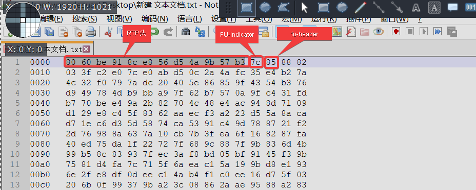
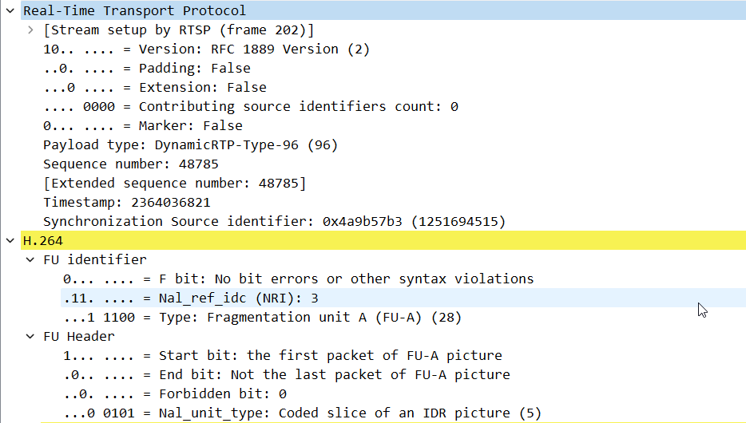

# H264（AVC）

## 特点

- 更高的编码效率：
  同H.263等标准的特率效率相比，能够平均节省大于50%的码率。

- 高质量的视频画面：
  H.264能够在低码率情况下提供高质量的视频图像，在较低带宽上提供高质量的图像传输是H.264的应用亮点。

- 提高网络适应能力：
  H.264可以工作在实时通信应用（如视频会议）低延时模式下，也可以工作在没有延时的视频存储或视频流服务器中。

- 采用混合编码结构：
  同H.263相同，H.264也使用采用DCT变换编码加DPCM的差分编码的混合编码结构，还增加了如多模式运动估计、帧内预测、多帧预测、基于内容的变长编码、4x4二维整数变换等新的编码方式，提高了编码效率。

- H.264的编码选项较少：
  在H.263中编码时往往需要设置相当多选项，增加了编码的难度，而H.264做到了力求简洁的“回归基本”，降低了编码时复杂度。

- H.264可以应用在不同场合：
  H.264可以根据不同的环境使用不同的传输和播放速率，并且提供了丰富的错误处理工具，可以很好的控制或消除丢包和误码。

- 错误恢复功能：
  H.264提供了解决网络传输包丢失的问题的工具，适用于在高误码率传输的无线网络中传输视频数据。

- 较高的复杂度：
  264性能的改进是以增加复杂性为代价而获得的。据估计，H.264编码的计算复杂度大约相当于H.263的3倍，解码复杂度大约相当于H.263的2倍。
- 网络适应性强：
  H.264提供了网络抽象层（Network Abstraction Layer），使得H.264的文件能容易地在不同网络上传输（例如互联网，CDMA，GPRS，WCDMA，CDMA2000等）。

## 关键技术（todo：具体的实现）

### 帧内预测编码

帧内编码用来缩减图像的**空间冗余**。

为了提高H.264帧内编码的效率，在给定帧中充分利用相邻宏块的空间相关性，**相邻的宏块通常含有相似的属性**。因此，在对一给定宏块编码时，首先可以**根据周围的宏块预测**（典型的是根据左上角的宏块，因为此宏块已经被编码处理），然后对预测值与实际值的差值进行编码，这样，相对于直接对该帧编码而言，可以大大减小码率。

### 帧间预测编码

帧间预测编码利用连续帧中的**时间冗余**来进行运动估计和补偿。

H.264的运动补偿支持以往的视频编码标准中的大部分关键特性，而且灵活地添加了更多的功能，除了支持P帧、B帧外，H.264还支持一种新的流间传送帧——SP帧。码流中包含SP帧后，能在有类似内容但有不同码率的码流之间快速切换，同时支持随机接入和快速回放模式。

### 整数变换

在变换方面，H.264使用了基于4×4像素块的类似于DCT的变换，但使用的是以整数为基础的空间变换，不存在反变换，因为取舍而存在误差的问题。与浮点运算相比，整数DCT变换会引起一些额外的误差，但因为DCT变换后的量化也存在量化误差，与之相比，整数DCT变换引起的量化误差影响并不大。此外，整数DCT变换还具有减少运算量和复杂度，有利于向定点DSP移植的优点。

### 量化

H.264中可选32种不同的量化步长，这与H.263中有31个量化步长很相似，但是在H.264中，步长是以12.5%的复合率递进的，而不是一个固定常数。

在H.264中，变换系数的读出方式也有两种：之字形（Zigzag）扫描和双扫描。

大多数情况下使用简单的之字形扫描；双扫描仅用于使用较小量化级的块内，有助于提高编码效率。

### 熵编码

视频编码处理的最后一步就是熵编码，在H.264中采用了两种不同的熵编码方法：通用可变长编码（UVLC）和基于文本的自适应二进制算术编码（CABAC）。

在H.263等标准中，根据要编码的数据类型如变换系数、运动矢量等，采用不同的VLC码表。H.264中的UVLC码表提供了一个简单的方法，不管符号表述什么类型的数据，都使用统一变字长编码表。其优点是简单；缺点是单一的码表是从概率统计分布模型得出的，没有考虑编码符号间的相关性，在中高码率时效果不是很好。

因此，H.264中还提供了可选的CABAC方法。算术编码使编码和解码两边都能使用所有句法元素（变换系数、运动矢量）的概率模型。为了提高算术编码的效率，通过内容建模的过程，使基本概率模型能适应随视频帧而改变的统计特性。内容建模提供了编码符号的条件概率估计，利用合适的内容模型，存在于符号间的相关性可以通过选择目前要编码符号邻近的已编码符号的相应概率模型来去除，不同的句法元素通常保持不同的模型。

## H.264尤其适合互联（包括移动互联网）的实时视频领域

H.264 草案中包含了用于**差错消除**的工具，便于压缩视频在误码、丢包多发环境中传输，如移动信道或IP信道中传输的健壮性。

为了抵御传输差错，H.264视频流中的**时间同步**可以通过采用**帧内图像刷新**来完成，**空间同步**由**条结构编码**（slice structured coding）来支持。同时为了便于误码以后的再同步，在一幅图像的视频数据中还提供了一定的重同步点。

另外，**帧内宏块刷新**和**多参考宏块**允许编码器在决定宏块模式的时候不仅可以考虑编码效率，还可以考虑传输信道的特性。

除了利用**量化步长**的改变来**适应信道码率**外，在H.264中，还常利用**数据分割**的方法来应对信道码率的变化。

从总体上说，数据分割的概念就是在编码器中生成具有不同优先级的视频数据以支持网络中的服务质量QoS。例如采用基于语法的数据分割（syntax-based data partitioning）方法，将每帧数据的按其重要性分为几部分，这样允许在缓冲区溢出时丢弃不太重要的信息。还可以采用类似的时间数据分割（temporal data partitioning）方法，通过在P帧和B帧中使用多个参考帧来完成。

在无线通信的应用中可以通过改变每一帧的量化精度或空间/时间分辨率来支持无线信道的大比特率变化。可是，在多播的情况下，要求编码器对变化的各种比特率进行响应是不可能的。因此，不同于MPEG-4中采用的精细分级编码FGS（Fine Granular Scalability）的方法（效率比较低），H.264采用**流切换**的**SP帧**来代替分级编码。

## SP帧

SP帧（Switching Predictive frame）是H.264/AVC视频编码标准中的一种特殊帧类型，旨在支持视频流中的**高效切换**和**随机访问（使得跳转不局限于I帧）**。这种帧类型结合了I帧和P帧的特性，允许在视频流的不同位置之间无缝切换，而不会显著增加码率。

SP帧的**设计目的**是在不影响解码图像质量的情况下，实现视频流之间的**无缝切换**。这对于适应网络状况变化和用户跳转需求非常重要。SP帧的编码包括两个部分：

1. **Primary SP Frame**：标准的预测编码帧，类似于普通P帧，参考前面的帧（如I帧或P帧）。保存了使用**当前流**的参考帧（如前面的I帧或P帧）进行预测编码的数据。
2. **Switching SP Frame**：使用不同的参考帧进行编码，这个参考帧可能来自另一个视频流或同一流的不同时间点（可以是I帧、P帧或B帧）。但解码结果与Primary SP Frame相同。

SP帧的设计核心在于预测编码的一致性。通过不同的参考帧进行编码，但保证解码结果相同。

**具体步骤如下**：

1. **编码阶段**：
   - 编码器对某一时刻的图像内容进行两次不同的预测编码：
     - 一次使用当前视频流中的参考帧（生成Primary SP Frame）。
     - 一次使用切换目标视频流中的参考帧（生成Switching SP Frame）。
2. **解码阶段**：
   - 解码器根据需要选择使用Primary SP Frame或Switching SP Frame进行解码。
   - 无论使用哪种编码数据，解码后的图像内容保持一致。

**实际操作示例**

**切换（适应网络的变化）**

假设有两个视频流A和B，其中需要在某一时刻进行切换：

1. **编码**：
   - 在流A中，某一帧编码为Primary SP Frame，使用流A的参考帧进行预测编码。
   - 同时，在流B中，对应时间点的帧编码为Switching SP Frame，使用流B的参考帧进行预测编码。
2. **解码**：
   - 在正常播放流A时，解码器使用Primary SP Frame进行解码。
   - 在切换到流B时，解码器使用Switching SP Frame进行解码。
   - 无论解码器使用哪个帧，解码后的图像内容保持一致，用户感知不到切换过程中的任何质量变化。

**跳转（使得跳转不局限于I帧）**

假设视频流A在时间点t0有一I帧（I帧A0），之后的帧是P帧（P帧A1，P帧A2），用户想在时间点t3跳转到时间点t6。

**编码阶段**

在时间点t3：

- **Primary SP帧A3**参考帧为P帧A2，生成Primary SP帧A3。
- **Switching SP帧A3**参考帧为时间点t6的参考帧（假设为P帧A6），生成Switching SP帧A3。

**解码阶段**

1. **正常播放到时间点t3**：
   - 解码器使用Primary SP帧A3进行解码，参考帧为P帧A2。
2. **用户跳转到时间点t6**：
   - 解码器使用Switching SP帧A3进行解码，参考帧为P帧A6。
   - 因为Switching SP帧A3与Primary SP帧A3解码结果相同，播放在跳转后的时间点t6保持一致性。

### 实际网络中的跳转

在实际的网络环境中，例如在YouTube观看视频时，跳转到未缓存和已缓存的地方，使用SP帧（Switching Predictive frame）能够有效提升用户体验。以下是详细解释：

#### **跳转到已缓存的地方**

当用户跳转到已缓存的地方，播放器已经具备了必要的参考帧，无需重新请求大量数据，从而可以迅速完成跳转。

**已缓存跳转过程**

1. **用户跳转请求**：
   - 用户点击进度条或选择跳转到视频的某个时间点（例如，从第5分钟跳到第10分钟）。
2. **播放器处理**：
   - 播放器检查本地缓存，发现第10分钟的帧已经缓存。
3. **解码过程**：
   - 播放器直接从缓存中读取参考帧和目标帧。
   - 例如，假设第10分钟的参考帧为I帧（I帧10），播放器使用此I帧进行解码。
4. **播放继续**：
   - 由于参考帧已经存在，解码器可以迅速解码目标帧并继续播放，用户感受到的跳转几乎是瞬时的。

#### **跳转到未缓存的地方**

当用户跳转到未缓存的地方，播放器需要从网络请求必要的数据。这时，SP帧的功能变得尤为重要，以确保跳转的平滑和图像质量的连续。

#### 未缓存跳转过程

1. **用户跳转请求**：
   - 用户点击进度条或选择跳转到视频的某个未缓存时间点（例如，从第5分钟跳到第30分钟）。
2. **播放器处理**：
   - 播放器检查本地缓存，发现第30分钟的帧尚未缓存。
3. **数据请求**：
   - 播放器向服务器请求第30分钟附近的关键帧（通常是I帧或SP帧）以及相应的预测帧。
4. **SP帧的作用**：
   - 服务器提供包括SP帧在内的必要数据。假设服务器提供了一个Switching SP帧，该帧能够参考第30分钟的I帧解码。
   - 如果第30分钟的目标帧是Switching SP帧，它可以使用已缓存的或新请求的参考帧进行解码。
5. **解码过程**：
   - 播放器收到数据后，使用Switching SP帧进行解码。
   - Switching SP帧参考服务器提供的I帧或其他参考帧进行预测解码，确保解码结果与Primary SP帧一致。
6. **播放继续**：
   - 播放器解码并播放目标帧，用户感受到跳转后的视频质量和内容连续。

# H264 码流的RTP封装方法

H264编码后的码流由**NAL** (Network Abstraction Layer)（网络抽象层）和**VCL** (Video Coding Layer)（视频编码层）构成。**网络抽象层**（NAL）负责将视频编码层（VCL）生成的编码数据**封装**成便于传输或存储的格式。**视频编码层**（VCL）负责实际的视频**压缩**，将视频数据压缩成更小的尺寸。

在H.264视频编码中，网络抽象层单元（NALU）用于封装编码后的视频数据。这些数据在传输或存储之前会被映射到一个NALU中。

每个NALU由一个**NALU头**和一个**原始字节序列载荷**（Raw Byte Sequence Payload）（RBSP）组成。

## NALU Header

NALU头前通常包含一个 Start Code（经常没有），Start Code 必须是 0x00000001 或者 0x000001，紧接着就是一个字节的NALU Header，NALU Header格式如下：



- **F (forbidden_zero_bit, 1 bit)**: 必须为0。

- **NRI (nal_ref_idc, 2 bits)**: 指示该NALU的重要性，值越大表示越重要，对于 NRI=0的NALU 解码器可以丢弃它而不影响解码。

- **Type (nal_unit_type, 5 bits)**: 取值 0 ~ 31，指示NALU的类型，如片段、SPS、PPS等。

Type在H264码流中的常用取值如下：

| type |        描述         |          备注           |
| :--: | :-----------------: | :---------------------: |
|  1   |    非IDR的图像片    |        一般指P帧        |
|  5   |   IDR 图像的片段    |        一般指I帧        |
|  6   | 补充增强信息（SEI） |       解码可不用        |
|  7   |  序列参数集（SPS）  | 一般SPS/PPS/I帧组合出现 |
|  8   |  图像参数集（PPS）  | 一般SPS/PPS/I帧组合出现 |
|  9   |   边界标记（AUD）   |      解码可不需要       |
|  10  |      序列结束       |        很少用到         |
|  11  |      码流结束       |        很少用到         |
|  12  |        填充         |        很少用到         |
|  24  |     STAP-A类型      |                         |
|  28  |      FU-A分片       |                         |

以下是截取的H264视频流的二进制数据，结合此二进制数据，我们来分析下其帧类型


- 0000000109，其中00000001是帧起始位标识，09是NALU Header，二进制为00001001，F为0标识非禁止，NRI为0标识可丢弃帧，type为9，表示分隔符，此帧可丢弃，表示分隔符
- 0000000167，同上面的分析，NALU头为67，二进制为01100111，F=0，NRI=3，type=7，帧类型为SPS帧，非常重要不可丢弃
- 0000000168，NALU头为68，二进制为01101000，F=0，NRI=3，type=8，帧类型为PPS帧，非常重要不可丢弃
- 0000000106，NALU头为06，二进制为00000110，F=0，NRI=0，type=6，帧类型为SEI，可丢弃
- 0000000165，NALU头为65，二进制为01100101，F=0，NRI=3，type=5，帧类型为I帧，非常重要不可丢弃

从上上面的分析可以看出，IDR（SPS/PPS/I)帧通常一起出现，极少数编码单独出现I帧，但是IDR与I帧单独出现也符合规范。

## RTP封装H264码流

由于H264帧大小差别较大，较小的帧小于MTU，则可单包直接发送，或者多帧组合发送，较大的帧大于MTU需要分片发送

RTP发送H264模式主要有三种：单一NALU模式、组合帧封装模式、分片封装模式，有关组合帧封包和分片封包类型包含好几种，这里介绍常用的两种：**STAP-A**和**FU-A**。

### 单一NALU模式

此模式一个RTP包包含一个完整的视频帧，RTP头部之后的一个字节为 NALU Header，之后是NALU数据部分，此视频帧大小需要小于MTU，可以单帧通过网络发送，其RTP封装格式如下：



以SPS为例，SPS一般小于MTU，可采用单NALU封装模式，其封包后的二进制如下：

```
80 e0 be 8e 8c e8 56 d5 4a 9b 57 b3 67 64 00 29 ad 84 05 45 62 b8 ac 54 74 20 2a 2b 15 c5 62 a3 a1 01 51 58 ae 2b 15 1d 08 0a 8a c5 71 58 a8 e8 40 54 56 2b 8a c5 47 42 02 a2 b1 5c 56 2a 3a 10 24 85 21 39 3c 9f 27 e4 fe 4f c9 f2 79 b9 b3 4d 08 12 42 90 9c 9e 4f 93 f2 7f 27 e4 f9 3c dc d9 a6 b4 03 c0 11 3f 2c a9 00 00 03 00 78 00 00 15 90 60 40 00 3e 80 00 00 11 94 06 f7 be 17 84 42 35
```

其中`80 e0 be 8e 8c e8 56 d5 4a 9b 57 b3`为RTP头，按照RTP协议格式解析如下：V=10B=2,Padding=0,Extension=0,CC=0,Mark=1,PT=96,SN=48782,TS=2364036821,SSRC=0x4a9b57b3

RTP头之后一个字节为NALU头，就是SPS帧去掉00000001起始位标识，为67，之后为NALU单元RBSP数据

### 组合帧封装模式

此模式是针对多个较小的帧，采用组合成一个RTP包发送的方式，此种方式在H264视频传输中较少使用，一般较小的帧都是通过单一NALU模式发送，此处以STAP-A组合类型为例，组合发送SPS和PPS
组合封包模式格式如下：




假设SPS和PPS的裸流如下：

```
sps
00 00 00 01 67 64 00 29 ad 84 05 45 62 b8 ac 54 74 20 2a 2b 15 c5 62 a3 a1 01 51 58 ae 2b 15 1d 08 0a 8a c5 71 58 a8 e8 40 54 56 2b 8a c5 47 42 02 a2 b1 5c 56 2a 3a 10 24 85 21 39 3c 9f 27 e4 fe 4f c9 f2 79 b9 b3 4d 08 12 42 90 9c 9e 4f 93 f2 7f 27 e4 f9 3c dc d9 a6 b4 03 c0 11 3f 2c a9 00 00 03 00 78 00 00 15 90 60 40 00 3e 80 00 00 11 94 06 f7 be 17 84 42 35
pps
00 00 00 01 68 33 3c b0 00 00
```

SPS和PPS组合帧封包后如下：
SPS去掉起始标志，size为117，十六进制为0x75;PPS去掉起始标志，size为0x06

```
[RTP header 12字节] [78 00 75 67 64 00 29 ad 84 05 45 62 b8 ac 54 74 20 2a 2b 15 c5 62 a3 a1 01 51 58 ae 2b 15 1d 08 0a 8a c5 71 58 a8 e8 40 54 56 2b 8a c5 47 42 02 a2 b1 5c 56 2a 3a 10 24 85 21 39 3c 9f 27 e4 fe 4f c9 f2 79 b9 b3 4d 08 12 42 90 9c 9e 4f 93 f2 7f 27 e4 f9 3c dc d9 a6 b4 03 c0 11 3f 2c a9 00 00 03 00 78 00 00 15 90 60 40 00 3e 80 00 00 11 94 06 f7 be 17 84 42 35 00 06  68 33 3c b0 00 00]
```

其中：

- 78 STAP-A类型头，其中F为0 NRI为3，type为24，24标识STAP-A类型，此类型标识后续负载为组合帧
- 00 75 表示第一个NALU的size，后面跟的0x75个自己为去掉起始标志的SPS数据
- 67 表示第一个NALU头，Type是7，表示第一个NALU是一个SPS
- 00 06 表示第二个NALU的size，后面跟的6个字节为去掉起始位的PPS数据
- 68 表示第二个NALU头，Type是8，表示第二个NALU是一个PPS

### 分片封装模式

如果视频帧大小超过MTU，则RTP封装需要分片封装，H264较常用的分片模式是**FU-A**，这里详细说明的是FU-A分片方式，其格式如下：

RTP头部之后的第一个字节为 FU Indicator，第二个字节为 FUHeader

FU Indicator结构如下所示:


与NALU Header类似，F和NRI取分片的NALU Header中对应的F和NRI，Type为分片类型，这里是28

FU Header结构如下：



其中

- S：start标记位，当为1时表示NALU分片的起始分片。
- E：end标记位，当为1时表示NALU分片的最后一个分片。
- R：保留位，可忽略。
- Type：NALU头里的Type类型，等于帧类型

这两个字节之后跟的是NALU数据去掉起始位及NALU Header之后按照分片大小进行的分包

同一个帧的分片的头两个字节除了起始和结束FU Header中的S和E位不同，其他分片都一样

这里要注意起始分片封包时去掉了H264起始字符和NALU Header，之后解包时通过FU Indicator的F/NRI以及FU Header即可组合成NALU Header。

实例如下：



- 0x7c：其二进制为：01111100，F=0，NRI=3，type=28表示FU-A分片

- 0x85：其二进制为：10000101，S=1，E=0, Type=5, 表示I帧的起始FU-A分片

  

其数据通过wireshark解析后如下图：

 

## 代码解析

一般H264进行RTP封装，SPS/PPS采用单一NALU封装方式，I帧/P帧采用FU-A分片模式，如果带有SEI及AUD可过滤掉，也可以采用单一NALU封装方式
有关H264采用单一NALU及FU-A分片进行RTP封装发送的相关代码详解，这里引用FFMPEG源码进行解析,这里引用部分打包的代码，解码和这个过程相反
[ffmpeg源码](https://gitee.com/mirrors/ffmpeg/)
在libavformat/rtpenc_h264_hevc.c中，如下函数对H264及H265（HEVC）打包并发送

```c++
static void nal_send(AVFormatContext *s1, const uint8_t *buf, int size, int last)
{
    RTPMuxContext *s = s1->priv_data;
    enum AVCodecID codec = s1->streams[0]->codecpar->codec_id;

    av_log(s1, AV_LOG_DEBUG, "Sending NAL %x of len %d M=%d\n", buf[0] & 0x1F, size, last);
    if (size <= s->max_payload_size) {//判断包大小是否小于等于RTP最大负载长度，一般RTP最大负载长度+RTP头小于MTU
        ...
            flush_buffered(s1, 0);
            ff_rtp_send_data(s1, buf, size, last);//这里调用此函数直接发送，ff_rtp_send_data中会对数据直接打RTP头后直接发送，
                                                  //这里由于小于MTU，所以采用单一帧发送模式
        ...
    } else {//视频帧长度大于MTU时，采用FU分片
        ...
        if (codec == AV_CODEC_ID_H264) {//只对H264进行注释，H265后续在说
            uint8_t type = buf[0] & 0x1F;//这里buf已经去掉起始标识00000001，buf[0]标识nalu header，这里取0~4位，即帧类型
            uint8_t nri = buf[0] & 0x60;//这里取5-6位，即：NRI，这里只是通过按位与的方式，保留了5-6位，并未真正转换为真实值，方面后买你组合
            //FU indicator字节
            s->buf[0] = 28;        /* FU Indicator; Type = 28 ---> FU-A */
            s->buf[0] |= nri; //因为nri只是保留了5-6位，这里直接按位或，即可组成fu-indicator
            // fu header
            s->buf[1] = type; //0~4帧类型
            s->buf[1] |= 1 << 7; //最高位起始位为1标识开始
            buf  += 1; //原始H264起始分片需要去掉nalu heder字节，这里直接跳过帧头
            size -= 1; //去掉头字节后，size要减去1

            flag_byte   = 1;
            header_size = 2;//fu-a 头长度
        } else {
            ...
        }

        while (size + header_size > s->max_payload_size) {
            memcpy(&s->buf[header_size], buf, s->max_payload_size - header_size);//发送缓冲buf中已经有了FU-A的2个头字节
            ff_rtp_send_data(s1, s->buf, s->max_payload_size, 0);//发送分片
            buf  += s->max_payload_size - header_size;//h264码流指针移动到未发送的起始位置
            size -= s->max_payload_size - header_size;//未发送的码流数据
            s->buf[flag_byte] &= ~(1 << 7);//更改fu-header，中间分片为00
        }
        s->buf[flag_byte] |= 1 << 6;//更改fu-header，最后一个分片，结束标志值为1
        memcpy(&s->buf[header_size], buf, size);
        ff_rtp_send_data(s1, s->buf, size + header_size, last);//打RTP头并发送
    }
}

```

