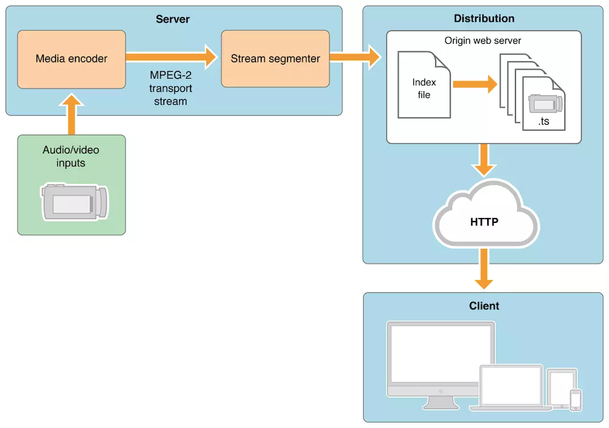
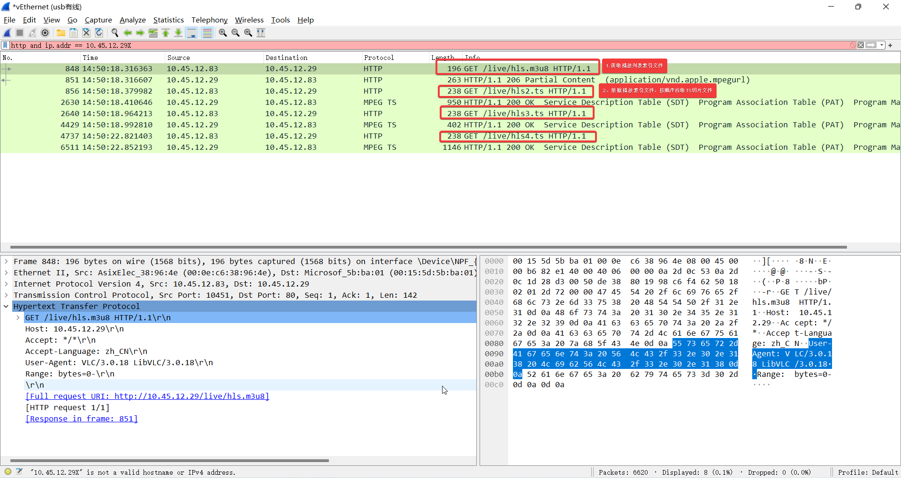

# HLS

HLS（HTTP Live streaming），是基于HTTP的流媒体传输协议，由apple公司所提出的一种用于传输音视频的协议交互方式，当前HLS被广泛应用于视频点直播领域。

HLS采用HTTP协议传输音视频数据，HLS通过将音视频流切割成一个个小的TS切片及生成m3u8的播放列表文件，播放客户端通过HTTP协议下载播放列表文件，按照播放列表文件制定的顺序下载切片文件并播放，从而实现便下载边播放，类似于实时在线播放的效果。

由于传输层只采用HTTP协议，因此其具备HTTP的网传优势，比如**可以方便的透过防火墙或者代理服务器，可简单的实现媒体流的负载均衡，可以方便的结合CDN进行媒体分发等**，另外HLS协议**本身可实现码率自适应**，通过视频转码，切片成不同码率的TS文件，从而实现播放客户端根据网络带宽情况，自由的选择码流进行播放，但是**HLS在直播时延时较大**。
采用HLS协议传输流媒体的优劣势总结如下：

- **优势**：客户端**支持简单**，H5 video即可直接播放；网络**兼容性好**，可很方便的**通过防火墙或代理服务器**，可很简单的实现媒体流的**负载均衡**，CDN支持良好；自带**多码率自适应机制**，实现播放码率自由选择
- **劣势**：**延时较高**，不能用于对延时较为苛刻的场景，如互动直播领域；TS**切片较多**，特别是实时视频流，需要**动态的生成和删除**TS切片文件，为了实现高性能、低**碎片化**，对于文件存储的逻辑需要更加复杂的设计

## HLS架构流程

HLS整体流程框图如下：

音视频输入单元采集音视频数据，通过媒体编码器编码成所需要的编码格式和码率，并以TS格式对音视频流进行封装，流切片器对封装好的TS流，按照预设的分割时间大小对TS流进行切片，并同时根据切片信息生成或更新m3u8文件列表文件，把播放列表文件和TS文件存储到web服务器配置的路径下，播放客户端通过HTTP协议向web服务器拉取播放列表，根据播放列表内容依次拉取TS切片文件并播放。

- 媒体编码器(media decoder):媒体编码器获取音视频设备的实时信号，通过预设的编码格式进行编码，或者通过流媒体协议接入已编码好的音视频流，根据流媒体预设条件确定是否需要转码，由编码或者转码操作，得到编码后的音视频流，然后根据TS封装格式对音视频流进行封装，封装后发送到切片器进行切片。
- 流切片器(stream segmenter):接收媒体编码器打包好的TS流，或者读取TS流的录像文件，按照预设时间间隔把TS流切片成等时间间隔的TS流切片文件，并生成或更新索引文件(m3u8文件/playlist播放列表文件)，每个新的切片生成之后，索引文件都要更新，索引文件用于定位切片文件的位置及有效性判断
- web服务器：用来提供HTTP服务器，并提供索引文件和切片文件下载的服务，这里可采用nginx来搭建。

以上HLS流媒体架构只是通用的框架，可根据HLS原理自行设计HLS流媒体架构。

> 切片器针对实时流一般如何切片？
>
> 假定切片持续时间设定为3s，切片文件一般以I帧开头，这样可以保证每个切片文件都是可独立播放的，不管客户端从实时流哪个位置拉取切片文件，都可以立即播放，因此切片的持续时间并不是严格按照设定时间来的，一般持续时间是I帧间隔的整数倍，最靠近预设值的那个值。

## 索引文件(m3u8文件)解析

HLS 协议的主要内容是关于 M3U8这个文本协议的, 文本协议非常简洁，以下面的索引文件为例子进行讲解。

```http
#EXTM3U
#EXT-X-VERSION:3
#EXT-X-TARGETDURATION:10
#EXT-X-MEDIA-SEQUENCE:0
#EXTINF:10.000000,
hls0.ts
#EXTINF:10.000000,
hls1.ts
#EXTINF:10.000000,
hls2.ts
```

- EXTM3U: 作为M3U文件的标识符，文件类型标识，必须要有
- EXT-X-VERSION: 协议的版本号，而且每个M3U8中只能出现一次该标签，这里版本号为3
- EXT-X-TARGETDURATION:表示最长分片的时长，这是必须的字段，秒为单位, 这里是10秒一个分片，也就是说这些ts切片的时长不能大于10的值
- EXT-X-MEDIA-SEQUENCE：表示索引文件中第一个分片的序列号（整数值），如果M3U8文件中没有该字段，则playlist中第一个分片的序列号必须是0
- EXTINF：格式 EXTINF [duration], [title]
  - duration 表示下一个分片的时长，对于每个分片，必须有该字段， 对于#EXT-X-VERSION小于3的情况下，duration必须是整数；其他情况下duration可以是浮点数和整数，这里每个分片的时长都是10；
  - title：TS切片文件的URL地址，可以是相对地址例如2000kbps-0001.ts，其标识地址与m3u8一致，也可以是完整的地址https://xxx.com/live/2000kbps-0001.ts

如果是**直播/实时视频**的文件，切片器对实时流进行切片，生成新的切片后需要更新m3u8文件并老化前面的TS切片文件。
如果是**录像**的HLS播放，还会带有`#EXT-X-ENDLIST`标签，如果有此标签，则表示录像文件的播放，切片器会对整个文件进行切片，并生成切片文件和m3u8，此时索引文件和切片文件在播放过程中不允许改变。

此外可能还存在`#EXT-X-PLAYLIST-TYPE`标签，该标签可取值为`EVENT/VOD`，`EVENT`指的是分片工具只能在M3U8末尾添加新的分片的信息，但不能删除老的分片，通常比较适用于直播+录播的情况，`VOD`表示对录像文件进行的切片，如果M3U8中存在#EXT-X-ENDLIST标签时，可以忽略EXT-X-PLAYLIST-TYPE。


为了能够实现**码率自适应**，HLS存在**二级索引结构**

- 一级索引文件存放的是不同码率的HLS源的M3U8地址，也就是二级索引文件的地址

- 二级索引文件如上所示是真正记录了同一码率下TS切片序列的下载地址

一级索引文件格式如下：

```http
#EXTM3U
#EXT-X-STREAM-INF:PROGRAM-ID=1, BANDWIDTH=1280000,AVERAGE-BANDWIDTH=1000000, RESOLUTION=704x576
http://example.com/d1.m3u8
#EXT-X-STREAM-INF:PROGRAM-ID=2, BANDWIDTH=2560000,AVERAGE-BANDWIDTH=2000000, RESOLUTION=1280x720
http://example.com/720p.m3u8
#EXT-X-STREAM-INF:PROGRAM-ID=3, BANDWIDTH=7680000,AVERAGE-BANDWIDTH=6000000, RESOLUTION=1920x1080
http://example.com/1080p.m3u8
```

- EXTM3U：m3u文件标识

- EXT-X-STREAM-INF：格式[attribute=value]\[，attribute=value]* ，该标签的属性列表中包含了可变码率的描述信息；

  - `BANDWIDTH` 指定码率峰值，单位bits/s
  - `AVERAGE-BANDWIDTH`表示媒体流的的平均比特率，单位bits/s
  - `CODECS`包含媒体流中音视频编码格式相关的信息
  - `RESOLUTION`包含媒体流的中对应视频流的分辨率
  - `FRAME-RATE`视频流的帧率
  - `PROGRAM-ID` 唯一ID，没啥用处

  二级索引文件播放特点：

- 主索引文件和子索引文件都是.M3U8的playlist
- 主索引文件只需下载一次，但对于直播节目子索引文件定期重新加载。
- 客户端可能会在任何时候改变到备用流，所有的切换都应该使用相同的音频文件

## HLS会话流程

HLS流媒体播放，通常包含直播Live和VOD（点播）两种

点播VOD是当前时间点可以获取到所有index文件和ts文件，二级index文件中记录了所有ts文件的地址，允许客户端访问全部内容，VOD点播拥有先进的下载技术，包括加密认证技术和动态切换文件传输速率的功能（通常用于不同分辨率视频之间的切换）

Live模式会实时生成M3u8和ts文件，它的索引文件一直处于动态变化的，播放的时候需要不断下载二级index文件，以获得最新生成的ts文件播放视频，如果索引文件的末尾没有#EXT-X-ENDLIST标志，说明它是一个Live视频流

客户端在播放**VOD模式**的视频时其实**只需要下载一次一级index文件和二级index文件**就可以得到所有ts文件的下载地址，除非客户端进行比特率切换，否则无需再下载任何index文件，只需顺序下载ts文件并播放就可以了；
但是**Live模式**下略有不同，因为播放的同时，新ts文件也在被生成中，所以客户端实际上是**下载一次二级index文件，然后下载ts文件，再下载二级index文件（这个时候这个二级index文件已经被重写，记录了新生成的ts文件的下载地址）,再下载新ts文件，如此反复进行播放。**

## HLS抓包分析

以下是通过VLC播放HLS视频的抓包文件，HLS地址：http://10.45.12.29/live/hls.m3u8


- 首先第一步获取播放列表索引文件：hls.m3u8，索引文件内容如下：

```HTTP
#EXTM3U
#EXT-X-VERSION:3
#EXT-X-TARGETDURATION:10
#EXT-X-MEDIA-SEQUENCE:2
#EXTINF:10.000000,
hls2.ts
#EXTINF:10.000000,
hls3.ts
#EXTINF:10.000000,
hls4.ts
```

根据索引文件可知，VLC客户端一次拉取2，3，4个TS文件，TS切片文件地址为相对地址，VLC拉取相关切片时，需要加上前缀,如：http://10.45.12.29/live/hls2.ts

这里是一级播放索引，比较简单，HLS服务器切片时，特别是实时流的情况下，切片涉及到更新m3u8、新生成TS切片和老化老的切片，需要注意老化时机，如果搞错了可能会导致播放客户端拉去了m3u8播放列表，在下载TS切片时，下载不到的现象。以下是规范中有关索引文件有效期的说明：

```1
如果播放列表索引文件没有包含EXT-X-ENDLIST标签（hls的live流），那么服务器应该使一个新版本的播放列表文件可用，并至少包含一个媒体文件的URL，新的播放列表索引文件必须与前一个播放列表索引文件在相对的时间内有效：从上一个播放列表文索引件开始有效的时间算起，不早于0.5倍持续时间，不晚于1.5倍持续时间，也就是说hls的live流要时刻更新m3u8文件，而更新时间要保持在[0.5,1.5]个ts持续时间内。
如果服务器期望移除TS切片，它必须使播放列表索引文件对于客户端不可用，在播放列表被清除时，它应该确保播放列表文件中的所有媒体文件对于客户端来说至少在一个播放列表文件持续时间内是可用的。
...
服务器可以限制最近一段时间添加到播放列表文件中的媒体文件的可用性，为了达到这个目的，播放列表文件必须包含准确的EXT-X-MEDIA-SEQUENCE标签。标签的值是按照从播放列表中移除的媒体文件的URL递增的。
媒体文件的URL必须按照其加入的顺序移除。当服务器从播放列表移除URL时，媒体文件在一段时间内必须保持可用，该时间等于媒体文件的时间加上包含该媒体文件的最长播放列表文件的时间。
当媒体文件通过http传输给客户端后，如果服务器打算移除该文件，那么它应该确保http响应头包含反应生存时间的过期头。
那些不包含EXT-X-ENDLIST标签的播放列表文件的持续时间必须至少三倍于targrt dutration。之所以为三倍的targrt dutration可能是因为，根据hls协议来看，每个终端的播放行为都是不一致的，对于点播的m3u8文件来说，都是从第一个文件开始播，但是对于直播的m3u8，播放器可以从任意一个文件开始向后（新的文件）追溯。不过一般的播放器都是从倒数第三个开始。
```

也是就是说HLS的live流要时刻更新m3u8文件，而更新时间要保持在[0.5,1.5]个ts持续时间内，针对老化的TS文件，至少要保留3倍目标持续时间之后再删除，才能确保客户端获取的播放列表文件，在下载TS切片时，切片是可用的。