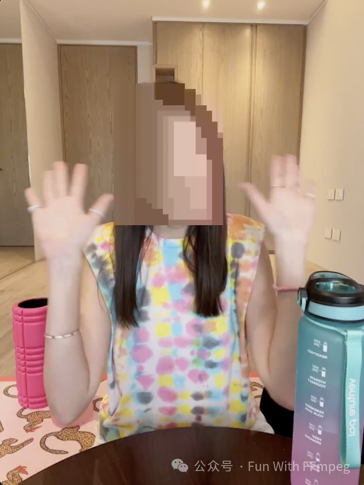
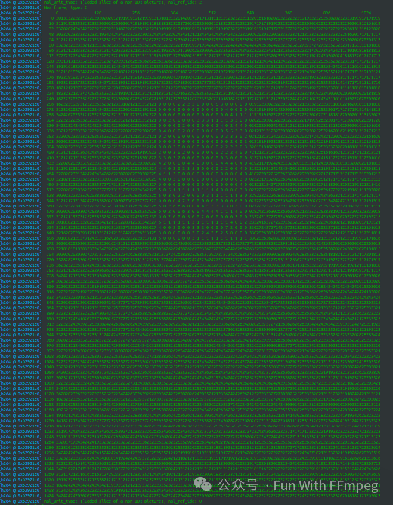
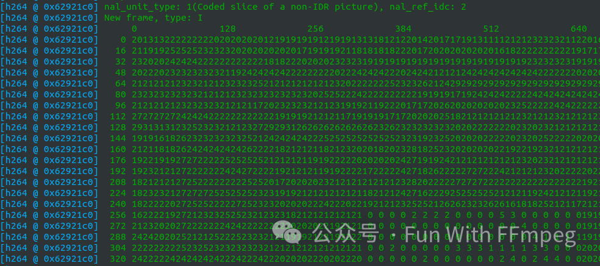

# 1. 概览

### 什么是H.264 ROI编码？

H.264 ROI编码是一种针对视频中的特定区域进行不同编码处理的技术。在视频帧中，某些区域（ROI）可能比其他区域更为重要，比如在视频会议中人脸部分的清晰度要求通常高于背景。ROI编码允许对这些重要区域进行更高质量的编码，而对其他非重要区域降低编码质量，从而在整体上节省带宽和存储空间。

### QP(quantization parameter)

量化参数 (QP) 在视频编码中起着至关重要的作用，影响压缩效率和视频质量。让我们探索一下 QP 是什么以及它是如何工作的，

1. 定义：

  \- QP 是视频压缩过程中使用的无量纲值。
  \- 它决定了用于变换视频帧内系数的量化步长。
  \- 量化会降低系数的精度，从而导致压缩。
  \- 较大的 QP 值会导致更激进的量化，从而产生较小的文件大小，但可能会降低质量。
  \- 较小的 QP 值保留更多细节，但会增加文件大小。

2. 工作原理：

  \- 在视频编码过程中，每个帧被分成更小的块，称为宏块。
  \- 根据这些块的空间频率内容应用量化矩阵。
  \- 根据所选的 QP 对结果值进行四舍五入。
  \- 高 QP 值导致更粗的量化，强调压缩。
  \- 低 QP 值保留更多细节，但可能会导致文件更大。
  \- 在 H.264/H265 中，QP 范围从 0 到 51，其中 0 表示无损编码，51 表示强压缩。
  \- 请注意，libvpx 没有固定的 QP 模式。

### H.264 ROI编码的实现方式

1. **ROI定义**：首先需要确定视频帧中的哪个区域是ROI。ROI可以通过手动选择，也可以使用自动检测算法，比如人脸检测、运动检测等。
2. **差异化编码参数**：H.264标准通过改变编码参数来实现ROI编码。通常，这包括减小ROI区域的量化参数（QP, Quantization Parameter），即使用更高的比特率来编码ROI区域以确保更高的质量。对于非ROI区域，可以使用更低的比特率进行编码，减少文件大小。
3. **编码器支持**：并非所有的H.264编码器都支持ROI功能。需要专门支持ROI编码的编码器来实现这一功能。硬件和软件实现都有可能，但需要编码器能够处理不同区域的差异化编码参数。

### H.264 ROI编码的优点

- **带宽优化**：通过对重要区域使用更高的编码质量，可以在总带宽固定的情况下提高重要区域的质量，或者在保证关键区域质量的前提下减少总体带宽需求。
- **存储效率**：在录像存储中，通过差异化的编码策略可以在不影响关键内容质量的情况下节省存储空间。
- **应用广泛**：适用于视频会议、监控视频、直播等场景，这些场景下通常会有明确的感兴趣区域，比如人脸、车牌、运动物体等。

### 使用场景

1. **视频监控**：在视频监控系统中，通常会对移动物体、车牌、人员等设置为ROI，以保证这些区域的高清晰度。
2. **视频会议**：视频会议中通常需要保证说话者的面部清晰度，因此说话者面部通常被设置为ROI。
3. **视频流媒体**：在带宽有限的情况下（如移动网络），ROI编码可以保证观众关注的主要区域（如视频中心）质量较高，而外围区域则以较低的质量传输。

H.264的ROI编码技术极大地提升了视频传输和存储的效率，使得在带宽有限和存储空间有限的场景下能够更好地满足用户的需求。

# 2. [Demo](https://blog.csdn.net/zhying719/article/details/136335109)

实现ROI编码总共需要两步：

1. 找出特定区域（😊）
2. 提高特定区域编码质量

第一步基本上由AI包办，第二步交给编码器完成。

编码器调整特定区域编码质量的基本原理是调整量化参数qp（Quantization Parameter）。简单来说，qp越大，量化误差越大，编码质量越差；反之，qp越小，量化误差越小，编码质量越高。**想增加某个区域的编码质量，即减小某个区域的qp。**

可以看下x264 ROI编码相关的API：

```cpp
typedef struct x264_image_properties_t
{
    /* All arrays of data here are ordered as follows:
     * each array contains one offset per macroblock, in raster scan order.  In interlaced
     * mode, top-field MBs and bottom-field MBs are interleaved at the row level.
     * Macroblocks are 16x16 blocks of pixels (with respect to the luma plane).  For the
     * purposes of calculating the number of macroblocks, width and height are rounded up to
     * the nearest 16.  If in interlaced mode, height is rounded up to the nearest 32 instead. */
    
    /* In: an array of quantizer offsets to be applied to this image during encoding.
     *     These are added on top of the decisions made by x264.
     *     Offsets can be fractional; they are added before QPs are rounded to integer.
     *     Adaptive quantization must be enabled to use this feature.  Behavior if quant
     *     offsets differ between encoding passes is undefined. */
    float *quant_offsets;
    /* In: optional callback to free quant_offsets when used.
     *     Useful if one wants to use a different quant_offset array for each frame. */
    void (*quant_offsets_free)( void* );
```

quant_offsets是一个表格，长度等于视频宏块的个数。通过传给编码器qp的offset值，达到调整对应宏块编码质量的目标，即ROI编码。

其他编码器ROI编码接口与x264差不多。FFmpeg libavcodec编码器封装也提供了ROI的支持，关键数据结构是作为AVFrame sidedata的AVRegionOfInterest：

```objectivec
/**
 * Structure describing a single Region Of Interest.
 *
 * When multiple regions are defined in a single side-data block, they
 * should be ordered from most to least important - some encoders are only
 * capable of supporting a limited number of distinct regions, so will have
 * to truncate the list.
 *
 * When overlapping regions are defined, the first region containing a given
 * area of the frame applies.
 */
typedef struct AVRegionOfInterest {
    /**
     * Must be set to the size of this data structure (that is,
     * sizeof(AVRegionOfInterest)).
     */
    uint32_t self_size;
    /**
     * Distance in pixels from the top edge of the frame to the top and
     * bottom edges and from the left edge of the frame to the left and
     * right edges of the rectangle defining this region of interest.
     *
     * The constraints on a region are encoder dependent, so the region
     * actually affected may be slightly larger for alignment or other
     * reasons.
     */
    int top;
    int bottom;
    int left;
    int right;
    /**
     * Quantisation offset.
     *
     * Must be in the range -1 to +1.  A value of zero indicates no quality
     * change.  A negative value asks for better quality (less quantisation),
     * while a positive value asks for worse quality (greater quantisation).
     *
     * The range is calibrated so that the extreme values indicate the
     * largest possible offset - if the rest of the frame is encoded with the
     * worst possible quality, an offset of -1 indicates that this region
     * should be encoded with the best possible quality anyway.  Intermediate
     * values are then interpolated in some codec-dependent way.
     *
     * For example, in 10-bit H.264 the quantisation parameter varies between
     * -12 and 51.  A typical qoffset value of -1/10 therefore indicates that
     * this region should be encoded with a QP around one-tenth of the full
     * range better than the rest of the frame.  So, if most of the frame
     * were to be encoded with a QP of around 30, this region would get a QP
     * of around 24 (an offset of approximately -1/10 * (51 - -12) = -6.3).
     * An extreme value of -1 would indicate that this region should be
     * encoded with the best possible quality regardless of the treatment of
     * the rest of the frame - that is, should be encoded at a QP of -12.
     */
    AVRational qoffset;
} AVRegionOfInterest;
```

可以查看一下有哪些编码器实现了ROI：

```swift
$ grep 'AVRegionOfInterest' -rl libavcodec/
libavcodec/libx264.c
libavcodec/libvpxenc.c
libavcodec/libx265.c
libavcodec/vaapi_encode.c
libavcodec/qsvenc.c
```

**3、测试ROI编码**

FFmpeg命令行可以用来测试ROI编码。libavfilter里有AI的支持，可以实现人脸识别，刚跑了一下，结果openvino崩溃了……libavfilter有个addroi的filter，手动指定一个区域，用来做测试更简单。

正向优化不一定能看出明显效果，负优化更容易看出效果，例如：

```ruby
ffmpeg -i input.mp4 -an -c:v libx264 -vf addroi=x=350:y=270:w=300:h=400:qoffset=0.9 -frames 1 output.mp4
```

这里针对[x, y, x + w, y + h]区域做了负优化，设置qoffset = 0.9，基本等于抹除了内容。结果如下：



正常业务使用ROI编码，一般只会小幅调整qp。

**4、分析ROI编码**

前面说了，正向优化小幅调整qp，效果如何需要仔细对比分析。除了直接看主观效果，我们还想要分析下qp的变化。看qp变化，可以用专业的编码分析工具来做。没专业工具的情况下，我们也可以借助FFmpeg来分析。

看一个正向优化的例子，把前面的命令改改成qoffset=-0.5（仅做示例）

```ruby
./ffmpeg -i input.mp4 -an -c:v libx264 -vf addroi=x=350:y=270:w=300:h=400:qoffset=-0.5 -frames 3 out.mp4
```

打印出qp来：

```javascript
./ffmpeg -threads 1 -debug qp -i out.mp4 -f null -
```



可以看到，ROI区域的qp非常小。再放大看下：

