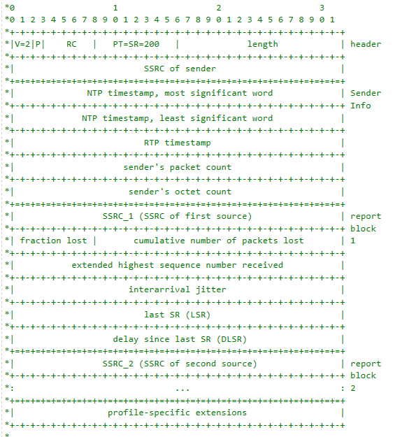
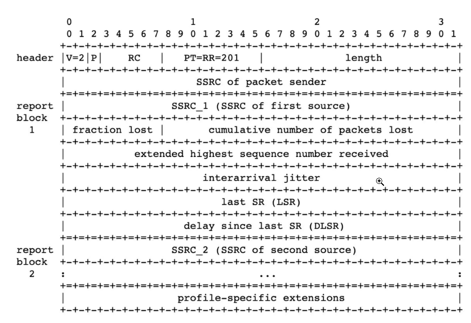

# RTCP

RTCP（RTP Control Protocol）是RTP（Real-time Transport Protocol）的控制协议，主要用于监控RTP数据传输的质量，提供统计和控制信息。RTCP为RTP流的发送和接收提供反馈机制，帮助优化传输质量。

## RTCP的工作原理

RTCP**在RTP会话中**定期发送控制报文，这些报文包括统计数据和其他控制信息。RTCP报文通常包含以下几种类型：

1. **SR（Sender Report）**：由主动发送RTP数据包的**发送端**生成。

   SR报文包含发送端的统计信息，如发送的包数、字节数、NTP（Network Time Protocol）时间戳和RTP时间戳。

2. **RR（Receiver Report）**：由**接收端**生成，报告接收到的RTP数据包的质量。

   RR报文包括丢包率、抖动、最后接收到的SR时间戳等信息。

3. **SDES（Source Description Items）**：用于描述RTP源的附加信息，如CNAME（Canonical Name），NAME，EMAIL，LOCATION等。SDES报文帮助识别和管理RTP源。

4. **BYE**：由发送或接收端生成，用于通知会话中的其他参与者该端点将离开会话。

5. **APP（Application-specific Message）**：用于特定应用的控制信息，可以自定义内容。

## RTCP报文结构

RTCP报文是多个RTCP包的组合，这些包可以是上述类型的任意组合。每个RTCP包都有一个固定的头部，包含版本、包类型、长度等信息。

### SR

- 版本（V）：同RTP包头域
- 填充（P）：同RTP包头域
- 接收报告计数器（RC）：5bits，该SR包中的接收报告块的数目，可以为0
- 包类型（PT）：8bits，SR包是200
- 长度域（Length）：16bits，其中存放的是该SR包以**32比特为单位**的总长度减一
- 同步源（SSRC）：SR包发送者的同步源标识符。与对应RTP包中的SSRC一样
- NTP Timestamp（Network time protocol）：SR包发送时的绝对时间值,NTP的作用是同步不同的RTP媒体流
- RTP Timestamp：与NTP时间戳对应，与RTP数据包中的RTP时间戳具有相同的单位和随机初始值

> **视频发送端**：在某个时间点发送SR包，包含NTP时间戳（例如，1640995200.000000000）和对应的RTP时间戳（例如，12345678）。
>
> **音频发送端**：在同一个时间点发送SR包，包含相同的NTP时间戳（1640995200.000000000）和对应的RTP时间戳（例如，87654321）。
>
> **接收端**：收到两个SR包后，通过比较RTP时间戳和NTP时间戳，确定视频和音频流的同步关系，然后调整播放。

- Sender’s packet count：从开始发送包到产生这个SR包这段时间里，发送者发送的RTP数据包的总数. SSRC改变时，这个域清零
- Sender`s octet count：从开始发送包到产生这个SR包这段时间里，发送者发送的净荷数据的总字节数（不包括头部和填充）,发送者改变其SSRC时，这个域要清零
- 同步源n的SSRC标识符：该报告块中包含的是从该源接收到的包的统计信息
- 丢失率（Fraction Lost）：表明从上一个SR或RR包发出以来从同步源n(SSRC_n)来的RTP数据包的丢失率
- 累计的包丢失数目：从开始接收到SSRC_n的包到发送SR,从SSRC_n传过来的RTP数据包的丢失总数
- 收到的扩展最大序列号：从SSRC_n收到的RTP数据包中最大的序列号，
- 接收抖动（Interarrival jitter）：RTP数据包接受时间的统计方差估计
- 上次SR时间戳（Last SR,LSR）：取最近从SSRC_n收到的SR包中的NTP时间戳的中间32比特。如果目前还没收到SR包，则该域清零。
- 上次SR以来的延时（Delay since last SR,DLSR）：上次从SSRC_n收到SR包到发送本报告的延时。

### RR

