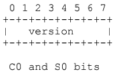
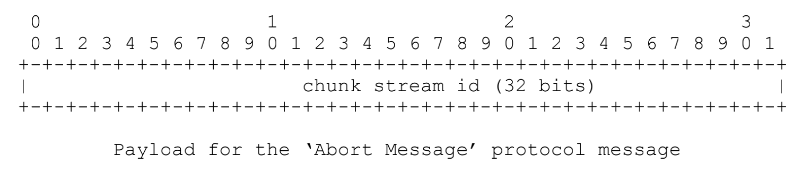

# RTMP

RTMP（Real Time Messaging Protocol，实时消息传输协议）是由Adobe公司提出的一种**应用层协议**，主要用于多媒体数据（如音频、视频）的传输。

RTMP解决了流媒体数据传输中的**多路复用**（Multiplexing）和**分包**（Packetizing）问题。以下是一些关于RTMP协议的详细信息：

## RTMP协议的特点

1. **应用层协议**：RTMP是一个应用层协议，它依赖于底层可靠的传输层协议来确保数据的可靠传输。通常情况下，RTMP使用**TCP**（Transmission Control Protocol）作为其传输层协议。
2. **握手机制**：在基于传输层协议（TCP）的连接建立完成后，RTMP还需要客户端和服务器进行“**握手**”过程，以协商RTMP版本及时间对齐作用，建立基于传输层连接之上的RTMP连接。这一步骤确保了双方能够正确地通信。
3. **多路复用和分包**：RTMP能够在一个TCP通道上传输多种类型的数据流（如视频流、音频流和命令）。它通过多路复用技术将不同的数据流合并到一个通道中，并通过分包技术将数据分成适当大小的包进行传输。
4. **常见格式**：RTMP通常用于传输FLV（Flash Video）、F4V等格式的流媒体数据。这些格式广泛应用于网络视频播放。

RTMP Connection上会传输RTMP控制信息，比SetChunkSize,SetACKWindowSize，CreateStream等，其中CreateStream命令会创建一个Stream链接，用于传输具体的音视频数据和控制这些信息传输的命令信息。

RTMP协议以RTMP Message格式传输，为了更好地实现多路复用、分包和信息的公平性，发送端把Message划分为带有MessageID的Chunk，每个Chunk可能是一个单独的Message，也可能是Message的一部分，在接受端会根据chunk中包含的data的长度，messageid和message的长度把chunk还原成完整的Message，从而实现信息的收发。


## RTMP交互过程

### 握手协议

RTMP在建立好传输层TCP连接后，通过RTMP握手协议来完成RTMP的连接。

RTMP握手协议由三个固定长度的块组成，客户端和服务端各发送相同的三个块，客户端发送C0、C1、C2，服务端发送S0、S1、S2，RTMP规范中没有详细规定各个块发送的顺序，只需要满足如下条件即可：

- 握手以客户端发送 C0 和 C1 块开始
- 客户端必须等待接收到 S1 才能发送 C2
- 客户端必须等待接收到 S2 才能发送任何其他数据
- 服务器必须等待接收到 C0 才能发送S0和S1，也可能是接收到 C1 后发送
- 服务器必须等待接收到 C1 才能发送S2
- 服务器必须等待接收到 C2 才能发送其他数据


客户端发送C0、C1之前客户端和服务器都处于**未初始化状态**；在未初始化状态之后客户端和服务端都进入**版本已发送状态**，客户端等待接收 S1 包，服务端等待接收 C1 包，收到所等待的包后，客户端发送 C2 包，服务端发送 S2 包。之后状态进入**发送确认状态**；客户端和服务端等待接收S2和C2包，收到后进入**握手完成状态**，客户端和服务端开始交换消息。
从规范上看只要满足以上条件，如何发送6个块的顺序都是可以的，但实际实现中为了在保证握手的身份验证功能的基础上尽量减少通信的次数，一般的发送顺序如下：

- 客户端向服务端同时发送C0+C1
- 服务端确认版本号后，向客户端同时发送S0+S1+S2
- 客户端接收到S2后发送C2到服务端

握手过程真实交互抓包截图如下：


握手协议格式解析：

**C0/S0格式：**

- C0和S0包都是单一的一个字节(8位)，表示版本号，C0包中表示客户端请求的RTMP版本，在S0中表示服务器选择的RTMP版本，规范最新定义为3，如果服务器和客户端版本号不一致，则可能会终止交互或者降级。
  

**C1/S1格式：**

- C1/S1长度为1536字节，其格式如下：
  

  - 时间戳(Time 4bytes)：时间戳，用于C/S发送所有后续块的时间起点,可以从0开始，或者其他值，主要用于多路流传输的时间同步

  - 零值 (Zero 4bytes)：规范中说必须为0，实际传输协议中并未对此进行校验，没啥意义，不为零也可正常传输。

  - 随机数据 (Random data 1528bytes)：为随机数序列，用户区分出其响应C2/S2来自此RTMP连接发起的握手还是其他方发起的握手。

**C2/S2格式：**

- 长度为1536字节，其格式如下：
   - 时间戳（Time 4bytes）：必须是对方C1/S1发来的时间戳（对C2来说是S1的时间戳，对S2来说是C1的时间戳）。
   - 时间戳2（Time2 4bytes）：必须是前面自己发送的C/S包里的时间戳。
   - 随机数据回显（Random echo 1528bytes）：必须是对方发来的C1/S1包里携带的随机数据（对C2来说是S1，对S2来说是C1）

在构建RTMP代码时一般只针对版本号进行校验，因为当前很多RTMP流媒体协议并没那么规范，如果严格校验，兼容性会差。

### RTMP分块（chunk）

RTMP 传输的数据称为Message，Message包含音视频数据和信令，传输时不是以Message为单位的，而是把Message拆分成Chunk发送，而且必须在一个Chunk发送完成之后才能开始发送下一个Chunk，每个Chunk中带有msg stream id代表属于哪个Message，接受端也会按照这个id来将chunk组装成Message。

每个Chunk的默认大小是 128 字节，可以通过Set Chunk Size的控制信息设置Chunk数据量的最大值，在发送端和接受端会各自维护一个Chunk Size，可以分别设置这个值来改变自己这一方发送的Chunk的最大值，其配置大小多少合适，需要我们去根据性能要求来调试合适的大小。

Chunk格式包含基本头、消息头、扩展时间戳和负载，如下图所示：


- **Basic Header**(基本的头信息)：长度可能是1，2，或3个字节，包含了`chunk stream ID`（流通道Id，CSID）和`chunk type`（chunk的类型，fmt）
  - CSID用来唯一标识一个特定的流通道，同一个Chunk Stream ID必然属于同一个信道，chunk type决定了后面Message Header的格式。
  - chunk type占最开始2bits，CSID的长度是可变的，其决定了基本头的长度，在足够表征流通道的前提下，最好用尽量少的字节来表示CSID，从而减少由于引入Header增加的数据量。
  - RTMP最多可支持65597个流，CSID范围在3-65599 内,CSID辅助 0，1，2为保留值，其中CSID=0表示块基本头为2个字节，并且CSID范围在64-319 之间（第二个字节+64）；CSID=1 表示块基本头为3个字节，并且ID范围在64-65599之间（第三个字节*256 + 第二个字节 + 64）；CSID=2 是为低版本协议保留的，用于协议控制消息和命令；3-63 范围内的值表示整个流ID。
    
    
    
- **Message Header**（消息头信息）：包含了要发送的实际信息（可能是完整的，也可能是一部分）的描述信息。
  Message Header的格式和长度取决于Basic Header的chunk type（fmt）取值，共有4种不同的格式，由fmt字段控制。
  其中第一种格式可以表示其他三种表示的所有数据，但由于其他三种格式是基于对之前chunk的差量化的表示，因此可以更简洁地表示相同的数据，实际使用的时候还是应该采用尽量少的字节表示相同意义的数据，以下按照字节数从多到少的顺序分别介绍这4种格式的。
  - **fmt=0**，类型0的chunk消息头长度是11个字节，**类型0必须用在块流的开头位置，或者每次当块流的时间戳后退的时候（例如向后拖动的操作）**，其格式如下：
    
    **timestamp**（3bytes）：最多能表示到16777215=0xFFFFFF，如果时间戳大于或等于16777215（0xFFFFFF），该字段值必须为16777215，并且必须设置扩展时间戳Extended Timestamp来一起表示32位的时间戳，否则该字段就是完整的时间戳。接受端在判断timestamp值为0xFFFFFF时就会去Extended timestamp中解析实际的时间戳。
    **message length**（消息数据的长度）：占用3个字节，表示实际发送的消息的数据，如音频帧、视频帧等数据的长度，注意这里**是Message的长度**，也就是chunk属于的Message的总数据长度，而**不是chunk本身Data的数据的长度**。
    **message type id**(消息的类型id) ：占用1个字节，表示实际发送的数据的类型，如8代表音频数据、9代表视频数据。
    **msg stream id**（msid)：占用4个字节，表示该chunk所在的流的ID，它采用**小端存储**的方式。
  - **fmt=1**，Message Header占用7个字节，省去了表示msg stream id的4个字节，表示**此chunk和上一次发的chunk所在的流相同**，如果在发送端只和对端有一个流链接的时候可以尽量去采取这种格式，其格式如下：
    
    **timestamp delta**：占用3个字节，这里和type＝0时不同，**表示上一个chunk的时间差**，当它的值超过3个字节所能表示的最大值时，设置为0xFFFFFF，实际的时间戳差值就会转存到Extended Timestamp字段中，接受端在判断timestamp delta字段24个位都为1时就会去Extended timestamp中解析时机的与上次时间戳的差值。
  - **fmt=2**，Message Header占用3个字节，相对于type＝1格式又省去了表示消息长度的3个字节和表示消息类型的1个字节，表示**此chunk和上一次发送的chunk所在的流、消息的长度和消息的类型都相同**，格式如下：
    
  - **fmt=3**，它表示**这个chunk的Message Header和上一个是完全相同的**，不存在消息头，当它跟在Type＝0的chunk后面时，表示和前一个chunk的时间戳都是相同的，就是一个Message拆分成了多个chunk，这个chunk和上一个chunk同属于一个Message；当它跟在Type＝1或者Type＝2的chunk后面时，表示和前一个chunk的时间戳的差是相同的。比如第一个chunk的Type＝0，timestamp＝3600，第二个chunk的Type＝2，timestamp delta＝3600，表示时间戳为3600+3600，第三个chunk的Type＝3，表示timestamp delta＝3600，时间戳为3600+3600+3600
- **Extended Timestamp**（扩展时间戳）：扩展时间戳用来辅助编码超过16777215（0xFFFFFF）的时间戳或时间戳增量。当类型0，1或2的块，无法用24位字段来表示时间戳或时间戳增量时就可以启用扩展时间戳，同时类型0块的时间戳字段或类型1，2的时间戳增量字段值应该设为16777215（0xFFFFFF）。当类型3块最近的属于相同块流ID的类型0块、类型1块或类型2块有此字段时，该类型3块也应该有此字段。
- **Chunk Data**（块数据）：用户层面上真正想要发送的与协议无关的数据，长度在[0,chunkSize]之间

### 协议控制消息（Protocol Control Message）

在RTMP的chunk会用一些特殊的值来代表协议的控制消息

**控制信息的Message Stream ID必须为0（代表控制流信息），CSID必须为2，Message Type ID可以为1/2/3/5/6，控制消息的接受端会忽略掉chunk中的时间戳，收到后立即生效**

- **Set Chunk Size**(Message Type ID=1) ：设置chunk中Data字段所能承载的最大字节数，默认为128bytes，通信过程中可以通过发送该消息来设置chunk Size的大小（不得小于128bytes），该值将作用于后续的所有块的发送，直到收到新的通知，而且通信双方会各自维护一个chunkSize，两端的chunkSize是独立的。其chunk data格式如下：
  
  其中第一位必须为0，chunk Size占31个位，最大可配置为2147483647＝0x7FFFFFFF，但实际上所有大于16777215=0xFFFFFF的值都用不上，因为chunk size不能大于Message的长度，表示Message的长度字段是用3个字节表示的，最大只能为0xFFFFFF
- **Abort Message**(Message Type ID=2)：当一个Message被切分为多个chunk，接受端只接收到了部分chunk时，发送该控制消息表示发送端不再传输同Message的chunk，接受端接收到这个消息后要丢弃这些不完整的chunk。
  
  Data数据中只需要一个CSID，表示丢弃该CSID的所有已接收到的chunk。
- **Acknowledgement**(Message Type ID=3)：当收到对端的消息大小等于窗口大小（Window Size）时接受端要回馈一个ACK给发送端告知对方可以继续发送数据。窗口大小就是指收到接受端返回的ACK前最多可以发送的字节数量，返回的ACK中会带有从发送上一个ACK后接收到的字节数。
  
- **Window Acknowledgement Size**(Message Type ID=5)：发送端在接收到接受端返回的两个ACK间最多可以发送的字节数，客户端或服务端发送该消息来通知对方发送确认消息（ACK）所使用的窗口大小，并等待对方发送回确认消息（ACK），对方（接收端）在接收到窗口大小确认信息后必须发送确认消息（ACK）。
  
- **Set Peer Bandwidth**(Message Type ID=6):限制对端的输出带宽。接受端接收到该消息后会通过设置消息中的Window ACK Size来限制已发送但未接受到反馈的消息的大小来限制发送端的发送带宽。如果消息中的Window ACK Size与上一次发送给发送端的size不同的话要回馈一个Window Acknowledgement Size的控制消息。
  
- Hard(Limit Type＝0):接受端应该将Window Ack Size设置为消息中的值
- Soft(Limit Type=1):接受端可以讲Window Ack Size设为消息中的值，原有值如果小于此值，也可以保存原来的值，
- Dynamic(Limit Type=2):如果上次的Set Peer Bandwidth消息中的Limit Type为0，本次也按Hard处理，否则忽略本消息，不去设置Window Ack Size。


## RTSP与RTMP的对比

RTSP（Real-Time Streaming Protocol，实时流传输协议）也是一种用于控制流媒体服务器的网络协议。与RTMP不同，RTSP通常需要多个通道来分别处理命令和数据：

1. **通道数量**：RTSP通常需要2-3个通道，其中一个用于命令控制，一个或两个用于数据传输（音频和视频数据可能分开）。
2. **命令和数据分离**：在RTSP中，命令和数据通道是分离的，这使得控制信令与实际媒体数据的传输相互独立。
3. **使用场景**：

**RTSP**

主要用于实时流媒体应用，如IPTV、视频会议等

```
控制信令和数据分离：
RTSP协议将控制信令和媒体数据分离，通过多个通道进行传输。这种设计使得控制命令（如播放、暂停、停止等）和实际的媒体数据传输互不干扰，能够更灵活地管理和控制流媒体会话。

实时性要求高：
在IPTV和视频会议等应用中，实时性是一个关键因素。RTSP支持即时的流控制和调整，能够快速响应用户的操作需求，确保流媒体传输的实时性。

复杂交互：
RTSP支持更复杂的交互操作，例如快进、快退、跳转到指定时间点等，这些功能在IPTV和视频会议中非常重要。

多种传输协议支持：
RTSP可以与RTP（Real-time Transport Protocol）结合使用，通过TCP/UDP进行数据传输，以减少延迟。这对于需要低延迟的应用场景非常有利。
```

**RTMP**

更多地用于互联网视频直播和点播

```
单通道传输：
RTMP通过一个TCP通道同时传输音频、视频和控制命令，这简化了网络配置和管理。对于互联网视频直播和点播，这种方式能够满足大部分需求，并且实现起来相对简单。

适应网络环境：
互联网环境下，网络状况复杂多变。RTMP通过TCP协议传输，能够利用TCP的可靠性特性（如重传机制）来保证数据完整性，即使在网络质量不佳的情况下也能提供较好的用户体验。

广泛支持：
由于历史原因，RTMP被广泛应用于Flash播放器中，很多流媒体平台和CDN服务都对RTMP提供良好的支持。这使得RTMP成为互联网视频直播和点播的一个常见选择。

延迟容忍度：
对于互联网视频直播和点播，用户通常可以容忍一定程度的延迟。RTMP通过TCP确保数据可靠传输，即使带来一些延迟，也能接受。而对于要求低延迟的场景，如实时互动直播，则可能需要其他协议（如WebRTC）。
```

