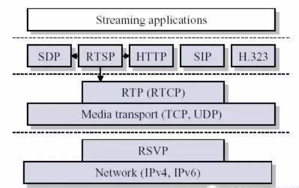
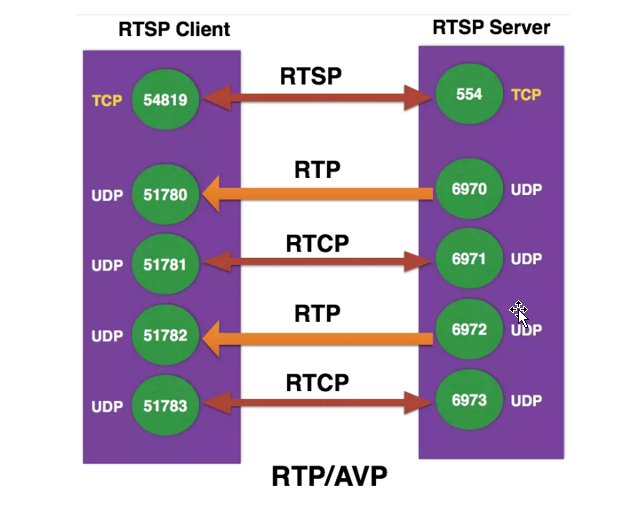
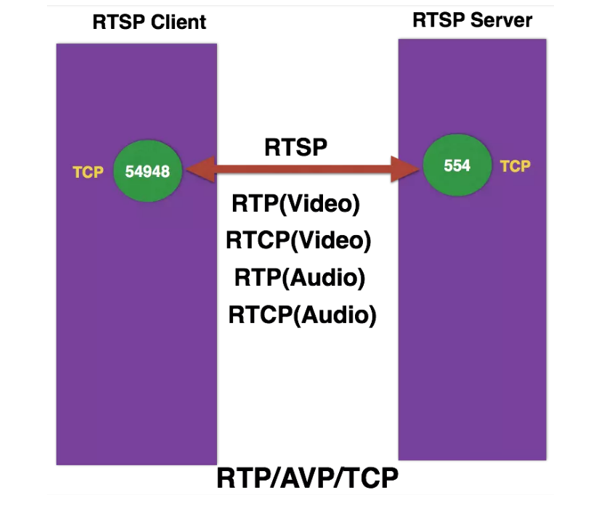
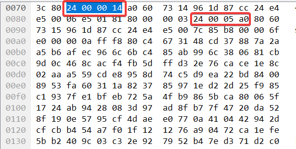

# RTP

RTP/RTCP被划分在传输层，它建立在UDP/TCP上，同UDP协议一样，为了实现其实时传输功能，RTP也有固定的封装形式，RTP用来为端到端的实时传输提供时间信息和流同步，但并不保证服务质量，服务质量由RTCP来提供。



## RTP包内容

| V=2  |  P   |  X   |  CC  |  M   |  PT  | sequence number |
| :--: | :--: | :--: | :--: | :--: | :--: | :-------------: |

| timestamp |
| :-------: |

| synchronization source (SSRC) identifier |
| :--------------------------------------: |

| contributing source (CSRC) identifiers |
| :------------------------------------: |

| payload... |
| :--------: |

**字段解释：**

|       字段        | 大小（比特） |                             描述                             |
| :---------------: | :----------: | :----------------------------------------------------------: |
|    Version (V)    |      2       |                   RTP协议版本号（通常为2）                   |
|    Padding (P)    |      1       | 填充位，指示是否在RTP数据包的末尾包含额外的填充字节，这些填充字节不是有效负荷的一部分,填充是一些需要固定块大小的加密算法所要求的，或是为了在低层PDU搬运RTP包 |
|   Extension (X)   |      1       |                 扩展位，指示是否存在头部扩展                 |
|  CSRC count (CC)  |      4       |         CSRC计数，指示包含在RTP头部的CSRC标识符数量          |
|  Marker bit (M)   |      1       | 标记位，用于应用特定的控制信息。如果M被置位，表示一些重要的项目如帧边界在包中被标记。<br />当一个RTP数据包包含一个完整的帧或帧的最后一个部分时，标记位会被设置为1。也可以用于标记其他重要事件，如关键帧。 |
| Payload type (PT) |      7       |      负载类型，指示RTP数据包中负载的类型，如音频或视频       |
|  Sequence number  |      16      | 序列号，每发送一个新的RTP数据包，序列号增加，用于检测丢失和重排序 |
|     Timestamp     |      32      | 时间戳，反映RTP数据包中第一个八位样本的时刻，用于同步音视频数据 |
|       SSRC        |      32      |             同步源标识符，标识RTP数据包的同步源              |
|       CSRC        |   32 each    | 贡献源标识符，每个标识符32比特，用于指示贡献数据源的SSRC标识符 |
|      payload      |   可变长度   |            负载数据，例如音频或视频数据的实际内容            |

## RTP的工作原理

### 序列号和时间戳

RTP数据包头包含两个关键字段：序列号和时间戳，这两个字段在接收方重组和同步媒体流时起到了重要作用。

- **序列号（顺序）**：RTP头部中的序列号用于标识数据包的顺序。每发送一个数据包，序列号递增1。接收方使用序列号来检测数据包的丢失和乱序传送，确保数据包按正确的顺序组装。
- **时间戳（同步）**：时间戳表示数据包的采样时间，用于同步和播放控制。它帮助接收方确定数据包的播放时间，特别是在需要同步多个媒体流（例如音频和视频）时非常重要。


## RTP over UDP & RTP over TCP 区别

### 端口数量

一般`setup`建立通道可以是`rtp/avp`或者`rtp/avp/tcp`类型，这里标识以rtp传输音视频，前者基于UDP传输，后者基于TCP传输

基于UDP传输码流时，需要根据setup交互的信息，单独建立RTP/RTCP两路UDP通道

如果是基于TCP传输码流则与RTSP公用一个TCP通道，通过在RTP/RTCP头加上`$`开头的四个字节的tcpheader来区分是哪一路的RTP/RTCP，还是RTSP。





### SETUP方法

**RTP OVER UDP抓包实例：**

```http
SETUP rtsp://10.45.12.141:554/h264/ch1/main/av_stream/trackID=1 RTSP/1.0
CSeq: 5
Authorization: Digest username="admin", realm="IP Camera(C7627)", nonce="c4c4e29b1620211e44ec28b077e2eb52", uri="rtsp://10.45.12.141:554/h264/ch1/main/av_stream/", response="ac52cf287fe4aa6be5bb168bc9d01446"
User-Agent: LibVLC/3.0.12 (LIVE555 Streaming Media v2016.11.28)
Transport: RTP/AVP;unicast;client_port=63538-63539

```

```http
RTSP/1.0 200 OK
CSeq: 5
Session: 1279114011;timeout=60
Transport: RTP/AVP;unicast;client_port=63538-63539;server_port=8312-8313;ssrc=3cc5faf7;mode="play"
Date:  Wed, Jul 27 2022 10:37:07 GMT
1234567891011
```

首先客户端侧，SETUP的path路径，加上了trackID=1,表示建立的时trackID=1的媒体源的码流传输通道，通过上文SDP描述可知，此路时编码类型为H265，payloadtype=96的视频源，这里要注意，**一个setup只能给一种媒体源建立流传输通道**。如果服务器需要认证，setup也需要带上认证信息Authorization，Transport字段表示客户端通过何种方式申请建立媒体流传输通道，这里RTP/AVP表示通过UDP方式;unicast表示单播方式(也支持组播，比较少用，这里不做介绍)，如果为UDP方式，则有client_port字段，client_port=63538-63539表示客户端测此路码流的RTP端口为UDP63538，RTCP端口为UDP63539；这里注意建立RTP码流传输通道时，RTP和RTCP要成对出现，一般码流端口号为RTCP=RTP+1

服务器响应时，如果支持客户端的传输方式，则Transport字段中，RTP/AVP;unicast；client_port=63538-63539;要与客户端申请的消息保持一致，增加server_port字段，表示服务器发送RTP/RTCP的UDP端口，可选增加ssrc标识。这里要注意，服务端回复setup时，将会生成一个session ID.后续消息必须带有此Session字段。

**RTP OVER TCP抓包实例：**

```http
SETUP rtsp://10.45.12.141:554/h264/ch1/main/av_stream/trackID=1 RTSP/1.0
CSeq: 5
Authorization: Digest username="admin", realm="IP Camera(C7627)", nonce="59db6d7ba1acb14582356c8bb8e61ce8", uri="rtsp://10.45.12.141:554/h264/ch1/main/av_stream/", response="129818708e48cd0326f8b6f1b19613a3"
User-Agent: LibVLC/3.0.12 (LIVE555 Streaming Media v2016.11.28)
Transport: RTP/AVP/TCP;unicast;interleaved=0-1

```

```http
RTSP/1.0 200 OK
CSeq: 5
Session: 2095163832;timeout=60
Transport: RTP/AVP/TCP;unicast;interleaved=0-1;ssrc=24e4e500;mode="play"
Date:  Fri, Aug 26 2022 14:35:46 GMT
1234567891011
```

RTP通过TCP传输时，与UDP方式在SETUP方法上有一定的区别，主要是Transport头，RTP/AVP/TCP表示RTP流通过TCP传输，当此值出现时，其**没有client_port字段，出现interleaved字段**

interleaved=0-1，表示streamid，前文已经介绍了，当码流通过TCP传输时，与RTSP共用一个TCP链路，所以其不需要建立新的连接，为了区分RTP、RTCP及RTSP协议，需要增加包头标识，这里采用TCPHEAD头字段，tcphead为四个字节，格式如下：

| magic number | channel number | embedded data length | data |
| :----------: | :------------: | :------------------: | :--: |

- **magic number** ： 1 Byte value of hex 0x24（$），标识传输的是数据不是rtsp协议
- **channel number** ： 1 Byte value to denote the channel，信道ID，标识流的类型
- **embedded data length** ：2 Bytes to denote the embedded data length，流长度，单位是字节
- **data** :  表示RTP/RTCP包数据

当TCP接收到的包开头为24时，可以判定其为RTP或者RTCP，通过streamid来却分，setup方法中interleaved=0-1，标识RTP的streamid=0；RTCP的streamid=1

tcphead抓包实例如下：



第一个24000014标识此包为RTP包长度为0x14，解析时只需要根据streamid及长度读取完整的RTP帧，去掉四字节头，通过RTP方式解析即可。由于TCP时流式传输，需要连续根据24标识判断。