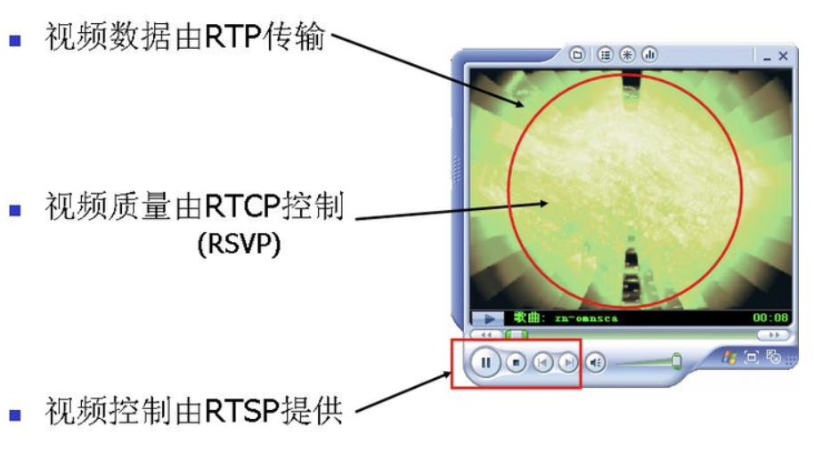

## RTP

RTP`Real-time Transport Protocol`是用于在互联网上传输实时音频和视频数据的一种**传输层协议**。

RTP协议详细说明了在互联网上传递音频和视频的标准数据包格式，而且它是建立在**TCP/UDP协议**上的。

### RTP包内容

| V=2  |  P   |  X   |  CC  |  M   |  PT  | sequence number |
| :--: | :--: | :--: | :--: | :--: | :--: | :-------------: |

| timestamp |
| :-------: |

| synchronization source (SSRC) identifier |
| :--------------------------------------: |

| contributing source (CSRC) identifiers |
| :------------------------------------: |

| payload...                               |
| :------------------------------------: |

**字段解释：**

|      字段       | 大小（比特） |                             描述                             |
| :-------------: | :----------: | :----------------------------------------------------------: |
|        V        |      2       |                   RTP协议版本号（通常为2）                   |
|        P        |      1       |     填充位，指示是否在RTP数据包的末尾包含额外的填充字节      |
|        X        |      1       |                 扩展位，指示是否存在头部扩展                 |
|       CC        |      4       |         CSRC计数，指示包含在RTP头部的CSRC标识符数量          |
|        M        |      1       |        标记位，用于应用特定的控制信息，如语音激活标记        |
|       PT        |      7       |      负载类型，指示RTP数据包中负载的类型，如音频或视频       |
| sequence number |      16      | 序列号，每发送一个新的RTP数据包，序列号增加，用于检测丢失和重排序 |
|    timestamp    |      32      | 时间戳，反映RTP数据包中第一个八位样本的时刻，用于同步音视频数据 |
|      SSRC       |      32      |             同步源标识符，标识RTP数据包的同步源              |
|      CSRC       |   32 each    | 贡献源标识符，每个标识符32比特，用于指示贡献数据源的SSRC标识符 |
|     payload     |   可变长度   |            负载数据，例如音频或视频数据的实际内容            |

### RTP的工作原理

#### 序列号和时间戳

RTP数据包头包含两个关键字段：序列号和时间戳，这两个字段在接收方重组和同步媒体流时起到了重要作用。

- **序列号（顺序）**：RTP头部中的序列号用于标识数据包的顺序。每发送一个数据包，序列号递增1。接收方使用序列号来检测数据包的丢失和乱序传送，确保数据包按正确的顺序组装。
- **时间戳（同步）**：时间戳表示数据包的采样时间，用于同步和播放控制。它帮助接收方确定数据包的播放时间，特别是在需要同步多个媒体流（例如音频和视频）时非常重要。

#### 传输控制

虽然RTP不提供服务质量保证，但它通常与RTCP（RTP Control Protocol）一起使用。RTCP通过发送控制报文，监控传输质量和提供反馈信息，帮助发送方调整传输参数以优化传输质量。

### RTP的优势

1. **灵活性**：RTP设计灵活，**支持多种媒体格式和编码**，可以用于各种实时应用，如视频会议、IP电话、直播等。
2. **扩展性**：RTP支持负载类型标识（payload type identification），可以轻松扩展以支持新的媒体格式。

### RTP的局限性

1. **无服务质量保证**：RTP本身不提供QoS保证。它依赖于底层传输协议（通常是UDP）和网络服务来提供这些功能。在需要高QoS的应用中，可以使用其他技术和协议（如DiffServ、IntServ、MPLS）来提供服务质量保证。
2. **无可靠传输**：RTP不提供可靠传输保证，不重传丢失的数据包。这是因为重传会导致延迟增加，不适用于实时应用。实时应用通常更关注低延迟和流畅性，而非数据的完整性。


### 应用场景

在实际应用中，RTP通常与其他协议和技术结合使用，以实现高效、可靠的实时传输。例如：

- **视频会议**：使用RTP传输音频和视频数据，RTCP监控传输质量，SIP（Session Initiation Protocol）建立和管理会话。
- **直播流媒体**：RTP传输实时视频，RTSP（Real-time Streaming Protocol）控制流媒体的播放，暂停和停止。
- **IP电话**：RTP传输语音数据，SIP建立和管理电话呼叫，RTCP监控语音质量。


## RTCP

RTCP（RTP Control Protocol）是RTP（Real-time Transport Protocol）的控制协议，主要用于监控RTP数据传输的质量，提供统计和控制信息。RTCP为RTP流的发送和接收提供反馈机制，帮助优化传输质量。

### RTCP的工作原理

RTCP**在RTP会话中**定期发送控制报文，这些报文包括统计数据和其他控制信息。RTCP报文通常包含以下几种类型：

1. **SR（Sender Report）**：由主动发送RTP数据包的**发送端**生成。

   SR报文包含发送端的统计信息，如发送的包数、字节数、NTP（Network Time Protocol）时间戳和RTP时间戳。

2. **RR（Receiver Report）**：由**接收端**生成，报告接收到的RTP数据包的质量。

   RR报文包括丢包率、抖动、最后接收到的SR时间戳等信息。

3. **SDES（Source Description Items）**：用于描述RTP源的附加信息，如CNAME（Canonical Name），NAME，EMAIL，LOCATION等。SDES报文帮助识别和管理RTP源。

4. **BYE**：由发送或接收端生成，用于通知会话中的其他参与者该端点将离开会话。

5. **APP（Application-specific Message）**：用于特定应用的控制信息，可以自定义内容。

#### RTCP报文结构

RTCP报文是多个RTCP包的组合，这些包可以是上述类型的任意组合。每个RTCP包都有一个固定的头部，包含版本、包类型、长度等信息。

### RTCP的主要功能

1. **监控传输质量**：RTCP报文提供关于RTP流的传输质量的反馈，包括丢包率、延迟、抖动等。这些信息帮助发送方了解网络状态，并调整发送策略以优化传输质量。
2. **同步多媒体流**：RTCP的SR报文中包含NTP和RTP时间戳，帮助接收端同步多个RTP流（如音频和视频）。
3. **标识和描述源**：SDES报文提供源的描述信息，帮助接收端识别和管理RTP源。
4. **会话控制**：BYE报文用于通知会话中的其他参与者端点的离开，帮助管理会话的生命周期。

### RTCP的优势

1. **实时反馈**：RTCP提供实时的传输质量反馈，帮助发送方及时调整传输策略，提高传输质量。
2. **同步功能**：RTCP的时间戳机制支持多媒体流的同步，确保音视频的同步播放。
3. **源标识**：SDES报文提供源的描述信息，帮助管理和识别多个RTP源，特别是在多点通信场景中。
4. **灵活性和扩展性**：RTCP设计灵活，支持应用自定义的APP报文，可以根据具体需求扩展。

### RTCP的不足

1. **带宽开销**：RTCP报文占用带宽，特别是在大规模会话中，可能对网络带宽造成额外负担。通常，RTCP带宽占总会话带宽的5%以内。
2. **反馈延迟**：RTCP报文不是立即发送，而是定期发送，这可能导致反馈信息的延迟，特别是在高延迟网络中。
3. **复杂性**：RTCP增加了RTP会话的复杂性，特别是在处理多种报文类型和同步多个媒体流时，需要额外的计算和处理。

### 示例

在一个视频会议系统中，RTP用于传输音频和视频数据，而RTCP用于监控和反馈传输质量。如果接收端检测到丢包率增加，会通过RR报文通知发送端。发送端根据RTCP反馈，可能会降低视频分辨率或码率，以适应网络状况，确保会议的流畅进行。同时，RTCP的SR报文帮助同步音频和视频流，确保接收端能够同步播放音视频。

## RTSP

RTSP（Real-time Streaming Protocol）是一种**应用层**网络协议，用于**控制**流媒体服务器。它为客户机和服务器之间的媒体流提供了一个标准的控制机制。

### RTSP的工作原理

#### 1. 客户端-服务器模型

RTSP基于**客户端-服务器**模型，客户端向服务器发送请求控制服务器上的流媒体。RTSP会话**通常在TCP连接上进行**，但也**可以通过UDP或TCP/UDP混合方式**进行传输。

#### 2. 请求-响应模型

RTSP请求和响应采用**文本格式**，类似于HTTP的请求-响应模型，客户端发送请求，服务器返回响应。常见的请求包括：

- **OPTIONS**：查询服务器支持的方法和功能。
- **DESCRIBE**：获取媒体资源的描述信息，如编码格式、分辨率等。
- **SETUP**：设置媒体流传输的参数，如传输协议（UDP或TCP）、端口号等。
- **PLAY**：开始播放媒体流。
- **PAUSE**：暂停播放。
- **TEARDOWN**：结束会话，释放资源。

RTSP使用**状态代码**指示请求的执行状态，如200 OK表示成功，404 Not Found表示资源未找到。

#### 3. 媒体描述和SDP

RTSP使用SDP（Session Description Protocol）描述媒体流的属性和参数，包括流的URL、编码格式、媒体类型等。客户端通过DESCRIBE请求获取SDP信息，以便设置和播放媒体流。

#### 4. 会话控制

每个RTSP会话都有一个唯一的会话标识符（Session ID），用于管理和控制会话。

RTSP允许客户端控制媒体流的播放和会话的管理。通过SETUP、PLAY、PAUSE和TEARDOWN等请求，客户端可以启动、暂停、恢复和终止媒体流的传输会话。

### RTSP的优势

1. **灵活性**：RTSP支持多种媒体格式和编码方式，可以适应各种实时流媒体应用，如视频点播、实时视频直播等。
2. **控制能力**：RTSP允许客户端对流媒体进行精细的控制，如播放、暂停、快进、快退等操作，提供了与用户交互的能力。
3. **与其他协议的结合**：RTSP常与RTP（用于传输媒体数据）、RTCP（用于控制和监控RTP流）一起使用，共同构建完整的实时传输系统。
4. **广泛支持**：RTSP被广泛应用于视频监控系统、视频会议、IP电话、多媒体流媒体服务器等领域，成为实时媒体传输的标准之一。

### RTSP的不足

1. **传输效率**：RTSP本身不传输媒体数据，而是用于控制和管理媒体流。实际的媒体数据传输通常由RTP完成，因此在传输效率上需要额外考虑。
2. **状态维护**：RTSP是无状态协议，不保留客户端和服务器之间的状态信息。因此，对于多媒体流的状态管理需要额外的协议支持或应用层处理。
3. **安全性**：RTSP最初设计时未考虑安全性问题，如身份验证和加密，因此在安全性方面可能需要额外的保护措施来保护传输的媒体内容和会话信息。
4. **带宽需求**：RTSP的控制消息和SDP描述信息需要占用一定的带宽资源，特别是在大规模媒体流的传输中，可能对网络带宽造成一定的压力。

## SDP

会话描述协议（Session Description Protocol，SDP）是一种用于描述多媒体通信会话的格式，通常用于初始化和控制实时传输协议（RTP）流。SDP 描述是纯文本格式，采用 UTF-8 编码。以下是一个示例 SDP 描述，包含各个字段的详细解释：

### 示例 SDP 描述

```plaintext
v=0
o=johndoe 2890844526 2890842807 IN IP4 192.168.0.1
s=SDP Seminar
i=A Seminar on the session description protocol
u=http://www.example.com/seminars/sdp.pdf
e=johndoe@example.com
p=+1 617 555-6011
c=IN IP4 192.168.0.1
b=CT:384
t=2873397496 2873404696
r=604800 3600 0 90000
z=2882844526 -1h 2898848070 0
k=clear:password
a=recvonly
m=audio 49170 RTP/AVP 0
i=Audio Stream
c=IN IP4 192.168.0.1
b=AS:128
k=prompt
a=sendrecv
m=video 51372 RTP/AVP 99
a=rtpmap:99 h263-1998/90000
```

### 字段解释

#### 会话描述

- `v=` （协议版本）
  
  ```plaintext
  v=0
  ```
  表示 SDP 版本，目前固定为 0。
  
- `o=` （所有者/创建者和会话标识符）
  ```plaintext
  o=johndoe 2890844526 2890842807 IN IP4 192.168.0.1
  ```
  描述会话的创建者和会话的唯一标识符。格式为：用户名、会话 ID、版本号、网络类型、地址类型和地址。

- `s=` （会话名称）
  ```plaintext
  s=SDP Seminar
  ```
  会话的名称。

- `i=*` （会话信息，选填）
  ```plaintext
  i=A Seminar on the session description protocol
  ```
  会话的描述信息。

- `u=*` （URI 描述，选填）
  
  ```plaintext
  u=http://www.example.com/seminars/sdp.pdf
  ```
  会话的相关 URI。
  
- `e=*` （Email 地址，选填）
  ```plaintext
  e=johndoe@example.com
  ```
  会话联系人的电子邮件地址。

- `p=*` （电话号码，选填）
  ```plaintext
  p=+1 617 555-6011
  ```
  会话联系人的电话号码。

- `c=*` （连接信息，选填）
  ```plaintext
  c=IN IP4 192.168.0.1
  ```
  会话的连接信息。如果每个媒体描述中都有连接信息，则此字段可选。

- `b=*` （带宽信息，选填）
  ```plaintext
  b=CT:384
  ```
  会话的带宽信息。

#### 时间描述

- `t=` （会话活动时间）
  ```plaintext
  t=2873397496 2873404696
  ```
  会话的开始和结束时间，格式为 NTP 时间戳。

- `r=*` （重复次数，选填）
  ```plaintext
  r=604800 3600 0 90000
  ```
  重复时间和间隔。

- `z=*` （时间区域调整，选填）
  ```plaintext
  z=2882844526 -1h 2898848070 0
  ```
  时间区域调整信息。

- `k=*` （加密密钥，选填）
  ```plaintext
  k=clear:password
  ```
  会话的加密密钥。

- `a=*` （会话属性，选填）
  ```plaintext
  a=recvonly
  ```
  会话的属性，例如接收模式。

#### 媒体描述

- `m=` （媒体名称和传输地址）
  ```plaintext
  m=audio 49170 RTP/AVP 0
  ```
  描述媒体类型、传输端口、传输协议和格式列表。

- `i=*` （媒体标题，选填）
  ```plaintext
  i=Audio Stream
  ```
  媒体流的标题。

- `c=*` （连接信息，选填）
  
  ```plaintext
  c=IN IP4 192.168.0.1
  ```
  媒体的连接信息。如果会话层已经提供连接信息，此字段可选。
  
- `b=*` （带宽信息，选填）
  ```plaintext
  b=AS:128
  ```
  媒体的带宽信息。

- `k=*` （加密密钥，选填）
  
  ```plaintext
  k=prompt
  ```
  媒体的加密密钥。
  
- `a=*` （媒体属性，选填）
  ```plaintext
  a=sendrecv
  ```
  媒体的属性，例如发送和接收模式。

- `a=rtpmap:` （RTP 映射）
  ```plaintext
  a=rtpmap:99 h263-1998/90000
  ```
  RTP 有效负载类型映射到编码名称和时钟速率。

上述示例展示了一个完整的 SDP 描述，包括会话描述、时间描述和媒体描述。根据具体需求，可以添加或省略可选字段。

## 示例

考虑一个视频点播系统，用户使用RTSP客户端控制服务器上的视频流。用户可以通过RTSP客户端发送DESCRIBE请求获取视频的SDP信息，通过SETUP请求设置传输参数（如选择UDP或TCP传输），然后通过PLAY请求开始播放视频。用户可以使用PAUSE和PLAY请求控制视频的暂停和恢复播放。最后，通过TEARDOWN请求结束会话并释放资源。


## 示例：实时视频监控系统（RTSP+RTCP+RTP）

### 背景

设想一个实时视频监控系统，其中多个摄像头将视频流实时传输到监控中心。在这个系统中，我们希望能够控制每个摄像头的播放状态（如开始、暂停、停止），并实时监控传输质量以确保视频流的流畅和稳定。

### 系统组成

1. **摄像头设备**：负责捕捉视频并通过RTP传输视频数据。
2. **RTSP服务器**：运行在监控中心，处理RTSP请求，控制摄像头的播放状态。
3. **监控客户端**：连接到RTSP服务器，发送控制命令，接收并显示视频流。
4. **网络**：传输视频数据和控制信息。

### 工作流程

1. **初始化连接**
   - 监控客户端通过RTSP向RTSP服务器发送`OPTIONS`请求，查询服务器支持的功能。
   - RTSP服务器响应支持的命令，如`DESCRIBE`、`SETUP`、`PLAY`、`PAUSE`、`TEARDOWN`等。
2. **获取媒体描述**
   - 客户端发送`DESCRIBE`请求，获取摄像头视频流的描述信息（如视频格式、编码类型、比特率等）。
   - RTSP服务器返回包含SDP（Session Description Protocol）的响应，描述视频流的详细信息。
3. **设置传输参数**
   - 客户端发送`SETUP`请求，设置视频流的传输参数（如RTP/UDP传输）。
   - RTSP服务器响应并建立会话，分配会话ID。
4. **开始播放**
   - 客户端发送`PLAY`请求，开始接收视频流。
   - RTSP服务器通知摄像头通过RTP传输视频数据。
5. **传输视频数据**
   - 摄像头通过RTP将视频数据包发送到客户端。RTP数据包包含序列号和时间戳，以确保数据包的有序传输和同步。
   - 同时，摄像头和客户端通过RTCP交换控制报文，监控传输质量。摄像头发送`Sender Report (SR)`，报告发送数据的统计信息；客户端发送`Receiver Report (RR)`，报告接收数据的质量，如丢包率、延迟等。
6. **暂停/停止播放**
   - 客户端发送`PAUSE`请求，暂停视频流。
   - 客户端发送`TEARDOWN`请求，终止会话并释放资源。

### 具体示例流程

1. **初始化连接**

```
OPTIONS rtsp://camera.example.com/stream1 RTSP/1.0
CSeq: 1
```

```
RTSP/1.0 200 OK
CSeq: 1
Public: DESCRIBE, SETUP, TEARDOWN, PLAY, PAUSE
```

2. **获取媒体描述**

```
DESCRIBE rtsp://camera.example.com/stream1 RTSP/1.0
CSeq: 2
```

```
RTSP/1.0 200 OK
CSeq: 2
Content-Base: rtsp://camera.example.com/stream1/
Content-Type: application/sdp
Content-Length: 460

v=0
o=- 2890844526 2890842807 IN IP4 127.0.0.1
s=Example Stream
i=Example video stream
t=0 0
a=control:rtsp://camera.example.com/stream1/
m=video 0 RTP/AVP 96
c=IN IP4 0.0.0.0
a=rtpmap:96 H264/90000
```

3. **设置传输参数**

```
SETUP rtsp://camera.example.com/stream1/trackID=1 RTSP/1.0
CSeq: 3
Transport: RTP/AVP;unicast;client_port=8000-8001
```

```
RTSP/1.0 200 OK
CSeq: 3
Transport: RTP/AVP;unicast;client_port=8000-8001;server_port=9000-9001
Session: 12345678
```

4. **开始播放**

```
PLAY rtsp://camera.example.com/stream1/ RTSP/1.0
CSeq: 4
Session: 12345678
```

```
RTSP/1.0 200 OK
CSeq: 4
Session: 12345678
RTP-Info: url=rtsp://camera.example.com/stream1/trackID=1;seq=9810092;rtptime=3450012
```

5. **传输视频数据**

摄像头通过RTP发送视频数据包，客户端接收并解码显示。

RTCP报文交换：

```
Sender Report (SR):
v=2 p=0 count=1 packet_type=200 length=6
sender_ssrc=1234
ntp_timestamp=3633244821
rtp_timestamp=3450012
packet_count=345
octet_count=123456
```

```
Receiver Report (RR):
v=2 p=0 count=1 packet_type=201 length=7
ssrc=1234
fraction_lost=0 cumulative_lost=0
highest_seq_no=9810092
jitter=5
lsr=0
dlsr=0
```

6. **暂停/停止播放**

```
PAUSE rtsp://camera.example.com/stream1/ RTSP/1.0
CSeq: 5
Session: 12345678
```

```
RTSP/1.0 200 OK
CSeq: 5
Session: 12345678
```


```
TEARDOWN rtsp://camera.example.com/stream1/ RTSP/1.0
CSeq: 6
Session: 12345678
```

```
RTSP/1.0 200 OK
CSeq: 6
Session: 12345678
```

#### 说明

- **RTSP**：负责控制摄像头的视频流，包括开始、暂停、停止等操作。
- **RTP**：负责传输实际的视频数据包。
- **RTCP**：负责监控视频流的传输质量，提供反馈以确保流的质量和同步。
