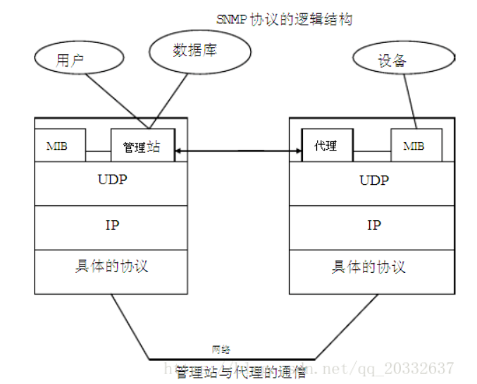
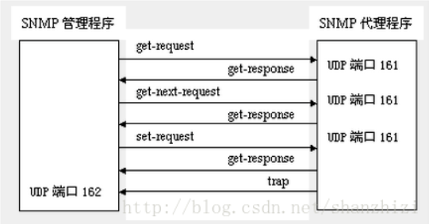
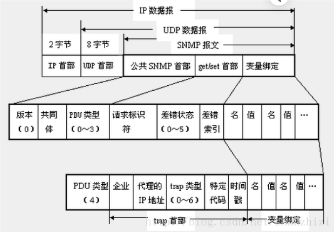
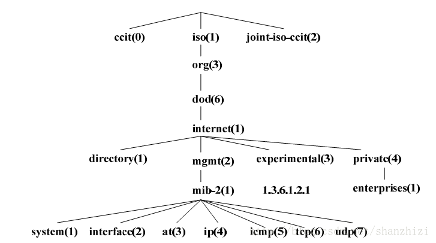
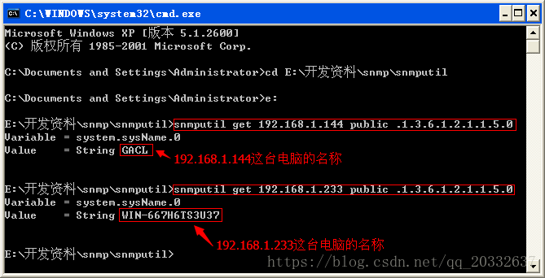

## 什么是Snmp

　　**SNMP**是英文"**Simple Network Management Protocol**"的缩写，中文意思是"**简单网络管理协议**"。**SNMP是一种简单网络管理协议，它属于TCP/IP五层协议中的应用层协议，用于网络管理的协议。SNMP主要用于网络设备的管理。由于SNMP协议简单可靠 ，受到了众多厂商的欢迎，成为了目前最为广泛的网管协议。**

SNMP协议主要由两大部分构成：SNMP管理站和SNMP代理。SNMP管理站是一个中心节点，负责收集维护各个SNMP元素的信息，并对这些信息进行处理，最后反馈给网络管理员；而SNMP代理是运行在各个被管理的网络节点之上，负责统计该节点的各项信息，并且负责与SNMP管理站交互，接收并执行管理站的命令，上传各种本地的网络信息。

SNMP管理站和SNMP代理之间是松散耦合。他们之间的通信是通过UDP协议完成的。一般情况下，SNMP管理站通过UDP协议向SNMP代理发送各种命令，当SNMP代理收到命令后，返回SNMP管理站需要的参数。但是当SNMP代理检测到网络元素异常的时候，也可以主动向SNMP管理站发送消息，通告当前异常状况。

**SNMP的基本思想：为不同种类的设备、不同厂家生产的设备、不同型号的设备，定义为一个统一的接口和协议，使得管理员可以是使用统一的外观面对这些需要管理的网络设备进行管理。通过网络，管理员可以管理位于不同物理空间的设备，从而大大提高网络管理的效率，简化网络管理员的工作。**

SNMP的工作方式：管理员需要向设备获取数据，所以SNMP提供了【读】操作；管理员需要向设备执行设置操作，所以SNMP提供了【写】操作；设备需要在重要状况改变的时候，向管理员通报事件的发生，所以SNMP提供了【Trap】操作。

## SNMP 和 UDP

SNMP采用UDP协议在管理端和agent之间传输信息。 

SNMP采用UDP 161端口接收和发送请求，162端口接收trap，执行SNMP的设备缺省都必须采用这些端口。

SNMP消息全部通过UDP端口161接收，只有Trap信息采用UDP端口162。

## Snmp的实现结构

在具体实现上，SNMP为管理员提供了一个网管平台(NMS)，又称为【管理站】，负责网管命令的发出、数据存储、及数据分析。【被】监管的设备上运行一个SNMP代理(Agent))，代理实现设备与管理站的SNMP通信。

管理站与代理端通过MIB进行接口统一，MIB定义了设备中的被管理对象。管理站和代理都实现了相应的MIB对象，使得双方可以识别对方的数据，实现通信。管理站向代理申请MIB中定义的数据，代理识别后，将管理设备提供的相关状态或参数等数据转换为MIB定义的格式，应答给管理站，完成一次管理操作。

一套完整的SNMP系统主要包括管理信息库（MIB）、管理信息结构（SMI）及SNMP报文协议。

### **代理和管理站的模型**

Snmp分2种角色：**SNMP管理站**（manager，我们的本机127.0.0.1）**和SNMP代理**（agent， 我们要操作的机器，比如 192.168.1.144）。

管理站指的是运行了可以执行网络管理任务软件的服务器，通常被称作为网络管理工作站（NMS）,NMS负责采样网络中agent的信息，并接受agent的trap。

代理是实际网络设备中用来实现SNMP功能的部分。代理在UDP的161端口接收NMS的读写请求消息，管理站在UDP的162端口接收代理的事件通告消息。

所以，一旦获取设备的访问权限（community，默认为public），就可以访问设备信息、改写和配置设备参数。由于采用UDP协议，不需要在代理和管理站之间保持连接。

## **SNMP的操作命令**

SNMP协议之所以易于使用，这是因为它对外提供了**三种用于控制MIB对象的基本操作命令**。它们是：**Get、Set 和 Trap**。

1. **Get**：管理站读取代理者处对象的值。它是SNMP协议中使用率最高的一个命令，因为该命令是从网络设备中获得管理信息的基本方式。
2. **Set**：管理站设置代理者处对象的值。它是一个特权命令，因为可以通过它来改动设备的配置或控制设备的运转状态。它可以设置设备的名称，关掉一个端口或清除一个地址解析表中的项等。
3. **Trap**： 代理者主动向管理站通报重要事件。它的功能就是在网络管理系统没有明确要求的前提下，由管理代理通知网络管理系统有一些特别的情况或问题 发生了。如果发生意外情况，客户会向服务器的162端口发送一个消息，告知服务器指定的变量值发生了变化。通常由服务器请求而获得的数据由服务器的161 端口接收。Trap 消息可以用来通知管理站线路的故障、连接的终端和恢复、认证失败等消息。管理站可相应的作出处理。

#### SNMP 报文

SNMP协议定义了数据包的格式，及网络管理员和管理代理之间的信息交换，它还控制着管理代理的MIB数据对象。因此，可用于处理管理代理定义的各种任务。
  一条SNMP消息由"版本号"、"SNMP共同体名"和"协议数据单元(PDU)"构成，数据包的长度不是固定的。

　　

- **版本识别符(version identifier)**：用于说明现在使用的是哪个版本的SNMP协议，确保SNMP代理使用相同的协议，每个SNMP代理都直接抛弃与自己协议版本不同的数据报。
- **团体名(Community Name)**：**团体（community）是基本的安全机制，用于实现SNMP网络管理员访问SNMP管理代理时的身份验证。类似于密码，默认值为 public。团体名（Community name）是管理代理的口令，管理员被允许访问数据对象的前提就是网络管理员知道网络代理的口令。**如果把配置管理代理成可以执行Trap命令，当网络管理 员用一个错误的分区名查询管理代理时，系统就发送一个autenticationFailure trap报文。
- **协议数据单元（PDU）**：**PDU** (协议数据单元)是SNMP消息中的数据区， 即Snmp通信时报文数据的载体。PDU指明了SNMP的消息类型及其相关参数

**PDU的5种协议数据单元**：

SNMP规定了5种协议数据单元PDU（也就是SNMP报文），用来在管理进程和代理之间的交换。

**get-request**操作：从代理进程处提取一个或多个参数值。

**get-next-request**操作：从代理进程处提取紧跟当前参数值的下一个参数值。

**set-request**操作：设置代理进程的一个或多个参数值。

**get-response**操作：返回的一个或多个参数值。这个操作是由代理进程发出的，它是前面三种操作的响应操作。

**trap**操作：代理进程主动发出的报文，通知管理进程有某些事情发生。

前面的3种操作是由管理进程向代理进程发出的，后面的2个操作是代理进程发给管理进程的，为了简化起见，前面3个操作今后叫做get、get-next和set操作。图1描述了SNMP的这5种报文操作。请注意，在代理进程端是用熟知端口161接收get或set报文，而在管理进程端是用熟知端口162来接收trap报文。

一个SNMP报文共有三个部分组成，即公共SNMP首部、get/set首部、trap首部、变量绑定。

##### **公共SNMP首部**

共三个字段：

- 版本 
  写入版本字段的是版本号减1，对于SNMP（即SNMPV1）则应写入0。
- 共同体（community）
  共同体就是一个字符串，作为管理进程和代理进程之间的明文口令，常用的是6个字符“public”。
- PDU类型
  根据PDU的类型，填入0～4中的一个数字，其对应关系如表2所示意图。

| PDU类型 | 名称             |
| ------- | ---------------- |
| 0       | get-request      |
| 1       | get-next-request |
| 2       | get-response     |
| 3       | set-request      |
| 4       | trap             |

##### get/set首部

- 请求标识符(request ID)
  这是由管理进程设置的一个整数值。代理进程在发送get-response报文时也要返回此请求标识符。管理进程可同时向许多代理发出get报文，这些报文都使用UDP传送，先发送的有可能后到达。设置了请求标识符可使管理进程能够识别返回的响应报文对于哪一个请求报文

- 差错状态（error status）
  由代理进程回答时填入0～5中的一个数字，见表3的描述

| 差错状态 | 名字       | 说明                                  |
| -------- | ---------- | ------------------------------------- |
| 0        | noError    | 一切正常                              |
| 1        | tooBig     | 代理无法将回答装入到一个SNMP报文之中  |
| 2        | noSuchName | 操作指明了一个不存在的变量            |
| 3        | badValue   | 一个set操作指明了一个无效值或无效语法 |
| 4        | readOnly   | 管理进程试图修改一个只读变量          |
| 5        | genErr     | 某些其他的差错                        |

- 差错索引(error index)
  当出现noSuchName、badValue或readOnly的差错时，由代理进程在回答时设置的一个整数，它指明有差错的变量在变量列表中的偏移。

##### trap首部

- 企业（enterprise）
  填入trap报文的网络设备的对象标识符。此对象标识符肯定是在图3的对象命名树上的enterprise结点{1.3.6.1.4.1}下面的一棵子树上。

- trap类型

  此字段正式的名称是generic-trap，共分为表4中的7种。

| trap类型 | 名字                  | 说明                                           |
| -------- | --------------------- | ---------------------------------------------- |
| 0        | coldStart             | 代理进行了初始化                               |
| 1        | warmStart             | 代理进行了重新初始化                           |
| 2        | linkDown              | 一个接口从工作状态变为故障状态                 |
| 3        | linkUp                | 一个接口从故障状态变为工作状态                 |
| 4        | authenticationFailure | 从SNMP管理进程接收到具有一个无效共同体的报文   |
| 5        | egpNeighborLoss       | 一个EGP相邻路由器变为故障状态                  |
| 6        | enterpriseSpecific    | 代理自定义的事件，需要用后面的“特定代码”来指明 |

当使用上述类型2、3、5时，在报文后面变量部分的第一个变量应标识响应的接口。

- 特定代码(specific-code)
  指明代理自定义的时间（若trap类型为6），否则为0。
- 时间戳(timestamp)
  指明自代理进程初始化到trap报告的事件发生所经历的时间，单位为ms。例如时间戳为1908表明在代理初始化后1908ms发生了该时间。

##### 变量绑定

指明一个或多个变量的名和对应的值。在get或get-next报文中，变量的值应忽略。

PDU (协议数据单元)是SNMP消息中的数据区， 即Snmp通信时报文数据的载体。

### MIB(管理信息库)

管理信息(MIB)库可以理解成为agent维护的管理对象数据库，MIB中定义的大部分管理对象的状态和统计信息都可以被NMS访问。MIB是一个按照层次结构组织的树状结构，每个被管对象对应树形结构的一个叶子节点，称为一个object，拥有唯一的数字标识符

MIB文件中的变量使用的名字取自ISO和ITU管理的对象标识符（object identifier）名字空间。它是一种分级树的结构。如图2所示，第一级有三个节点：ccitt、iso、iso-ccitt。低级的对象ID分别由相关组织分配。一个特定对象的标识符可通过由根到该对象的路径获得。一般网络设备取iso节点下的对象内容。如名字空间ip结点下一个名字为ipInReceives的MIB变量被指派数字值3，因而该变量的名字为：

  iso.org.dod.internet.mgmt.mib.ip.ipInReceives

相应的数字表示（对象标识符OID，唯一标识一个MIB对象）为：

MIB数据对象以一种树状分层结构进行组织，这个树状结构中的每个分枝都有一个专用的名字和一个数字形式的标识符。结构树的分枝实际表示的是数据对象的逻 辑分组。而树叶，有时候也叫节点（node），代表了各个数据对象。在结构树中使用子树表示增加的中间分枝和增加的树叶。 

使用这个树状分层结构，MIB浏览器能够以一种方便而且简洁的方式访问整个MIB数据库。MIB浏览器是这样一种工具，它可以遍历整棵MIB结构树，通常 以图形显示的形式来表示各个分枝和树叶对象。可以通过其数字标识符来查找MIB中的数据对象，这个数字标识符号从结构树的顶部（或根部）开始，直到各个叶 子节点（即数据对象）为止。这种访问方式和文件系统的组织方式一致。两者的主要区别在于文件系统中的路径名可以以绝对也可以以相对方式表示，而MIB数据 对象只能以绝对方式表示，不能使用相对方式。

每一个节点都有一个对象标识符（OID）来唯一的标识，每个节点用数字和字符两种方式显示，其中对象标识符OID是由句点隔开的一组整数，也就是从根节点 通向它的路径。一个带标号节点可以拥有包含其它带标号节点为它的子树，如果没有子树它就是叶子节点，它包含一个值并被称为对象。比如网络设备名的oid 是.1.3.6.1.2.1.1.5.0，其值为设备名称的字符串。

网络资源被抽象为对象进行管理。但SNMP中的对象是表示被管资源某一方面的数据变量。对象被标准化为跨系统的类，对象的集合被组织为管理信息库 （MIB）。MIB作为设在代理者处的管理站访问点的集合，管理站通过读取MIB中对象的值来进行网络监控。管理站可以在代理者处产生动作，也可以通过修改变量值改变代理者处的配置。

### 管理信息结构（SMI）

SMI定义了SNMP框架所用信息的组织、组成和标识，它还为描述MIB对象和描述协议怎样交换信息奠定了基础。

SMI定义的数据类型：

◆ 简单类型（simple）

Integer：整型是-2,147,483,648~2,147,483,647的有符号整数

octet string: 字符串是0~65535个字节的有序序列

OBJECT IDENTIFIER: 来自按照ASN.1规则分配的对象标识符集

◆  简单结构类型（simple-constructed）

SEQUENCE 用于列表。这一数据类型与大多数程序设计语言中的“structure”类似。一个SEQUENCE包括0个或更多元素，每一个元素又是另一个ASN.1数据类型

 SEQUENCE OF type 用于表格。这一数据类型与大多数程序设计语言中的“array”类似。一个表格包括0个或更多元素，每一个元素又是另一个ASN.1数据类型。

◆  应用类型（application-wide）

IpAddress: 以网络序表示的IP地址。因为它是一个32位的值，所以定义为4个字节；

counter：计数器是一个非负的整数，它递增至最大值，而后回零。在SNMPv1中定义的计数器是32位的，即最大值为4，294，967，295；

Gauge ：也是一个非负整数，它可以递增或递减，但达到最大值时保持在最大值，最大值为232-1；

time ticks：是一个时间单位，表示以0.01秒为单位计算的时间；

**OID(Object Identifier)**

每个管理对象都有自己的OID(Object Identifier)，管理对象通过树状结构进行组织，OID由树上的一系列整数组成，整数之间用点( . )分隔开，树的叶子节点才是真正能够被管理的对象。

## SNMP的运行过程

驻留在被管设备上的AGENT从UDP端口161接受来自网管站的串行化报文，经解码、团体名验证、分析得到管理变量在MIB树中对应的节点，从相应的模块中得到管理变量的值，再形成响应报文，编码发送回网管站。网管站得到响应报文后，再经同样的处理，最终显示结果。

下面根据RFC1157详细介绍Agent接受到报文后采取的动作：

首先解码生成用内部数据结构表示的报文，解码依据ASN.1的基本编码规则，如果在此过程中出现错误导致解码失败则丢弃该报文，不做进一步处理。

第二步：将报文中的版本号取出，如果与本Agent支持的SNMP版本不一致，则丢弃该报文，不做进一步处理。当前北研的数据通信产品只支持SNMP版本1。

第三步：将报文中的团体名取出，此团体名由发出请求的网管站填写。如与本设备认可的团体名不符，则丢弃该报文，不做进一步处理，同时产生一个陷阱报文。SNMPv1只提供了较弱的安全措施，在版本3中这一功能将大大加强。

第四步：从通过验证的ASN.1对象中提出协议数据单元PDU，如果失败，丢弃报文，不做进一不处理。否则处理PDU，结果将产生一个报文，该报文的发送目的地址应同收到报文的源地址一致。

根据不同的PDU，SNMP协议实体将做不同的处理：

## Snmp 的体验

我们来做一个最简单的Snmp操作：获取一台IP为192.168.1.144的电脑的名称。
   首先要给为192.168.1.144（Agent机器）的电脑安装Snmp环境。Window组件的管理监视工具里包含Snmp，只需要安装一下就可以了。代理机器需要开通Input 161端口用于管理端请求和代理端向管理端响应，管理端开通Input 162端口用于代理端trap请求。

snmp 工具可以到官网下载[https://snmpsoft.com](https://snmpsoft.com/)

工具列：SnmpGet.exe，SnmpSet.exe，SnmpWalk.exe SnmpTapGen.exe

以下为汉化版的一个snmp集成工具，**snmputil**

**snmputil** **使用**
**snmputil工具的命令规则是**：**snmputil [get|getnext|walk] agent community oid [oid ...]**
**[get|getnext|walk]：**为消息类型，我们此次进行的操作是get
**agent：**指Snmp代理即你想进行操作的网络设备的ip或名称，即192.168.1.144
**community**：分区域，即密码，默认是public
**oid**：想要操作的MIB数据对象号，设备名称对应的MIB对象号是.1.3.6.1.2.1.1.5.0

打开命令行窗口，进入snmputil所在路径，键入：**snmputil get 192.168.1.144 public .1.3.6.1.2.1.1.5.0**
如果参数都正确，控制台就会显示出192.168.1.144的机器名。如下图所示：

　　