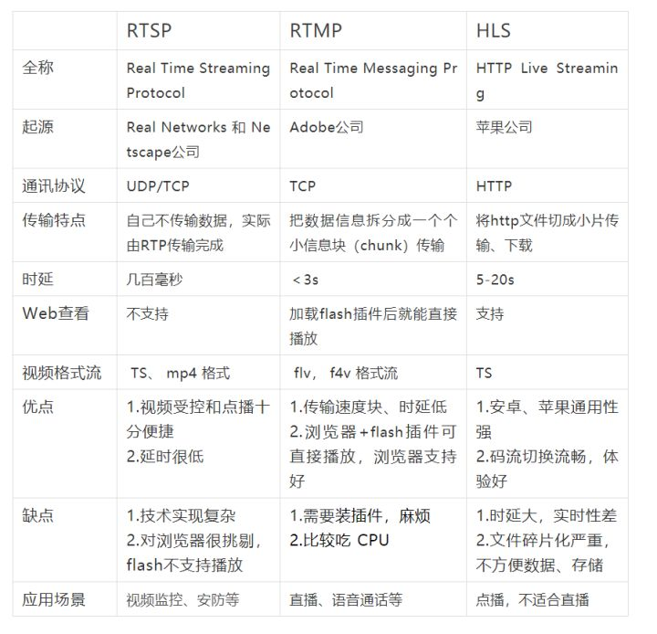

RTSP、RTMP、HLS都可以做直播和点播，它们是三种不同的应用层协议

## RTSP、RTMP、HLS 区别与联系

RTSP、RTMP、HLS都可以做直播和点播，它们是三种不同的应用层协议

> ・HLS 延迟大，适合**视频点播**
> ・RTSP实时性最好，但是实现复杂，适合**视频聊天和视频监控**
> ・RTMP强在**浏览器支持好**，加载flash插件后就能直接播放，非常火，相反在浏览器里播放rtsp就很困难了

## 关于直播

直播应用中，RTMP和HLS基本上可以覆盖所有客户端观看。

> ・RTSP优势主要在于传输层可以使用udp/rtp，实时性好，延迟可控制到1s内，
> ・RTMP主要优势在于延时相对较低(1-3s)，而且RTMP支持的很完善，能做到flash播放RTMP流长时间不断流，以前很多SIP的视频会议已被RTMP所取代。
> ・HLS的优势就是直接使用http协议请求流数据，可以在不同速率的版本间自由切换，实现无缝播放，缺点是延时比较大(10s以上)。

三种协议各有各的优势，主要还是看场景选择，当然大点公司，可以做些私有协议来提供更好更符合场景的服务。

## RTMP的特点

**1)Adobe支持得很好：**

RTMP实际上是现在编码器输出的工业标准协议，基本上所有的编码器（摄像头之类）都支持RTMP输出。
原因在于PC市场巨大，PC主要是Windows，Windows的浏览器基本上都支持flash，
Flash又支持RTMP支持得非常好。

**2)适合长时间播放：**

因为RTMP支持的很完善，所以能做到flash播放RTMP流长时间不断流，
对于商用流媒体应用，客户端的稳定性当然也是必须的。
我就知道有个教育客户，最初使用播放器播放http流，需要播放不同的文件，结果就总出问题，
如果换成服务器端将不同的文件转换成RTMP流，客户端就可以一直播放；
该客户走RTMP方案后，经过CDN分发，没听说客户端出问题了。

**3）延迟较低：**

比起YY的那种UDP私有协议，RTMP算延迟大的（延迟在1-3秒），
比起HTTP流的延时（一般在10秒以上）RTMP算低延时。
一般的直播应用，只要不是电话类对话的那种要求，RTMP延迟是可以接受的。
在一般的视频会议应用中，RTMP延时也能接受，原因是别人在说话的时候我们一般在听，
实际上1秒延时没有关系，我们也要思考（话说有些人的CPU处理速度还没有这么快）。

**4)有累积延迟：**

技术一定要知道弱点，RTMP有个弱点就是累积误差，原因是RTMP基于TCP不会丢包。
所以当网络状态差时，服务器会将包缓存起来，导致累积的延迟；
待网络状况好了，就一起发给客户端。
这个的对策就是，当客户端的缓冲区很大，就断开重连。

**5)稳定性高：**

在PC平台上flash播放的最稳定方式是RTMP，如果做CDN或者大中型集群分发，选择稳定性高的协议一定是必要的。HTTP也很稳定，但HTTP是在协议上稳定；稳定性不只是服务端的事情，在集群分发，服务器管理，主备切换，客户端的支持上，RTMP在PC分发这种方式上还是很有优势。

**6)编码器接入：**

编码器输出到互联网（还可以输出为udp组播之应用），主要是RTMP。譬如专业编码器，或者flash网页编码器，或者FMLE，或者ffmpeg，或者安防摄像头，都支持RTMP输出。若需要接入多种设备，譬如提供云服务；或者希望网页直接采集摄像头；或者能在不同编码器之间切换，那么RTMP作为服务器的输入协议会是最好的选择。

**7)系统容错：**

容错有很多种级别，RTMP的集群实现时可以指定N上层，在错误时切换不会影响到下层或者客户端，另外RTMP的流没有标识，切到其他的服务器的流也可以继续播放。HLS的流热备切换没有这么容易。若对于直播的容错要求高，譬如降低出问题的概率，选择RTMP会是很好的选择。

**8)可监控：**

在监控系统或者运维系统的角度看，流协议应该比较合适监控。HTTP的流监控感觉没有那么完善。这个不算绝对优势，但比较有利。

- PC/Phone+直播+实时性要求高：使用flash播放RTMP。
- PC/Phone+直播+没有实时性要求：使用RTMP或者HLS均可。
- PC/Phone+点播：使用HTTP或者HLS。
- Phone+WEB+直播：想啥呢，老老实实用HLS吧。

