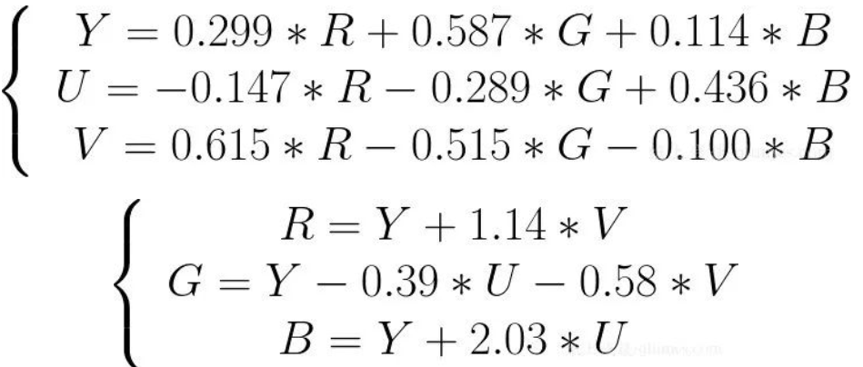
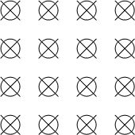
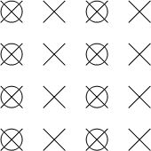
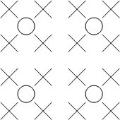

## 无损压缩和有损压缩

- **无损压缩（Lossless）：**压缩前、解压缩后图像完全一致X=X'，压缩比低(2:1~3:1)。典型格式例如：Winzip，JPEG-LS。
- **有损压缩（Lossy）：**压缩前解压缩后图像不一致X≠X'，压缩比高(10:1~20:1)，利用人的视觉系统的特性。典型格式例如：MPEG-2，H.264/AVC，AVS。

## YUV和RGB

对于图像显示器来说，它是通过 RGB 模型来显示图像的，而在传输图像数据时又是使用 YUV 模型，这是因为 YUV 模型可以节省带宽。因此就需要采集图像时将 RGB 模型转换到 YUV 模型，显示时再将 YUV 模型转换为 RGB 模型。



YUV是一个色彩编码系统，用于将颜色图像或视频表示为亮度(Y)和色度(U和V)分量。它广泛应用于模拟和数字视频标准中。具体来说，Y代表亮度信号，U和V代表色度信号。

- **Y（亮度）**：代表图像的明暗程度，不包含颜色信息。
- **U（色度）**：代表蓝色色度（从蓝到黄的差异）。
- **V（色度）**：代表红色色度（从红到青的差异）。

### YUV信号编码和RGB的区别

1. **色彩空间**：
   - **RGB**：是一种加法色彩模型，直接表示图像的红(R)、绿(G)、蓝(B)三种颜色分量。适合于显示设备，如电脑显示器和电视机。
   - **YUV**：是一种基于人眼感知特性的色彩模型。将图像分解为亮度和色度分量，更符合人眼对亮度和色彩的感知特点，尤其适合于压缩和传输。
2. **带宽效率**：
   - **RGB**：每个颜色通道通常具有相同的带宽，因此数据量较大。
   - **YUV**：利用人眼对亮度比色度更敏感的特点，可以对色度分量进行压缩，从而减少数据量，提高带宽效率。
3. **应用场景**：
   - **RGB**：主要用于图像采集和显示。
   - **YUV**：主要用于图像压缩、传输和存储。

### Y'CbCr

Y'CbCr是一种从YUV派生出的数字色彩空间，广泛用于数字视频图像处理和压缩。Y'CbCr与YUV的主要区别在于其分量经过缩放和偏移，以适应数字处理的需要。

- **Y'**：数字亮度信号，与模拟Y信号类似，但范围经过了调整。
- **Cb**：蓝色色度分量的差值信号。
- **Cr**：红色色度分量的差值信号。

### YUV主流的采样方式

[腾讯云开发者社区](https://cloud.tencent.com/developer/article/1442041)

YUV 图像的主流采样方式有如下三种：

- YUV 4:4:4 采样
- YUV 4:2:2 采样
- YUV 4:2:0 采样

#### **YUV 4:4:4 采样**

YUV 4:4:4 采样，意味着 Y、U、V 三个分量的采样比例相同，因此在生成的图像里，每个像素的三个分量信息完整，都是 8 bit，也就是一个字节。

如下图所示：



其中，Y 分量用叉表示，UV 分量用圆圈表示。

```javascript
举个例子 ：

假如图像像素为：[Y0 U0 V0]、[Y1 U1 V1]、[Y2 U2 V2]、[Y3 U3 V3]

那么采样的码流为：Y0 U0 V0 Y1 U1 V1 Y2 U2 V2 Y3 U3 V3 

最后映射出的像素点依旧为 [Y0 U0 V0]、[Y1 U1 V1]、[Y2 U2 V2]、[Y3 U3 V3] 
```

可以看到这种采样方式的图像和 RGB 颜色模型的图像大小是一样，并没有达到节省带宽的目的，当将 RGB 图像转换为 YUV 图像时，也是先转换为 YUV 4:4:4 采样的图像。

#### **YUV 4:2:2 采样**

YUV 4:2:2 采样，意味着 UV 分量是 Y 分量采样的一半，Y 分量和 UV 分量按照 2 : 1 的比例采样。如果水平方向有 10 个像素点，那么采样了 10 个 Y 分量，而只采样了 5 个 UV 分量。

如下图所示：



其中，Y 分量用叉表示，UV 分量用圆圈表示。

```
 举个例子 ：

 假如图像像素为：[Y0 U0 V0]、[Y1 U1 V1]、[Y2 U2 V2]、[Y3 U3 V3]

 那么采样的码流为：Y0 U0 Y1 V1 Y2 U2 Y3 V3 

 其中，每采样过一个像素点，都会采样其 Y 分量，而 U、V 分量就会间隔一个采集一个。

 最后映射出的像素点为 [Y0 U0 V1]、[Y1 U0 V1]、[Y2 U2 V3]、[Y3 U2 V3]
```

采样的码流映射为像素点，还是要满足每个像素点有 Y、U、V 三个分量。但是可以看到，第一和第二像素点公用了 U0、V1 分量，第三和第四个像素点公用了 U2、V3 分量，这样就节省了图像空间。

一张 1280 * 720 大小的图片，在 YUV 4:2:2 采样时的大小为：

> （1280 * 720 * 8 + 1280 * 720 * 0.5 * 8 * 2）/ 8 / 1024 / 1024 = 1.76 MB 。

可以看到 YUV 4:2:2 采样的图像比 RGB 模型图像节省了三分之一的存储空间，在传输时占用的带宽也会随之减少。

#### **YUV 4:2:0 采样**

YUV 4:2:0 采样，并不是指只采样 U 分量而不采样 V 分量。而是指，在每一行扫描时，只扫描一种色度分量（U 或者 V），和 Y 分量按照 2 : 1 的方式采样。比如，第一行扫描时，YU 按照 2 : 1 的方式采样，那么第二行扫描时，YV 分量按照 2:1 的方式采样。对于每个色度分量来说，它的水平方向和竖直方向的采样和 Y 分量相比都是 2:1 。

如下图所示：



其中，Y 分量用叉表示，UV 分量用圆圈表示。

假设第一行扫描了 U 分量，第二行扫描了 V 分量，那么需要扫描两行才能够组成完整的 UV 分量。

```
举个例子 ：

假设图像像素为：

[Y0 U0 V0]、[Y1 U1 V1]、 [Y2 U2 V2]、 [Y3 U3 V3]
[Y5 U5 V5]、[Y6 U6 V6]、 [Y7 U7 V7] 、[Y8 U8 V8]

那么采样的码流为：Y0 U0 Y1 Y2 U2 Y3 Y5 V5 Y6 Y7 V7 Y8

其中，每采样过一个像素点，都会采样其 Y 分量，而 U、V 分量就会间隔一行按照 2 : 1 进行采样。

最后映射出的像素点为：

[Y0 U0 V5]、[Y1 U0 V5]、[Y2 U2 V7]、[Y3 U2 V7]
[Y5 U0 V5]、[Y6 U0 V5]、[Y7 U2 V7]、[Y8 U2 V7]
```

从映射出的像素点中可以看到，四个 Y 分量是共用了一套 UV 分量，而且是按照 2*2 的小方格的形式分布的，相比 YUV 4:2:2 采样中两个 Y 分量共用一套 UV 分量，这样更能够节省空间。

一张 1280 * 720 大小的图片，在 YUV 4:2:0 采样时的大小为：

> （1280 * 720 * 8 + 1280 * 720 * 0.25 * 8 * 2）/ 8 / 1024 / 1024 = 1.32 MB 。

可以看到 YUV 4:2:0 采样的图像比 RGB 模型图像节省了一半的存储空间，因此它也是比较主流的采样方式。

## 码率（BitRate）

码率是指单位时间内传输或处理的数据量，通常以每秒比特数（bps，bits per second）为单位表示。码率在视频和音频编码中是一个关键概念，因为它直接影响数据流的质量和文件大小。

### 视频码率

视频码率决定了视频质量和文件大小的平衡。较高的码率通常意味着更高的图像质量，但也会导致更大的文件和更高的带宽需求。视频码率可以是恒定码率（CBR）或可变码率（VBR）。

1. **恒定码率（CBR，Constant Bitrate）**：
   - **定义**：数据传输速率保持恒定，不随内容复杂度变化。
   - **优点**：带宽需求可预测，适用于实时视频传输和直播。
   - **缺点**：对于复杂场景可能质量不足，对于简单场景可能浪费带宽。
2. **可变码率（VBR，Variable Bitrate）**：
   - **定义**：根据内容复杂度调整数据传输速率，复杂场景使用更高码率，简单场景使用较低码率。
   - **优点**：更高效的带宽使用，通常提供更好的总体视频质量。
   - **缺点**：带宽需求不稳定，不适用于需要固定带宽的应用。

### 音频码率

与视频码率类似，音频码率表示音频数据每秒钟的比特数。常见的音频码率单位包括kbps（千比特每秒）。

1. **恒定码率（CBR）**：
   - **定义**：数据传输速率保持恒定。
   - **优点**：文件大小可预测。
   - **缺点**：对于复杂音频可能质量不足，对于简单音频可能浪费带宽。
2. **可变码率（VBR）**：
   - **定义**：根据音频内容的复杂度调整数据传输速率。
   - **优点**：更高效的带宽使用，通常提供更好的总体音频质量。
   - **缺点**：文件大小不稳定。

### 不同应用的推荐码率

不同应用场景对码率的需求不同。以下是一些常见视频分辨率和对应推荐码率的参考：

- **480p**：1-2 Mbps
- **720p**：2.5-5 Mbps
- **1080p**：5-10 Mbps
- **4K**：20-35 Mbps

## 按时发送机制

按时发送机制（On-time Delivery Mechanism）是指在实时音视频传输过程中，确保数据包按照预定的时间间隔发送，以保证接收端能够按时接收到数据并进行播放，从而实现流畅的实时通信体验。这种机制在RTP协议中尤为重要，因为RTP主要用于传输实时音视频数据。

**按时发送机制的关键要素**

1. **时间戳**：
   - RTP数据包中包含时间戳，用于指示该数据包中媒体样本的采集时间。
   - 发送端根据时间戳和当前时间决定何时发送该数据包。
   - 接收端使用时间戳来重组和同步数据流。
2. **序列号**：
   - 每个RTP数据包都有一个序列号，用于标识数据包的顺序。
   - 序列号帮助接收端检测丢包和乱序，并进行相应的处理。
3. **定时发送**：
   - 发送端按照媒体数据的采样率和时间戳，定时发送RTP数据包。
   - 例如，对于音频数据，发送端每20毫秒发送一个数据包，以保持稳定的音频流。
4. **缓冲机制**：
   - 接收端通常会有一个缓冲区，用于暂时存储接收到的数据包。
   - 缓冲区可以平滑网络抖动，确保数据包按时被解码和播放。
5. **传输控制协议（RTCP）**：
   - RTP通常与RTCP一起使用。RTCP用于传输控制数据和反馈信息。
   - 接收端通过RTCP报告网络状况、数据包丢失和抖动等信息，发送端可以根据这些反馈调整发送策略。