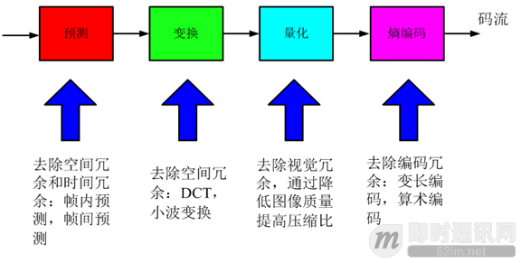
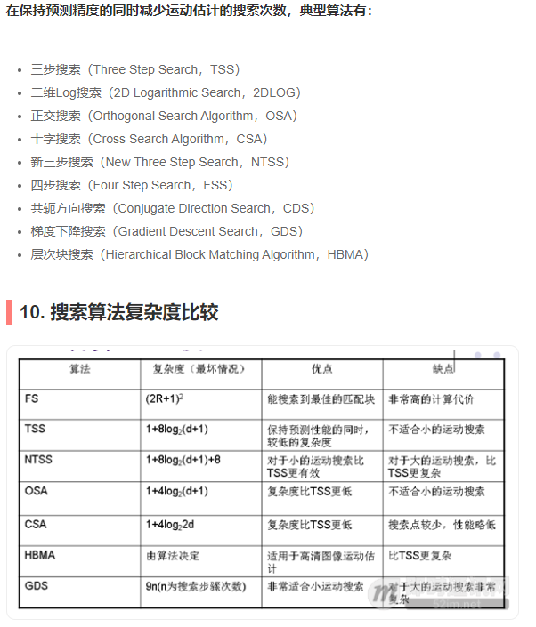

## 码流

### 压缩码流

- 语法：码流中各个元素的位置关系。
  如：01001001…，表示图像编码类型(01)，宏块类型(00)，编码系数1001等。
- 语义：每个语法元素所表达的意义。
  例如：图像编码类型。


### 码流结构


## 视频编码的原理

- 寻找不同像素、不同时间图像帧之间的相关性
- 减少冗余


主要减少的是

- 空间冗余
- 时间冗余



### 分块编码的优势

- **局部处理**：将图像分成较小的块可以简化编码和解码过程，并且能够更好地处理局部图像特征。
- **并行处理**：块之间相互独立，可以并行处理，提高编码和解码的速度。
- **高效压缩**：通过变换和量化，可以显著减少块内的数据冗余，实现高效压缩。

### 分块编码的挑战

- **块效应（Blocking Artifacts）**：量化引入的损失可能导致块边界出现可见的伪影，特别是在低码率下。
- **复杂度**：高质量的分块编码（如H.264、HEVC）需要复杂的算法和计算资源，增加了编码和解码的复杂度。

## 预测

**空间预测：**利用图像空间相邻像素的相关性来预测的方法

- 帧内预测技术：利用当前编码块周围已经重构出来的像素预测当前块
- Intra图像编码（I帧）

**时间预测：**利用时间上相邻图像的相关性来预测的方法

- 帧间预测：运动估计（Motion Estimation，ME），运动补偿（Motion Compensation，MC）
- Inter图像编码：前向预测编码图像（P帧），双向预测编码图像（B帧）

**GOP：**

编码器将多张图像进行编码后生产成一段一段的 GOP ( Group of Pictures ) 如下图， 解码器在播放时则是读取一段一段的 GOP 进行解码后读取画面再渲染显示。GOP (Group of Pictures) 是一组连续的画面，由一个 I 帧和数个 B / P 帧组成，是视频图像编码器和解码器存取的基本单位，它的排列顺序将会一直重复到影像结束。


### I帧、P帧、B帧

#### I帧

**I帧**（Intra Frame）是独立编码的帧，只利用了单帧图像内的空间相关性，而没有利用时间相关性，不依赖于其他帧，可以单独解码和显示。

I帧通常用作视频序列的起始帧，提供一个参考点，从而允许随时从I帧开始解码和播放视频。

I 帧图像是周期性出现在图像序列中的，出现频率可由编码器选择。在视频画面播放过程中，如果 I 帧丢失了，则后面的 P 帧也就随着解不出来，就会出现视频画面黑屏或卡顿的现象。

**特点**：

- 独立存在：不依赖其他帧。
- 质量高：包含所有图像数据，图像质量通常较高。
- 数据量大：由于没有参考其他帧，压缩效率较低，数据量较大。

**应用**：

- 视频的起始位置。
- 需要随机访问的关键点，例如在视频快进、快退或跳转时。

#### P帧

**P帧**（Predictive Frame）是基于前一帧（通常是I帧或另一个P帧）进行预测和编码的帧。

P帧只存储与参考帧的差异信息，通过运动补偿和运动矢量来描述帧间的变化。这种方法利用了视频中的时间冗余，显著减少了数据量。

若 P 帧丢失了，则视频画面会出现花屏、马赛克等现象。

**特点**：

- 依赖前帧：需要前一帧的数据进行解码。
- 数据量小：只存储差异信息，压缩效率高，数据量较小。
- 更高的压缩效率：利用运动补偿来减少数据冗余。

**应用**：

- 连续场景中的中间帧。
- 在减少数据量和保持画质之间寻找平衡。

#### B帧

**B帧**（Bi-directional Predictive Frame）是基于前后两帧（I帧或P帧）进行预测和编码的帧。

B帧通过双向预测，即同时参考前一帧和后一帧（因为传递的关系（参考了B帧，其实就是参考了B帧前后的帧），只参考I帧和P帧），存储前后帧与当前帧之间的差异信息。B帧通常能达到最高的压缩效率，但也需要更复杂的解码过程。

因为依赖后面的帧，所以不适合实时传输（例如视频会议）。

**特点**：

- 双向依赖：需要前后两帧的数据进行解码。
- 数据量最小：通过双向预测，压缩效率最高，数据量最小。
- 解码复杂度高：由于需要同时参考前后两帧，解码过程更复杂。

**应用**：

- 用于高压缩率的视频流中。
- 在需要最大限度减少数据量的场景中使用。


#### 梳理

对I帧的处理，是采用帧内编码方式，只利用本帧图像内的空间相关性。对P帧的处理，采用帧间编码（前向运动估计），同时利用空间和时间上的相关性。简单来说，采用运动补偿(motion compensation)算法来去掉冗余信息。


需要特别注意，I帧（帧内编码），虽然只有空间相关性，但整个编码过程也不简单。


### DTS和PTS

由于 B 帧图像采用了未来帧作为参考，因此 MPEG-2 编码码流中图像帧的传输顺序和显示顺序是不同的。

这就带来一个问题：在视频流中，先到来的 B 帧无法立即解码，需要等待它依赖的后面的 I、P 帧先解码完成，这样一来播放时间与解码时间不一致了，顺序打乱了，那这些帧该如何播放呢？这时就需要我们来了解另外两个概念：DTS 和 PTS。

- DTS（Decoding Time Stamp）：即解码时间戳，这个时间戳的意义在于告诉播放器该在什么时候解码这一帧的数据。

- PTS（Presentation Time Stamp）：即显示时间戳，这个时间戳用来告诉播放器该在什么时候显示这一帧的数据。

DTS 和 PTS 都是在编码的时候由编码器生成的。

#### 例如：

一个采集顺序为 IBBBP 的GOP

则**显示顺序**与采集顺序相同，为： 

```java
I B B B P
PTS:     12345
```

**编码顺序如下：**

```javascript
I P B B B
DTS:     12345
PTS:     15234
```

**推流顺序**与编码顺序相同：

```Java
I P B B B
DTS:     12345
PTS:     15234
```

**解码顺序**与推流顺序相同：

```java
I P B B B
DTS:     12345
PTS:     15234
```

根据PTS调整解码后的帧：

```java
I B B B P
PTS:     12345
DTS:     13452
```

### 帧内预测

- I帧图像的每个宏块都采用帧内（Intra）预测编码模式。
- 宏块分成8x8或者4x4块，对每个块采用帧内预测编码，称作Intra8x8或者Intra4x4。
- 帧内预测有多个预测方向：水平，垂直，左下，右上（复制）。
- 帧内预测还有直流（DC）预测（平均值）。
- 色度块预测还有平面预测。


### 帧间预测

#### 运动估计

运动估计是视频压缩中的关键技术，用于检测和描述视频帧之间的**运动信息**。通过识别和预测视频帧中物体的**移动**，可以减少帧间的冗余，从而有效压缩视频数据。

**工作原理**

1. **块匹配（Block Matching）**：
   - 视频帧被划分为若干固定大小的宏块（如16x16像素）。
   - 对每个宏块，在参考帧中搜索一个最佳匹配块，以找到最相似的块。
   - 通过计算各种匹配度量（如绝对误差和、均方误差等），确定匹配块的位置。
2. **运动矢量（Motion Vectors）**：
   - 每个宏块的移动由运动矢量表示，矢量指示宏块从参考帧的位置到当前帧的位置。
   - 运动矢量存储在比特流中，供解码器使用。

**匹配度量**

常见的匹配度量方法包括：

- **绝对误差和（SAD, Sum of Absolute Differences）**
- **均方误差（MSE, Mean Squared Error）**




#### 运动补偿

运动补偿是**利用运动估计得到的运动矢量**来预测视频帧的过程。通过运动补偿，可以重建帧的内容，只需**存储差异信息**，从而进一步压缩数据。

**工作原理**

1. **预测帧（Predicted Frame）**：
   - 利用运动矢量从参考帧中提取块，组合成预测帧。
2. **残差编码（Residual Coding）**：
   - 计算预测帧与实际帧之间的差异（残差）。
   - 对残差进行编码和压缩。

#### 运动估计和运动补偿的步骤

1. **视频分割**：将视频帧划分为宏块。
2. **运动估计**：
   - 在参考帧中搜索最佳匹配块。
   - 计算匹配度量。
   - 确定运动矢量。
3. **运动补偿**：
   - 利用运动矢量从参考帧提取块，形成预测帧。
   - 计算残差（实际帧 - 预测帧）。
   - 对残差进行编码。

### B帧有更好的编码效率

B帧（Bi-directional Predictive Frame）能够实现更高的编码效率，主要是因为它利用了前后帧的信息进行双向预测。这种双向预测的机制使得B帧在压缩数据时可以更有效地减少冗余。以下是详细解释：

**双向预测**

B帧既参考前一帧（I帧或P帧）也参考后一帧（P帧或I帧），通过双向预测可以更准确地描述当前帧的内容。这种方法有几个关键优势：

1. **更高的匹配度**：
   - 由于B帧可以参考两个方向的帧，可以选择更适合的预测模式，从而更准确地预测当前帧中的像素。
   - 这种双向参考增加了匹配块的选择范围，使得找到匹配块的概率更高，从而减少残差（预测帧与实际帧的差异）。
2. **更小的残差**：
   - 双向预测通常能更准确地捕捉到运动信息，从而减少残差。
   - 残差越小，编码所需的比特数就越少，从而提高了压缩效率。

**数据冗余的减少**

由于B帧能够利用前后帧的信息进行预测，所以在描述当前帧时能够更加准确和有效。具体来说：

1. **时间冗余的利用**：
   - 视频中的帧序列往往具有很高的时间冗余，即相邻帧之间变化不大。
   - B帧通过双向预测最大化地利用这种时间冗余，使得压缩效果更佳。
2. **更精确的运动补偿**：
   - 运动补偿是视频压缩中的关键技术，通过准确的运动预测减少帧间的冗余。
   - B帧的双向运动补偿机制可以更加精确地描述运动，从而减少误差，提高压缩效率。

**编码策略的灵活性**

在编码过程中，B帧提供了更多的选择和灵活性。例如：

1. **块匹配的灵活性**：
   - 在进行块匹配时，B帧可以在前后帧中找到最佳匹配块，这增加了选择的灵活性。
   - 这种灵活性意味着可以选择更合适的参考块，减少预测误差。
2. **帧内压缩的优化**：
   - B帧的引入允许编码器在GOP（Group of Pictures）内进行更多的优化。
   - 编码器可以根据场景的复杂度调整B帧、P帧和I帧的比例和位置，以实现最佳的压缩效果。


## 变换


## 量化

### 原理

将含有大量的数据集合映射到含有少量的数据集合中。


